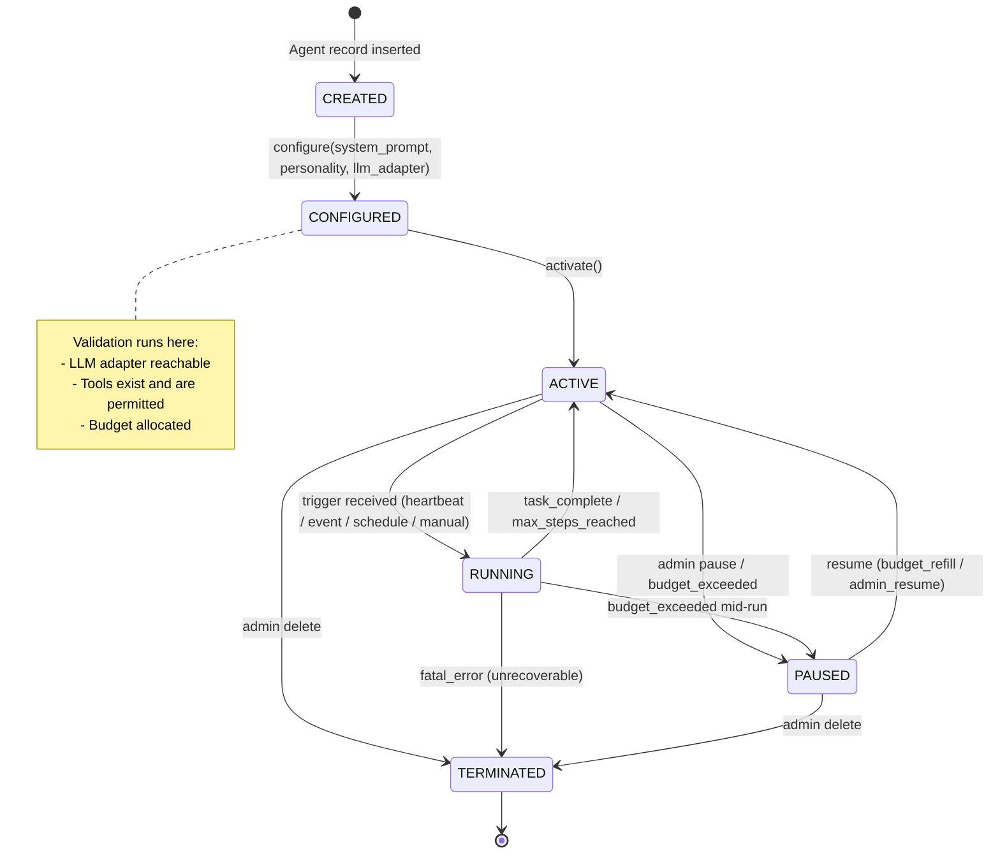
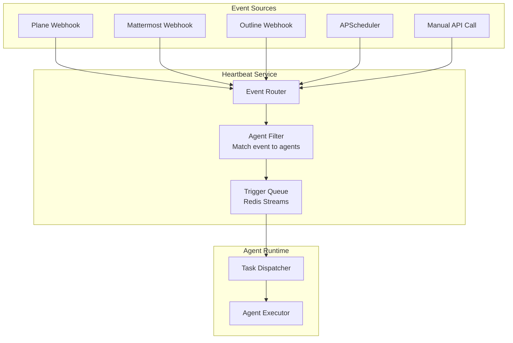
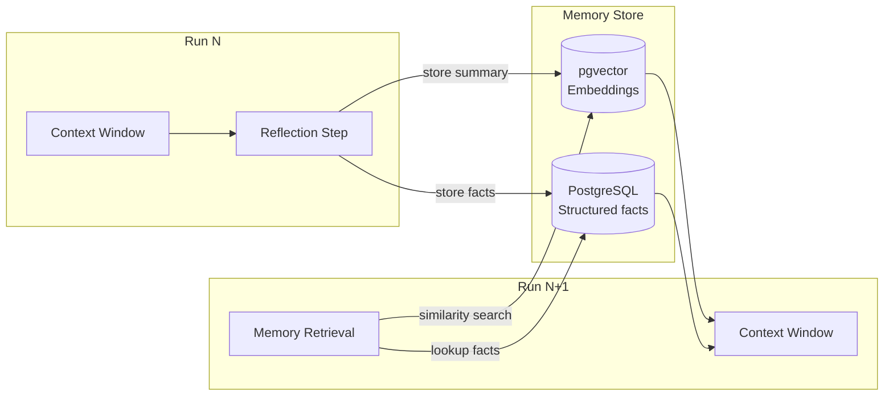
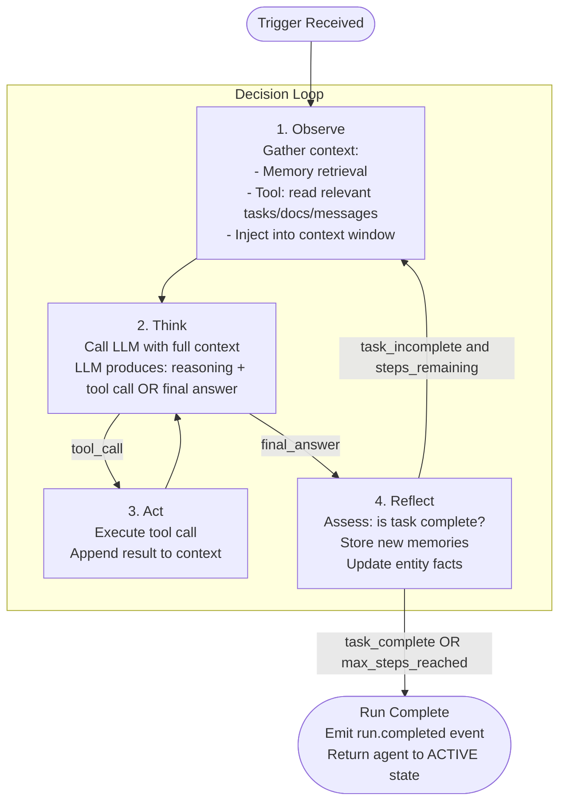

# Agent Framework Architecture

**Status**: Draft  
**Date**: 2026-04-18  
**Scope**: Agent lifecycle, state machine, heartbeat system, memory model, inter-agent communication, and decision loop

---

## Table of Contents

1. [Overview](#overview)
2. [Agent Lifecycle](#agent-lifecycle)
3. [State Machine](#state-machine)
4. [Heartbeat System](#heartbeat-system)
5. [Agent Memory Model](#agent-memory-model)
6. [Inter-Agent Communication](#inter-agent-communication)
7. [Decision-Making Loop](#decision-making-loop)
8. [Agent Configuration Schema](#agent-configuration-schema)
9. [Design Decisions](#design-decisions)

---

## Overview

An agent in AgentCompany is a software entity that fills an organizational role — CEO, CTO, PM, Developer, etc. Each agent wraps an LLM, a set of tools, a personality definition, and a lifecycle controller. Agents are not long-running OS processes. They are stateless task executors that are invoked when triggered and that persist their context to storage between invocations.

This distinction is load-bearing: a company may have dozens of agents but most are idle at any given moment. Running each as an always-on process would waste resources. Instead, each agent is an async coroutine that is scheduled when work arrives.

---

## Agent Lifecycle

Agents move through six states from creation to termination.

```
CREATED -> CONFIGURED -> ACTIVE -> RUNNING -> PAUSED -> TERMINATED
                                       ^           |
                                       |           v
                                       +-- ACTIVE <-+  (resume)
```

### State Definitions

| State | Description |
|---|---|
| `CREATED` | Agent record exists in DB. No configuration attached. |
| `CONFIGURED` | System prompt, personality, capabilities, and LLM adapter assigned. Not yet accepting work. |
| `ACTIVE` | Agent is registered with the event router and its heartbeat schedule is live. Ready to accept triggers. |
| `RUNNING` | Agent is currently executing a decision loop iteration for a specific task. |
| `PAUSED` | Agent is suspended — budget exceeded, maintenance, or explicit admin pause. Triggers queue but do not execute. |
| `TERMINATED` | Agent is permanently shut down. All triggers are removed. State is archived. |

### Lifecycle Transitions

```python
# agents/lifecycle.py

from enum import Enum
from dataclasses import dataclass, field
from datetime import datetime
from typing import Optional
import uuid


class AgentState(str, Enum):
    CREATED = "created"
    CONFIGURED = "configured"
    ACTIVE = "active"
    RUNNING = "running"
    PAUSED = "paused"
    TERMINATED = "terminated"


# Valid transitions: (from_state, to_state)
VALID_TRANSITIONS: set[tuple[AgentState, AgentState]] = {
    (AgentState.CREATED, AgentState.CONFIGURED),
    (AgentState.CONFIGURED, AgentState.ACTIVE),
    (AgentState.ACTIVE, AgentState.RUNNING),
    (AgentState.ACTIVE, AgentState.PAUSED),
    (AgentState.ACTIVE, AgentState.TERMINATED),
    (AgentState.RUNNING, AgentState.ACTIVE),      # task complete, return to ready
    (AgentState.RUNNING, AgentState.PAUSED),      # budget exceeded mid-run
    (AgentState.RUNNING, AgentState.TERMINATED),  # fatal error
    (AgentState.PAUSED, AgentState.ACTIVE),       # budget refilled or admin resume
    (AgentState.PAUSED, AgentState.TERMINATED),
}


@dataclass
class AgentStateTransition:
    agent_id: str
    from_state: AgentState
    to_state: AgentState
    reason: str
    timestamp: datetime = field(default_factory=datetime.utcnow)
    triggered_by: Optional[str] = None  # user_id or system


class AgentLifecycleManager:
    def __init__(self, agent_repo, event_bus, budget_service):
        self._repo = agent_repo
        self._bus = event_bus
        self._budget = budget_service

    async def transition(
        self,
        agent_id: str,
        to_state: AgentState,
        reason: str,
        triggered_by: Optional[str] = None,
    ) -> AgentStateTransition:
        agent = await self._repo.get(agent_id)
        from_state = agent.state

        if (from_state, to_state) not in VALID_TRANSITIONS:
            raise InvalidTransitionError(
                f"Cannot move agent {agent_id} from {from_state} to {to_state}"
            )

        transition = AgentStateTransition(
            agent_id=agent_id,
            from_state=from_state,
            to_state=to_state,
            reason=reason,
            triggered_by=triggered_by,
        )

        await self._repo.update_state(agent_id, to_state)
        await self._repo.append_transition(transition)
        await self._bus.publish("agent.state_changed", transition)

        # Side effects by target state
        if to_state == AgentState.ACTIVE:
            await self._register_triggers(agent_id)
        elif to_state in (AgentState.PAUSED, AgentState.TERMINATED):
            await self._deregister_triggers(agent_id)

        return transition

    async def _register_triggers(self, agent_id: str) -> None:
        """Register the agent's heartbeat and event subscriptions."""
        agent = await self._repo.get(agent_id)
        config = agent.heartbeat_config
        await self._bus.publish("heartbeat.register", {
            "agent_id": agent_id,
            "mode": config.mode,
            "cron": config.cron,
            "event_filters": config.event_filters,
        })

    async def _deregister_triggers(self, agent_id: str) -> None:
        await self._bus.publish("heartbeat.deregister", {"agent_id": agent_id})
```

---

## State Machine



### Entry/Exit Actions per State

| State | On Entry | On Exit |
|---|---|---|
| `CONFIGURED` | Validate config, allocate budget slot | - |
| `ACTIVE` | Register triggers with event router | Deregister triggers |
| `RUNNING` | Acquire execution lock, log start | Release lock, persist context |
| `PAUSED` | Queue incoming triggers | Drain trigger queue |
| `TERMINATED` | Archive state and memory, emit audit event | - |

---

## Heartbeat System

The heartbeat system determines when an agent wakes up. It is implemented as a service that routes triggers to the agent runtime.

### Trigger Modes

| Mode | When the Agent Runs | Example Use |
|---|---|---|
| `always_on` | On a fixed interval (e.g., every 60s). Checks for new tasks on each tick. | Monitoring agent |
| `event_triggered` | Only when a qualifying event occurs: @mention, task assignment, channel message | Developer agent, PM agent |
| `scheduled` | Cron expression. Runs at specific times. | Daily standup summarizer, billing agent |
| `manual` | Only when an authenticated user explicitly invokes the agent via API | Audit agent, one-off analysis |

### Heartbeat Service Architecture



### Event Routing Rules

Each `ACTIVE` agent has an `event_filter` — a set of rules that determine which events wake it.

```python
# agents/heartbeat.py

from dataclasses import dataclass, field
from typing import Literal, Optional
from enum import Enum


class HeartbeatMode(str, Enum):
    ALWAYS_ON = "always_on"
    EVENT_TRIGGERED = "event_triggered"
    SCHEDULED = "scheduled"
    MANUAL = "manual"


@dataclass
class EventFilter:
    """Rules that determine which events trigger this agent."""
    # Event types this agent subscribes to
    event_types: list[str] = field(default_factory=list)
    # e.g. ["task.assigned", "message.mention", "document.created"]

    # Only trigger if the event targets this agent's assigned_user_id
    match_assigned_to_agent: bool = True

    # Regex patterns to match against message content
    content_patterns: list[str] = field(default_factory=list)

    # Source systems to listen to (plane, mattermost, outline, all)
    sources: list[str] = field(default_factory=lambda: ["all"])

    # Priority filter: only wake for high/critical items if set
    min_priority: Optional[str] = None


@dataclass
class HeartbeatConfig:
    mode: HeartbeatMode
    interval_seconds: Optional[int] = None   # for always_on
    cron: Optional[str] = None               # for scheduled, e.g. "0 9 * * 1-5"
    event_filter: Optional[EventFilter] = None  # for event_triggered
    # Maximum time an agent can run per invocation (safety ceiling)
    max_run_seconds: int = 300


class HeartbeatService:
    """
    Runs inside the agent-runtime process.
    Receives raw platform events and decides which agents to wake.
    """

    def __init__(self, agent_repo, trigger_queue, scheduler):
        self._agents = agent_repo
        self._queue = trigger_queue      # Redis Streams producer
        self._scheduler = scheduler      # APScheduler

    async def handle_platform_event(self, event: dict) -> None:
        """
        Called by webhook handlers when a platform event arrives.
        Finds all ACTIVE, EVENT_TRIGGERED agents whose filter matches.
        """
        active_agents = await self._agents.list_active_event_triggered()
        for agent in active_agents:
            if self._matches(event, agent.heartbeat_config.event_filter):
                await self._queue.enqueue(agent.agent_id, event)

    def _matches(self, event: dict, f: EventFilter) -> bool:
        if "all" not in f.sources and event.get("source") not in f.sources:
            return False
        if f.event_types and event.get("type") not in f.event_types:
            return False
        if f.match_assigned_to_agent:
            if event.get("assigned_to") != event.get("_agent_user_id"):
                return False
        return True

    async def register_agent(self, agent_id: str, config: HeartbeatConfig) -> None:
        if config.mode == HeartbeatMode.ALWAYS_ON:
            self._scheduler.add_job(
                self._tick,
                "interval",
                seconds=config.interval_seconds or 60,
                id=f"heartbeat_{agent_id}",
                args=[agent_id],
            )
        elif config.mode == HeartbeatMode.SCHEDULED:
            self._scheduler.add_job(
                self._tick,
                "cron",
                id=f"schedule_{agent_id}",
                args=[agent_id],
                **self._parse_cron(config.cron),
            )
        # event_triggered: handled by handle_platform_event above
        # manual: no registration needed

    async def _tick(self, agent_id: str) -> None:
        """Periodic heartbeat tick for always_on and scheduled agents."""
        await self._queue.enqueue(agent_id, {"type": "heartbeat.tick", "agent_id": agent_id})
```

### Trigger Queue Implementation

The trigger queue uses Redis Streams. This gives us:
- Durable delivery (messages survive runtime restarts)
- Consumer group semantics (each agent processes its own stream)
- Dead-letter capability (failed triggers move to a DLQ stream)

```
Stream key pattern: triggers:{agent_id}
Consumer group: agent-runtime
Dead-letter stream: triggers:dlq
```

Each trigger message contains:

```json
{
  "trigger_id": "trig_01HZ...",
  "agent_id": "agent_01HZ...",
  "type": "task.assigned",
  "source": "plane",
  "payload": { ... },
  "enqueued_at": "2026-04-18T09:00:00Z",
  "attempt": 1
}
```

---

## Agent Memory Model

Agents have two tiers of memory. This mirrors how humans work: active working memory during a task, and long-term knowledge that accumulates over time.

### Tier 1: Short-Term Context (In-Flight)

While executing a decision loop, the agent maintains a context window. This is the conversation history passed to the LLM on each step. It is held in memory for the duration of a single run and written to the database when the run completes.

```python
@dataclass
class AgentContext:
    """The working memory for a single agent run."""
    run_id: str
    agent_id: str
    trigger: dict
    messages: list[dict]          # LLM conversation history (system + turns)
    tool_results: list[dict]      # Tool calls and their outputs this run
    step_count: int = 0
    tokens_used: int = 0
    started_at: datetime = field(default_factory=datetime.utcnow)
```

Context window limits are enforced by the LLM adapter (see `llm-adapters.md`). When the conversation grows too large, older messages are summarized and compressed.

### Tier 2: Long-Term Memory (Persistent)

Long-term memory persists across runs. It is stored as vector embeddings in a vector store (default: pgvector on PostgreSQL). When an agent starts a new run, relevant memories are retrieved via similarity search and injected into the system prompt.



#### Memory Categories

| Category | Storage | Retrieval Method | TTL |
|---|---|---|---|
| Task summaries | pgvector | Semantic similarity | 90 days |
| Decisions made | pgvector | Semantic similarity | 365 days |
| Entity facts (project names, people) | PostgreSQL JSONB | Key lookup | No expiry |
| Conversation summaries | pgvector | Semantic similarity | 30 days |
| Tool outputs | PostgreSQL | Run ID lookup | 30 days |

```python
# agents/memory.py

from dataclasses import dataclass
from typing import Optional
import uuid


@dataclass
class MemoryEntry:
    memory_id: str
    agent_id: str
    category: str          # "task_summary" | "decision" | "entity" | "conversation"
    content: str           # The text content to embed and store
    metadata: dict         # Source run_id, task_id, timestamp, tags
    embedding: Optional[list[float]] = None


class AgentMemoryService:
    def __init__(self, vector_store, relational_store, embedder):
        self._vectors = vector_store   # pgvector client
        self._db = relational_store    # asyncpg pool
        self._embed = embedder         # embedding model client

    async def store(self, entry: MemoryEntry) -> None:
        embedding = await self._embed.encode(entry.content)
        entry.embedding = embedding
        await self._vectors.upsert(
            collection=f"agent_{entry.agent_id}",
            id=entry.memory_id,
            vector=embedding,
            payload={"content": entry.content, "metadata": entry.metadata},
        )

    async def retrieve_relevant(
        self,
        agent_id: str,
        query: str,
        top_k: int = 5,
        categories: Optional[list[str]] = None,
    ) -> list[MemoryEntry]:
        query_embedding = await self._embed.encode(query)
        filter_conditions = {}
        if categories:
            filter_conditions["category"] = {"$in": categories}

        results = await self._vectors.search(
            collection=f"agent_{agent_id}",
            vector=query_embedding,
            top_k=top_k,
            filter=filter_conditions,
        )
        return [MemoryEntry(**r.payload, embedding=r.vector) for r in results]

    async def store_entity(self, agent_id: str, entity_type: str, entity_id: str, facts: dict) -> None:
        """Store structured facts about entities (people, projects, etc.)"""
        await self._db.execute(
            """
            INSERT INTO agent_entities (agent_id, entity_type, entity_id, facts, updated_at)
            VALUES ($1, $2, $3, $4::jsonb, NOW())
            ON CONFLICT (agent_id, entity_type, entity_id)
            DO UPDATE SET facts = EXCLUDED.facts, updated_at = NOW()
            """,
            agent_id, entity_type, entity_id, facts,
        )
```

---

## Inter-Agent Communication

Agents communicate with each other indirectly through the same tools humans use. There is no agent-to-agent RPC. This keeps the system auditable — all agent activity is visible in Mattermost, Plane, and Outline.

### Communication Patterns

#### 1. Task Delegation (via Plane)

A manager agent (CEO, CTO, PM) creates a task in Plane and assigns it to the agent user that represents the target agent. The target agent's event filter wakes it when it receives the `task.assigned` event.

```
CEO Agent -> creates Plane issue "Design auth system" -> assigns to CTO Agent user
CTO Agent -> event filter matches -> wakes up -> reads task -> works on it
```

#### 2. Mention-Based Communication (via Mattermost)

An agent can post a message in a Mattermost channel and @mention another agent's user handle. The mentioned agent's event filter matches `message.mention` events.

```
PM Agent -> posts "Hey @dev-agent-1, can you pick up TICKET-42?"
Developer Agent -> wakes on mention -> reads message -> acknowledges
```

#### 3. Document Collaboration (via Outline)

Agents write to and read from shared Outline documents. A PM agent can write a spec; a Developer agent reads it as context for implementation.

#### 4. Escalation (Structured)

When an agent cannot make a decision within its authority level, it raises an escalation. This is a first-class object in the system, not just a message.

```python
@dataclass
class Escalation:
    escalation_id: str
    from_agent_id: str
    to_agent_id: Optional[str]   # None means "route to human manager"
    to_human_id: Optional[str]
    reason: str
    context: dict                 # Relevant facts the escalation recipient needs
    decision_options: list[str]   # Proposed options for the recipient to choose from
    created_at: datetime
    resolved_at: Optional[datetime] = None
    resolution: Optional[str] = None
```

Escalations are stored in the DB and surfaced in the web UI for humans to review. They can also be posted to a Mattermost escalation channel.

### Communication Guardrails

- Agents cannot send DMs to human users without approval (configurable per agent).
- Agents cannot @mention humans at authority levels above their direct manager without escalating through the proper chain.
- All cross-agent messages are logged with the originating run_id for full traceability.

---

## Decision-Making Loop

Every agent invocation runs the same four-phase loop. The number of iterations is bounded by `max_steps` (default: 10).



### Loop Implementation

```python
# agents/loop.py

from dataclasses import dataclass
from typing import Optional
import logging

logger = logging.getLogger(__name__)

MAX_STEPS_DEFAULT = 10


@dataclass
class LoopResult:
    run_id: str
    agent_id: str
    outcome: str            # "completed" | "max_steps" | "budget_exceeded" | "error"
    steps_taken: int
    tokens_used: int
    final_message: Optional[str] = None
    error: Optional[str] = None


class AgentDecisionLoop:
    def __init__(
        self,
        llm_adapter,
        tool_executor,
        memory_service,
        budget_service,
        lifecycle_manager,
        max_steps: int = MAX_STEPS_DEFAULT,
    ):
        self._llm = llm_adapter
        self._tools = tool_executor
        self._memory = memory_service
        self._budget = budget_service
        self._lifecycle = lifecycle_manager
        self._max_steps = max_steps

    async def run(self, agent: "Agent", context: "AgentContext") -> LoopResult:
        # Phase 1: Observe — retrieve relevant memories and seed the context
        memories = await self._memory.retrieve_relevant(
            agent_id=agent.agent_id,
            query=self._summarize_trigger(context.trigger),
            top_k=5,
        )
        context.messages = self._build_initial_messages(agent, context, memories)

        try:
            await self._lifecycle.transition(agent.agent_id, AgentState.RUNNING, "loop_start")
        except InvalidTransitionError:
            logger.warning("Agent %s already running, skipping", agent.agent_id)
            return

        step = 0
        while step < self._max_steps:
            step += 1

            # Phase 2: Think — call the LLM
            budget_check = await self._budget.check(agent.agent_id, estimated_tokens=500)
            if not budget_check.allowed:
                await self._lifecycle.transition(agent.agent_id, AgentState.PAUSED, "budget_exceeded")
                return LoopResult(
                    run_id=context.run_id,
                    agent_id=agent.agent_id,
                    outcome="budget_exceeded",
                    steps_taken=step,
                    tokens_used=context.tokens_used,
                )

            llm_response = await self._llm.complete(
                messages=context.messages,
                tools=agent.available_tools,
                system=agent.system_prompt,
            )

            context.tokens_used += llm_response.tokens_used
            await self._budget.record_usage(agent.agent_id, llm_response.tokens_used)
            context.messages.append({"role": "assistant", "content": llm_response.content})

            # Phase 3: Act — execute tool calls if present
            if llm_response.tool_calls:
                for tool_call in llm_response.tool_calls:
                    result = await self._tools.execute(
                        agent=agent,
                        tool_name=tool_call.name,
                        arguments=tool_call.arguments,
                    )
                    context.tool_results.append(result)
                    context.messages.append({
                        "role": "tool",
                        "tool_call_id": tool_call.id,
                        "content": result.output,
                    })
                # Loop back to Think
                continue

            # No tool calls: this is the final answer
            # Phase 4: Reflect — store memories and assess
            await self._reflect(agent, context, llm_response.content)

            await self._lifecycle.transition(
                agent.agent_id, AgentState.ACTIVE, "task_complete"
            )
            return LoopResult(
                run_id=context.run_id,
                agent_id=agent.agent_id,
                outcome="completed",
                steps_taken=step,
                tokens_used=context.tokens_used,
                final_message=llm_response.content,
            )

        # Max steps reached without final answer
        await self._reflect(agent, context, "Max steps reached without resolution.")
        await self._lifecycle.transition(agent.agent_id, AgentState.ACTIVE, "max_steps")
        return LoopResult(
            run_id=context.run_id,
            agent_id=agent.agent_id,
            outcome="max_steps",
            steps_taken=step,
            tokens_used=context.tokens_used,
        )

    async def _reflect(self, agent, context: "AgentContext", final_content: str) -> None:
        """Store what the agent did and learned this run."""
        summary = f"Run {context.run_id}: {final_content[:500]}"
        await self._memory.store(MemoryEntry(
            memory_id=f"run_{context.run_id}",
            agent_id=agent.agent_id,
            category="task_summary",
            content=summary,
            metadata={
                "run_id": context.run_id,
                "trigger_type": context.trigger.get("type"),
                "steps": context.step_count,
                "tokens": context.tokens_used,
            },
        ))

    def _build_initial_messages(self, agent, context, memories) -> list[dict]:
        memory_block = "\n".join(f"- {m.content}" for m in memories)
        return [
            {
                "role": "user",
                "content": (
                    f"## Relevant Memory\n{memory_block}\n\n"
                    f"## Current Task\n{context.trigger.get('payload', {})}"
                ),
            }
        ]

    def _summarize_trigger(self, trigger: dict) -> str:
        payload = trigger.get("payload", {})
        return f"{trigger.get('type', '')} {payload.get('title', '')} {payload.get('description', '')}"
```

---

## Agent Configuration Schema

```python
# agents/models.py

from dataclasses import dataclass, field
from typing import Optional
import uuid


@dataclass
class AgentPersonality:
    """Defines how the agent communicates and makes decisions."""
    communication_style: str     # "formal" | "casual" | "technical" | "concise"
    decision_approach: str       # "consensus" | "directive" | "data_driven" | "creative"
    risk_tolerance: str          # "conservative" | "moderate" | "aggressive"
    response_verbosity: str      # "brief" | "standard" | "detailed"
    custom_traits: list[str] = field(default_factory=list)
    # e.g. ["always cites sources", "asks clarifying questions before acting"]


@dataclass
class AgentCapabilities:
    """Which tools this agent can use and what actions it can take."""
    allowed_tools: list[str]     # Tool names from the tool registry
    # e.g. ["ProjectManagementTool", "ChatTool", "DocumentationTool"]
    can_create_tasks: bool = True
    can_assign_tasks: bool = False   # Only manager-level agents
    can_approve_prs: bool = False    # Only senior dev / tech lead agents
    can_spend_budget: bool = False   # Only CFO / admin agents
    can_spawn_agents: bool = False   # Only CEO / admin


@dataclass
class AgentConfig:
    agent_id: str = field(default_factory=lambda: f"agent_{uuid.uuid4().hex[:12]}")
    company_id: str = ""
    role: str = ""                   # "ceo" | "cto" | "pm" | "developer" | "analyst" | ...
    display_name: str = ""
    platform_user_id: str = ""       # The Mattermost/Plane user ID this agent acts as
    system_prompt: str = ""          # Role-specific system prompt
    personality: AgentPersonality = field(default_factory=AgentPersonality)
    capabilities: AgentCapabilities = field(default_factory=AgentCapabilities)
    heartbeat_config: HeartbeatConfig = field(default_factory=HeartbeatConfig)
    llm_adapter_id: str = "anthropic_claude"  # References LLM adapter registry
    llm_model: str = "claude-sonnet-4-6"
    authority_level: int = 1         # 1=individual contributor, 5=CEO
    manager_agent_id: Optional[str] = None    # Who this agent reports to
    state: AgentState = AgentState.CREATED
    token_budget_daily: int = 100_000
    token_budget_monthly: int = 2_000_000
    created_at: datetime = field(default_factory=datetime.utcnow)
    metadata: dict = field(default_factory=dict)
```

---

## Design Decisions

### Why no direct agent-to-agent RPC?

Direct RPC between agents would create tight coupling, make communications invisible to humans, and bypass the same tools humans use. By routing all communication through Plane, Mattermost, and Outline, we maintain a single pane of glass for everything happening in the company. Humans can observe every interaction without special tooling.

### Why pgvector over a dedicated vector DB?

AgentCompany already requires PostgreSQL for relational data. Adding pgvector keeps the operational footprint small during the early stages. The vector store interface is abstracted, so migrating to Qdrant or Weaviate later requires only a single adapter swap.

### Why async coroutines over subprocesses?

Each agent run is short (seconds to minutes). Subprocess overhead is unnecessary and complicates memory sharing. Async tasks within a single Python process share the event loop efficiently. Isolation (if needed for untrusted tools like `CodeTool`) is achieved at the tool execution layer, not the agent layer.

### Why bound max_steps?

LLMs can loop indefinitely on ambiguous tasks. A hard ceiling on steps prevents runaway token consumption. When max_steps is hit, the agent posts a summary of its progress and the reason it stopped, which a human or manager agent can review.

### Why event sourcing for state transitions?

Every state change is appended to a `agent_transitions` table, never updated. This gives a complete audit trail. "Why is this agent paused?" is answerable by querying the log. This is critical for compliance and debugging in a multi-agent system.
