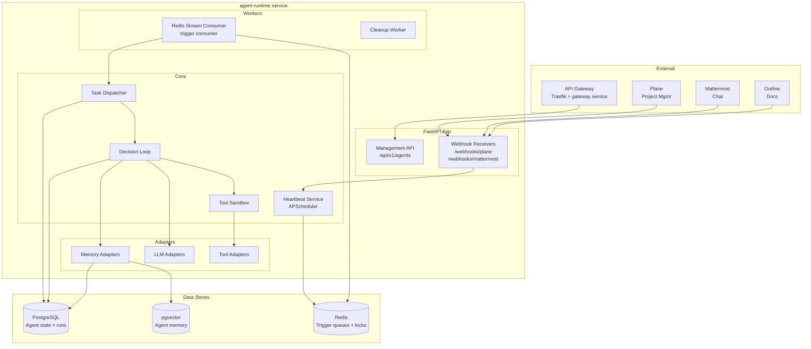

# Agent Runtime Architecture

**Status**: Draft  
**Date**: 2026-04-18  
**Scope**: Python/FastAPI service design, agent process model, concurrency, resource management, sandboxing, and observability

---

## Table of Contents

1. [Service Overview](#service-overview)
2. [Runtime Architecture](#runtime-architecture)
3. [Agent Process Model](#agent-process-model)
4. [Concurrency Model](#concurrency-model)
5. [Resource Management](#resource-management)
6. [Agent Sandbox](#agent-sandbox)
7. [Logging and Observability](#logging-and-observability)
8. [API Reference](#api-reference)
9. [Deployment](#deployment)
10. [Design Decisions](#design-decisions)

---

## Service Overview

The agent-runtime is the core orchestration service. It is responsible for:

1. Receiving and routing triggers to agents
2. Executing agent decision loops
3. Enforcing budgets and resource limits
4. Persisting agent state and run history
5. Exposing a management API for the gateway and web UI

It is a single Python service built on FastAPI with async/await throughout. It does not manage the external tools (Plane, Mattermost, etc.) — those are accessed through the integrations service.

```
services/
  agent-runtime/
    app/
      main.py               # FastAPI application factory
      api/
        agents.py           # Agent CRUD and lifecycle endpoints
        runs.py             # Run history and status endpoints
        triggers.py         # Manual trigger endpoint
        webhooks.py         # Platform webhook receivers
      core/
        loop.py             # Decision loop (see agent-framework.md)
        lifecycle.py        # State machine (see agent-framework.md)
        heartbeat.py        # Heartbeat service
        dispatcher.py       # Task dispatcher
        sandbox.py          # Tool execution sandbox
      adapters/
        llm/                # LLM adapters (see llm-adapters.md)
        tools/              # Tool implementations (see agent-tools.md)
        memory/             # Vector store and DB adapters
      models/               # SQLAlchemy ORM models
      repositories/         # DB access layer
      services/
        budget.py           # Budget tracking service
        memory.py           # Memory service
        org_hierarchy.py    # Org hierarchy engine
      workers/
        trigger_consumer.py # Redis Streams consumer
        cleanup.py          # Stale run GC
    tests/
    Dockerfile
    pyproject.toml
```

---

## Runtime Architecture



### Application Bootstrap

```python
# app/main.py

from contextlib import asynccontextmanager
from fastapi import FastAPI
import asyncpg
import redis.asyncio as redis
from apscheduler.schedulers.asyncio import AsyncIOScheduler

from app.api import agents, runs, triggers, webhooks
from app.workers.trigger_consumer import TriggerConsumer
from app.core.heartbeat import HeartbeatService
from app.core.dispatcher import TaskDispatcher
from app.adapters.memory.pgvector import PgVectorStore


@asynccontextmanager
async def lifespan(app: FastAPI):
    # Startup
    db_pool = await asyncpg.create_pool(dsn=settings.DATABASE_URL, min_size=5, max_size=20)
    redis_client = redis.from_url(settings.REDIS_URL, decode_responses=True)
    vector_store = PgVectorStore(db_pool)
    scheduler = AsyncIOScheduler(timezone="UTC")

    dispatcher = TaskDispatcher(db_pool=db_pool, redis=redis_client)
    heartbeat_svc = HeartbeatService(
        agent_repo=AgentRepository(db_pool),
        trigger_queue=RedisTriggerQueue(redis_client),
        scheduler=scheduler,
    )

    consumer = TriggerConsumer(
        redis=redis_client,
        dispatcher=dispatcher,
        concurrency=settings.MAX_CONCURRENT_AGENTS,
    )

    scheduler.start()
    await consumer.start()

    app.state.db = db_pool
    app.state.redis = redis_client
    app.state.heartbeat = heartbeat_svc
    app.state.dispatcher = dispatcher

    yield

    # Shutdown
    await consumer.stop()
    scheduler.shutdown()
    await redis_client.aclose()
    await db_pool.close()


def create_app() -> FastAPI:
    app = FastAPI(title="AgentCompany Runtime", version="0.1.0", lifespan=lifespan)
    app.include_router(agents.router, prefix="/api/v1")
    app.include_router(runs.router, prefix="/api/v1")
    app.include_router(triggers.router, prefix="/api/v1")
    app.include_router(webhooks.router, prefix="/webhooks")
    return app


app = create_app()
```

---

## Agent Process Model

Each agent run is an async coroutine — not a separate OS process or thread. This is the key architectural decision that determines all concurrency behavior.

```
Python Process (agent-runtime)
  asyncio Event Loop
    FastAPI Request Handler coroutines
    APScheduler heartbeat coroutines
    TriggerConsumer coroutines
      |- AgentRun coroutine (agent_id=A)
      |- AgentRun coroutine (agent_id=B)
      |- AgentRun coroutine (agent_id=C)
    CleanupWorker coroutine
```

### Why Coroutines?

Agent runs are I/O-bound, not CPU-bound. The dominant operations are:
- Awaiting LLM API responses (network I/O, typically 1–30 seconds)
- Awaiting tool calls to Plane/Mattermost/Outline APIs (network I/O)
- Database reads and writes

Async coroutines handle I/O-bound concurrency with very low overhead. A single Python process can manage dozens of concurrent agent runs without the overhead of process spawning or thread management.

### Execution Lock

An agent cannot run two decision loops simultaneously. Before starting a run, the dispatcher acquires a distributed lock in Redis.

```python
# core/dispatcher.py

import asyncio
from contextlib import asynccontextmanager


class TaskDispatcher:
    LOCK_TTL_SECONDS = 600  # max run duration + buffer

    def __init__(self, db_pool, redis):
        self._db = db_pool
        self._redis = redis

    async def dispatch(self, trigger: dict) -> None:
        agent_id = trigger["agent_id"]
        lock_key = f"agent_run_lock:{agent_id}"

        acquired = await self._redis.set(
            lock_key, trigger["trigger_id"], nx=True, ex=self.LOCK_TTL_SECONDS
        )
        if not acquired:
            # Agent already running — requeue the trigger to try again shortly
            await asyncio.sleep(5)
            await self._requeue(trigger)
            return

        try:
            await self._execute_run(agent_id, trigger)
        finally:
            await self._redis.delete(lock_key)

    async def _execute_run(self, agent_id: str, trigger: dict) -> None:
        agent = await self._load_agent(agent_id)
        context = self._build_context(trigger)
        loop = self._build_loop(agent)
        result = await loop.run(agent, context)
        await self._persist_result(result)
```

---

## Concurrency Model

### Concurrency Limits

There are three levels of concurrency control:

| Level | Limit | Enforcement |
|---|---|---|
| Per-agent | 1 concurrent run | Redis distributed lock |
| Per-company | Configurable (default: 10) | Semaphore in dispatcher |
| System-wide | Configurable (default: 50) | Semaphore in trigger consumer |

### Trigger Consumer

The trigger consumer pulls from Redis Streams and dispatches agent runs. It uses an asyncio Semaphore to cap system-wide concurrency.

```python
# workers/trigger_consumer.py

import asyncio
import logging
from typing import Optional

logger = logging.getLogger(__name__)


class TriggerConsumer:
    STREAM_KEY_PATTERN = "triggers:{agent_id}"
    GLOBAL_STREAM = "triggers:all"
    CONSUMER_GROUP = "agent-runtime"
    BATCH_SIZE = 10
    BLOCK_MS = 5000   # block for 5s waiting for messages

    def __init__(self, redis, dispatcher, concurrency: int = 50):
        self._redis = redis
        self._dispatcher = dispatcher
        self._semaphore = asyncio.Semaphore(concurrency)
        self._running = False
        self._task: Optional[asyncio.Task] = None

    async def start(self) -> None:
        await self._ensure_consumer_group()
        self._running = True
        self._task = asyncio.create_task(self._consume_loop())
        logger.info("TriggerConsumer started")

    async def stop(self) -> None:
        self._running = False
        if self._task:
            self._task.cancel()
            try:
                await self._task
            except asyncio.CancelledError:
                pass
        logger.info("TriggerConsumer stopped")

    async def _consume_loop(self) -> None:
        while self._running:
            try:
                messages = await self._redis.xreadgroup(
                    groupname=self.CONSUMER_GROUP,
                    consumername="runtime-0",
                    streams={self.GLOBAL_STREAM: ">"},
                    count=self.BATCH_SIZE,
                    block=self.BLOCK_MS,
                )
                if not messages:
                    continue

                for _stream, entries in messages:
                    for msg_id, data in entries:
                        asyncio.create_task(self._handle_message(msg_id, data))

            except asyncio.CancelledError:
                break
            except Exception as e:
                logger.exception("Error in consume loop: %s", e)
                await asyncio.sleep(1)

    async def _handle_message(self, msg_id: str, data: dict) -> None:
        async with self._semaphore:
            try:
                trigger = self._deserialize(data)
                await self._dispatcher.dispatch(trigger)
                await self._redis.xack(self.GLOBAL_STREAM, self.CONSUMER_GROUP, msg_id)
            except Exception as e:
                logger.exception("Failed to dispatch trigger %s: %s", msg_id, e)
                await self._move_to_dlq(msg_id, data, str(e))
```

### Backpressure

If the trigger queue depth grows beyond a threshold, the consumer slows down by reducing `BATCH_SIZE` and adding delay. This prevents memory exhaustion when many agents are triggered simultaneously.

---

## Resource Management

### CPU and Memory

Agent coroutines are I/O bound, so CPU management is not a primary concern. However:

- The `CodeTool` (for developer agents) can execute arbitrary code. This runs in an isolated subprocess via Docker-in-Docker or a sandbox container, not as a coroutine.
- If CPU-bound workloads emerge (e.g., local model inference), they run in a `ProcessPoolExecutor` to avoid blocking the event loop.

### API Rate Limits

External LLM providers enforce rate limits. These are managed at the LLM adapter layer (see `llm-adapters.md`). The runtime adds a token bucket at the company level:

```python
# services/budget.py

import time
from dataclasses import dataclass


@dataclass
class BudgetCheckResult:
    allowed: bool
    reason: str
    remaining_tokens_today: int
    remaining_tokens_month: int


class BudgetService:
    def __init__(self, db_pool, redis):
        self._db = db_pool
        self._redis = redis

    async def check(self, agent_id: str, estimated_tokens: int = 500) -> BudgetCheckResult:
        agent = await self._get_agent_budget(agent_id)
        used_today = await self._get_daily_usage(agent_id)
        used_month = await self._get_monthly_usage(agent_id)

        if used_today + estimated_tokens > agent.token_budget_daily:
            return BudgetCheckResult(
                allowed=False,
                reason="daily_budget_exceeded",
                remaining_tokens_today=max(0, agent.token_budget_daily - used_today),
                remaining_tokens_month=max(0, agent.token_budget_monthly - used_month),
            )

        if used_month + estimated_tokens > agent.token_budget_monthly:
            return BudgetCheckResult(
                allowed=False,
                reason="monthly_budget_exceeded",
                remaining_tokens_today=max(0, agent.token_budget_daily - used_today),
                remaining_tokens_month=max(0, agent.token_budget_monthly - used_month),
            )

        # Check company-wide budget
        company_check = await self._check_company_budget(agent.company_id, estimated_tokens)
        if not company_check.allowed:
            return company_check

        return BudgetCheckResult(
            allowed=True,
            reason="ok",
            remaining_tokens_today=agent.token_budget_daily - used_today,
            remaining_tokens_month=agent.token_budget_monthly - used_month,
        )

    async def record_usage(self, agent_id: str, tokens_used: int) -> None:
        # Atomic increment in Redis for fast in-memory tracking
        today_key = f"budget:agent:{agent_id}:daily:{self._today()}"
        month_key = f"budget:agent:{agent_id}:monthly:{self._month()}"
        await self._redis.incrby(today_key, tokens_used)
        await self._redis.incrby(month_key, tokens_used)
        await self._redis.expire(today_key, 86400 * 2)    # 2 days TTL
        await self._redis.expire(month_key, 86400 * 35)   # 35 days TTL

        # Async flush to DB for durable reporting
        await self._flush_usage_to_db(agent_id, tokens_used)

    async def _get_daily_usage(self, agent_id: str) -> int:
        key = f"budget:agent:{agent_id}:daily:{self._today()}"
        val = await self._redis.get(key)
        return int(val or 0)

    def _today(self) -> str:
        return time.strftime("%Y-%m-%d")

    def _month(self) -> str:
        return time.strftime("%Y-%m")
```

### Memory Usage per Run

Each agent run allocates a context window (up to 200k tokens for Claude). To prevent OOM:
- Maximum context size is enforced before LLM calls (see `llm-adapters.md`)
- Runs that exceed `max_run_seconds` are cancelled by the dispatcher watchdog
- A stale run cleanup worker terminates runs that lost their lock due to crashes

---

## Agent Sandbox

The sandbox defines what agents can and cannot do. The goal is least-privilege: agents can only access the systems and data relevant to their role.

### Tool Access Control

Tool permissions are checked before every tool call. The agent config specifies `allowed_tools`. The sandbox layer enforces this regardless of what the LLM requests.

```python
# core/sandbox.py

from dataclasses import dataclass
from typing import Any
import logging

logger = logging.getLogger(__name__)


@dataclass
class ToolResult:
    tool_name: str
    tool_call_id: str
    output: str
    success: bool
    error: Optional[str] = None


class ToolSandbox:
    """
    Enforces tool permissions and wraps tool execution with
    input validation, output sanitization, and audit logging.
    """

    def __init__(self, tool_registry, audit_logger):
        self._registry = tool_registry
        self._audit = audit_logger

    async def execute(self, agent: "Agent", tool_name: str, arguments: dict) -> ToolResult:
        # 1. Permission check
        if tool_name not in agent.capabilities.allowed_tools:
            logger.warning(
                "Agent %s attempted to use forbidden tool %s",
                agent.agent_id, tool_name,
            )
            return ToolResult(
                tool_name=tool_name,
                tool_call_id=arguments.get("_call_id", ""),
                output="Error: You do not have permission to use this tool.",
                success=False,
                error="permission_denied",
            )

        # 2. Load tool
        tool = self._registry.get(tool_name)
        if not tool:
            return ToolResult(
                tool_name=tool_name,
                tool_call_id=arguments.get("_call_id", ""),
                output=f"Error: Tool {tool_name} not found.",
                success=False,
                error="tool_not_found",
            )

        # 3. Validate input
        try:
            validated_args = tool.input_schema.model_validate(arguments)
        except Exception as e:
            return ToolResult(
                tool_name=tool_name,
                tool_call_id=arguments.get("_call_id", ""),
                output=f"Error: Invalid tool arguments: {e}",
                success=False,
                error="invalid_arguments",
            )

        # 4. Execute with timeout
        try:
            output = await asyncio.wait_for(
                tool.execute(agent=agent, **validated_args.model_dump()),
                timeout=tool.timeout_seconds,
            )
        except asyncio.TimeoutError:
            return ToolResult(
                tool_name=tool_name,
                tool_call_id=arguments.get("_call_id", ""),
                output=f"Error: Tool {tool_name} timed out after {tool.timeout_seconds}s.",
                success=False,
                error="timeout",
            )
        except Exception as e:
            logger.exception("Tool %s raised an exception: %s", tool_name, e)
            return ToolResult(
                tool_name=tool_name,
                tool_call_id=arguments.get("_call_id", ""),
                output=f"Error: Tool execution failed: {type(e).__name__}",
                success=False,
                error="execution_error",
            )

        # 5. Audit log
        await self._audit.log_tool_call(
            agent_id=agent.agent_id,
            tool_name=tool_name,
            arguments=arguments,
            output_summary=str(output)[:500],
            success=True,
        )

        return ToolResult(
            tool_name=tool_name,
            tool_call_id=arguments.get("_call_id", ""),
            output=str(output),
            success=True,
        )
```

### Sandbox Restrictions by Role

| Capability | Developer | PM | CTO | CEO | CFO |
|---|---|---|---|---|---|
| Read tasks | Yes | Yes | Yes | Yes | Yes |
| Create tasks | Yes | Yes | Yes | Yes | No |
| Assign tasks to others | No | Yes | Yes | Yes | No |
| Write documents | Yes | Yes | Yes | Yes | Yes |
| Send chat messages | Yes | Yes | Yes | Yes | Yes |
| Execute code | Yes | No | No | No | No |
| Query analytics | No | No | No | Yes | Yes |
| Spawn new agents | No | No | No | Yes | No |
| Approve budget | No | No | No | Yes | Yes |

This table is enforced by the `AgentCapabilities` config. Individual agents within a role can be further restricted by their specific config.

### Code Execution Sandbox

The `CodeTool` (Developer agents only) executes code in complete isolation:

```
Developer Agent -> CodeTool.execute(code) -> Docker subprocess
                                              - No network access
                                              - Tmpfs only (no persistent disk)
                                              - CPU: 0.5 cores max
                                              - Memory: 256MB max
                                              - Timeout: 30 seconds
                                              - Non-root user
```

The Docker container is pulled from a trusted base image and is not permitted to spawn further containers.

---

## Logging and Observability

### Structured Logging

All log output is structured JSON, suitable for ingestion by Loki, Elasticsearch, or any log aggregator.

```python
# app/logging_config.py

import logging
import json
import time
from typing import Any


class StructuredFormatter(logging.Formatter):
    def format(self, record: logging.LogRecord) -> str:
        log_entry = {
            "timestamp": time.strftime("%Y-%m-%dT%H:%M:%SZ", time.gmtime(record.created)),
            "level": record.levelname,
            "logger": record.name,
            "message": record.getMessage(),
            "service": "agent-runtime",
        }
        # Attach context fields added via LoggerAdapter
        for key in ("agent_id", "run_id", "company_id", "trigger_id"):
            if hasattr(record, key):
                log_entry[key] = getattr(record, key)
        if record.exc_info:
            log_entry["exception"] = self.formatException(record.exc_info)
        return json.dumps(log_entry)
```

Every agent run uses a context-enriched logger:

```python
run_logger = logging.LoggerAdapter(
    logger,
    {"agent_id": agent.agent_id, "run_id": context.run_id, "company_id": agent.company_id},
)
run_logger.info("Decision loop starting")
```

### Metrics

Exposed at `/metrics` in Prometheus format via `prometheus-fastapi-instrumentator`.

Key metrics:

| Metric | Type | Description |
|---|---|---|
| `agent_runs_total` | Counter | Runs by agent_id and outcome |
| `agent_run_duration_seconds` | Histogram | Run duration distribution |
| `agent_run_steps` | Histogram | Steps per run |
| `agent_tokens_used_total` | Counter | Tokens by agent_id and model |
| `agent_tool_calls_total` | Counter | Tool calls by tool_name and outcome |
| `trigger_queue_depth` | Gauge | Pending triggers in Redis |
| `agent_budget_remaining_tokens` | Gauge | Remaining daily budget per agent |
| `agent_state_active` | Gauge | Count of agents by state |

### Distributed Tracing

Each agent run creates an OpenTelemetry trace. Tool calls, LLM calls, and DB queries are child spans.

```python
from opentelemetry import trace

tracer = trace.get_tracer("agent-runtime")

async def run_with_trace(agent, context):
    with tracer.start_as_current_span(
        "agent.run",
        attributes={
            "agent.id": agent.agent_id,
            "agent.role": agent.role,
            "run.id": context.run_id,
            "trigger.type": context.trigger.get("type"),
        },
    ) as span:
        result = await loop.run(agent, context)
        span.set_attribute("run.outcome", result.outcome)
        span.set_attribute("run.tokens_used", result.tokens_used)
        span.set_attribute("run.steps", result.steps_taken)
        return result
```

### Run History

Every run is persisted to the `agent_runs` table for querying by the web UI.

```sql
CREATE TABLE agent_runs (
    run_id          TEXT PRIMARY KEY,
    agent_id        TEXT NOT NULL REFERENCES agents(agent_id),
    company_id      TEXT NOT NULL,
    trigger_id      TEXT,
    trigger_type    TEXT,
    state           TEXT NOT NULL,           -- "running" | "completed" | "failed" | "budget_exceeded" | "max_steps"
    steps_taken     INTEGER,
    tokens_used     INTEGER,
    cost_usd        NUMERIC(10, 6),
    started_at      TIMESTAMPTZ NOT NULL DEFAULT NOW(),
    completed_at    TIMESTAMPTZ,
    final_message   TEXT,
    error_message   TEXT,
    metadata        JSONB DEFAULT '{}'
);

CREATE INDEX idx_agent_runs_agent_id ON agent_runs (agent_id, started_at DESC);
CREATE INDEX idx_agent_runs_company_id ON agent_runs (company_id, started_at DESC);
```

---

## API Reference

### Management API

```
POST   /api/v1/agents                     Create agent
GET    /api/v1/agents/{agent_id}          Get agent config and state
PATCH  /api/v1/agents/{agent_id}          Update agent config
DELETE /api/v1/agents/{agent_id}          Terminate agent

POST   /api/v1/agents/{agent_id}/activate    Transition to ACTIVE
POST   /api/v1/agents/{agent_id}/pause       Transition to PAUSED
POST   /api/v1/agents/{agent_id}/resume      Transition PAUSED -> ACTIVE

GET    /api/v1/agents/{agent_id}/runs        List run history
GET    /api/v1/runs/{run_id}                 Get run detail

POST   /api/v1/agents/{agent_id}/trigger     Manually trigger an agent run

GET    /api/v1/companies/{company_id}/budget  Get budget summary
GET    /metrics                               Prometheus metrics
GET    /health                                Health check
```

### Webhook Receivers

```
POST /webhooks/plane        Plane event webhook (HMAC-verified)
POST /webhooks/mattermost   Mattermost outgoing webhook (token-verified)
POST /webhooks/outline      Outline webhook (signature-verified)
```

---

## Deployment

### Dockerfile

```dockerfile
FROM python:3.12-slim AS base
WORKDIR /app
ENV PYTHONDONTWRITEBYTECODE=1
ENV PYTHONUNBUFFERED=1

FROM base AS builder
RUN pip install uv
COPY pyproject.toml uv.lock ./
RUN uv sync --frozen --no-dev

FROM base AS runtime
COPY --from=builder /app/.venv /app/.venv
COPY app/ ./app/
ENV PATH="/app/.venv/bin:$PATH"
EXPOSE 8000
CMD ["uvicorn", "app.main:app", "--host", "0.0.0.0", "--port", "8000", "--workers", "1"]
```

Note: `--workers 1` is intentional. The service uses asyncio for concurrency. Multiple uvicorn workers would each run their own asyncio event loop and trigger consumer, which would require distributed locking coordination. A single worker handles all concurrency via asyncio. Horizontal scaling is done by running multiple instances with a shared Redis and PostgreSQL backend (the distributed lock in Redis handles deduplication).

### Environment Variables

| Variable | Description | Default |
|---|---|---|
| `DATABASE_URL` | PostgreSQL DSN | required |
| `REDIS_URL` | Redis connection URL | required |
| `MAX_CONCURRENT_AGENTS` | System-wide concurrency cap | `50` |
| `ANTHROPIC_API_KEY` | Anthropic API key | required |
| `OPENAI_API_KEY` | OpenAI API key | optional |
| `OLLAMA_BASE_URL` | Ollama endpoint | optional |
| `PLANE_BASE_URL` | Plane API base URL | required |
| `MATTERMOST_BASE_URL` | Mattermost API base URL | required |
| `OUTLINE_BASE_URL` | Outline API base URL | required |
| `WEBHOOK_SECRET_PLANE` | Plane webhook HMAC secret | required |
| `WEBHOOK_SECRET_MATTERMOST` | Mattermost outgoing webhook token | required |
| `OTEL_EXPORTER_OTLP_ENDPOINT` | OpenTelemetry collector URL | optional |
| `LOG_LEVEL` | Log level | `INFO` |

---

## Design Decisions

### Why a single FastAPI service rather than micro-services per agent?

Individual agents are not long-running. They wake, run for seconds or minutes, and sleep. Running each as its own service would require per-agent container orchestration and service mesh complexity that the project does not yet need. A single runtime service handles dozens of agents efficiently via asyncio. When scaling demands require it, horizontal scaling of the runtime service is straightforward.

### Why Redis Streams for the trigger queue?

Redis Streams provide durable delivery, consumer groups, and acknowledgment semantics. If the runtime crashes mid-processing, unacknowledged messages are automatically reassigned. This is simpler than standing up a full message broker (Kafka, RabbitMQ) at this stage. The interface is abstracted, so a migration to Kafka is a single adapter swap.

### Why asyncpg over SQLAlchemy async?

asyncpg provides direct, low-level access to PostgreSQL's async protocol. For a service that runs thousands of DB queries per hour (every LLM turn persists data), the overhead savings of asyncpg over SQLAlchemy async are meaningful. The repository pattern keeps DB access isolated, so if ORM features become necessary later, the switch is localized.

### Why not use Celery?

Celery is designed for distributed task queues across multiple workers. The runtime's concurrency model is asyncio within a single process, not distributed work queues. Celery would add complexity (broker, result backend, worker configuration) without benefit. Redis Streams with a manual consumer loop gives identical semantics with far less operational surface.
