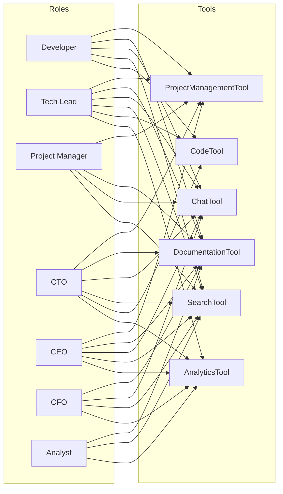

# Agent Tools Architecture

**Status**: Draft  
**Date**: 2026-04-18  
**Scope**: Tool definition schema, built-in tools, permission model, and tool execution sandbox

---

## Table of Contents

1. [Overview](#overview)
2. [Tool Definition Schema](#tool-definition-schema)
3. [Tool Registry](#tool-registry)
4. [Built-In Tools](#built-in-tools)
   - [ProjectManagementTool](#projectmanagementtool)
   - [DocumentationTool](#documentationtool)
   - [ChatTool](#chattool)
   - [SearchTool](#searchtool)
   - [CodeTool](#codetool)
   - [AnalyticsTool](#analyticstool)
5. [Tool Permission Model](#tool-permission-model)
6. [Tool Execution Sandbox](#tool-execution-sandbox)
7. [Adding New Tools](#adding-new-tools)
8. [Design Decisions](#design-decisions)

---

## Overview

Tools are the actions agents take in the world. An agent thinks, then calls a tool, then observes the result and thinks again. Every capability an agent has — creating tasks, writing documents, sending messages — is implemented as a tool.

Tools are:
- **Discoverable**: The LLM receives a list of tool definitions in each request, so it knows what it can do.
- **Permission-controlled**: The sandbox checks permissions before every call.
- **Typed**: Inputs are validated with Pydantic. The LLM cannot pass malformed arguments.
- **Audited**: Every tool call is logged with the agent, arguments (sanitized), and result.

Tools live at `services/agent-runtime/app/adapters/tools/`.

---

## Tool Definition Schema

```python
# adapters/tools/base.py

from abc import ABC, abstractmethod
from dataclasses import dataclass
from typing import Any, Optional
from pydantic import BaseModel
import logging

logger = logging.getLogger(__name__)


class ToolInputSchema(BaseModel):
    """Base class for tool input schemas. Each tool subclasses this."""
    pass


@dataclass
class ToolMetadata:
    """Static metadata about a tool — used to build the LLM tool definition."""
    name: str
    description: str
    # JSON Schema for LLM tool calling (derived from the input_schema Pydantic model)
    input_schema: dict
    # Which roles can use this tool (empty = all roles)
    allowed_roles: list[str]
    # Maximum time this tool can run before being cancelled
    timeout_seconds: int = 30
    # Whether this tool makes writes (vs. read-only)
    is_write: bool = False


class BaseTool(ABC):
    """Base class for all tools."""

    @property
    @abstractmethod
    def metadata(self) -> ToolMetadata:
        ...

    @property
    @abstractmethod
    def input_schema(self) -> type[ToolInputSchema]:
        ...

    @abstractmethod
    async def execute(self, agent: "Agent", **kwargs) -> str:
        """
        Execute the tool. Returns a string that is fed back to the LLM.
        Raise ToolExecutionError for expected failures (e.g., resource not found).
        Let unexpected exceptions propagate — the sandbox catches them.
        """
        ...

    def to_llm_definition(self) -> "ToolDefinition":
        """Convert to the ToolDefinition format expected by the LLM adapter."""
        from ..llm.base import ToolDefinition
        return ToolDefinition(
            name=self.metadata.name,
            description=self.metadata.description,
            input_schema=self.input_schema.model_json_schema(),
        )


class ToolExecutionError(Exception):
    """Raised when a tool fails for an expected, recoverable reason."""
    pass
```

---

## Tool Registry

```python
# adapters/tools/registry.py

from .base import BaseTool, ToolMetadata
from typing import Optional
from ..llm.base import ToolDefinition


class ToolRegistry:
    def __init__(self):
        self._tools: dict[str, BaseTool] = {}

    def register(self, tool: BaseTool) -> None:
        self._tools[tool.metadata.name] = tool

    def get(self, name: str) -> Optional[BaseTool]:
        return self._tools.get(name)

    def get_tools_for_agent(self, agent: "Agent") -> list[BaseTool]:
        """Return tools this agent is permitted to use."""
        return [
            tool for name, tool in self._tools.items()
            if name in agent.capabilities.allowed_tools
        ]

    def get_llm_definitions_for_agent(self, agent: "Agent") -> list[ToolDefinition]:
        return [t.to_llm_definition() for t in self.get_tools_for_agent(agent)]


def build_tool_registry(
    plane_client,
    outline_client,
    mattermost_client,
    meilisearch_client,
    code_sandbox,
    analytics_client,
) -> ToolRegistry:
    registry = ToolRegistry()
    registry.register(ProjectManagementTool(plane_client))
    registry.register(DocumentationTool(outline_client))
    registry.register(ChatTool(mattermost_client))
    registry.register(SearchTool(meilisearch_client, plane_client, outline_client, mattermost_client))
    registry.register(CodeTool(code_sandbox))
    registry.register(AnalyticsTool(analytics_client))
    return registry
```

---

## Built-In Tools

### ProjectManagementTool

Integrates with Plane. Covers the full project management lifecycle: issues, boards, sprints, and comments.

```python
# adapters/tools/project_management.py

from pydantic import BaseModel, Field
from typing import Optional, Literal
from .base import BaseTool, ToolMetadata, ToolInputSchema, ToolExecutionError


class CreateIssueInput(ToolInputSchema):
    project_id: str = Field(description="The Plane project ID")
    title: str = Field(description="Issue title", max_length=500)
    description: str = Field(default="", description="Issue description in Markdown")
    priority: Literal["urgent", "high", "medium", "low", "none"] = "medium"
    assignee_id: Optional[str] = Field(default=None, description="Platform user ID to assign to")
    label_ids: list[str] = Field(default_factory=list)
    cycle_id: Optional[str] = Field(default=None, description="Sprint/cycle to add to")


class UpdateIssueInput(ToolInputSchema):
    issue_id: str
    title: Optional[str] = None
    description: Optional[str] = None
    state: Optional[str] = None    # "backlog" | "todo" | "in_progress" | "done" | "cancelled"
    priority: Optional[str] = None
    assignee_id: Optional[str] = None


class GetIssueInput(ToolInputSchema):
    issue_id: str


class ListIssuesInput(ToolInputSchema):
    project_id: str
    assignee_id: Optional[str] = None
    state: Optional[str] = None
    limit: int = Field(default=20, le=100)


class AddCommentInput(ToolInputSchema):
    issue_id: str
    comment: str = Field(description="Comment text in Markdown", max_length=5000)


class GetSprintInput(ToolInputSchema):
    project_id: str
    active_only: bool = True


class ProjectManagementTool(BaseTool):
    _ACTIONS = Literal[
        "create_issue", "update_issue", "get_issue", "list_issues",
        "add_comment", "get_sprint", "list_projects"
    ]

    def __init__(self, plane_client):
        self._plane = plane_client

    @property
    def metadata(self) -> ToolMetadata:
        return ToolMetadata(
            name="ProjectManagementTool",
            description=(
                "Interact with the project management system (Plane). "
                "Create and update issues, read sprint status, assign work, and add comments. "
                "Use this to manage tasks, check what is in progress, and coordinate work."
            ),
            input_schema=self.input_schema.model_json_schema(),
            allowed_roles=[],  # All roles — restrictions handled by capabilities config
            timeout_seconds=15,
            is_write=True,
        )

    @property
    def input_schema(self):
        class Input(ToolInputSchema):
            action: str = Field(description=(
                "One of: create_issue, update_issue, get_issue, list_issues, "
                "add_comment, get_sprint, list_projects"
            ))
            # Nested action inputs are passed as flat fields
            project_id: Optional[str] = None
            issue_id: Optional[str] = None
            title: Optional[str] = None
            description: Optional[str] = None
            priority: Optional[str] = None
            assignee_id: Optional[str] = None
            state: Optional[str] = None
            comment: Optional[str] = None
            active_only: bool = True
            limit: int = 20
        return Input

    async def execute(self, agent: "Agent", **kwargs) -> str:
        action = kwargs.get("action")

        if action == "create_issue":
            issue = await self._plane.issues.create(
                project_id=kwargs["project_id"],
                title=kwargs["title"],
                description=kwargs.get("description", ""),
                priority=kwargs.get("priority", "medium"),
                assignee_ids=[kwargs["assignee_id"]] if kwargs.get("assignee_id") else [],
            )
            return f"Created issue: {issue['id']} — {issue['title']} (priority: {issue['priority']})"

        elif action == "update_issue":
            updated = await self._plane.issues.update(
                issue_id=kwargs["issue_id"],
                **{k: v for k, v in kwargs.items() if k not in ("action", "issue_id") and v is not None}
            )
            return f"Updated issue {kwargs['issue_id']}: {updated}"

        elif action == "get_issue":
            issue = await self._plane.issues.get(kwargs["issue_id"])
            if not issue:
                raise ToolExecutionError(f"Issue {kwargs['issue_id']} not found")
            return self._format_issue(issue)

        elif action == "list_issues":
            issues = await self._plane.issues.list(
                project_id=kwargs["project_id"],
                assignee_id=kwargs.get("assignee_id"),
                state=kwargs.get("state"),
                limit=kwargs.get("limit", 20),
            )
            if not issues:
                return "No issues found matching the criteria."
            return "\n".join(self._format_issue(i) for i in issues)

        elif action == "add_comment":
            await self._plane.issue_comments.create(
                issue_id=kwargs["issue_id"],
                comment_html=kwargs["comment"],
            )
            return f"Comment added to issue {kwargs['issue_id']}"

        elif action == "get_sprint":
            cycles = await self._plane.cycles.list(
                project_id=kwargs["project_id"],
                active_only=kwargs.get("active_only", True),
            )
            if not cycles:
                return "No active sprints found."
            return "\n".join(self._format_cycle(c) for c in cycles)

        elif action == "list_projects":
            projects = await self._plane.projects.list()
            return "\n".join(f"- {p['id']}: {p['name']}" for p in projects)

        else:
            raise ToolExecutionError(f"Unknown action: {action}")

    def _format_issue(self, issue: dict) -> str:
        return (
            f"Issue {issue['sequence_id']}: {issue['name']}\n"
            f"  State: {issue.get('state_detail', {}).get('name', 'Unknown')}\n"
            f"  Priority: {issue.get('priority', 'none')}\n"
            f"  Assignee: {issue.get('assignee_detail', {}).get('display_name', 'Unassigned')}\n"
            f"  Description: {(issue.get('description_stripped', '') or '')[:200]}"
        )

    def _format_cycle(self, cycle: dict) -> str:
        return (
            f"Sprint: {cycle['name']}\n"
            f"  Status: {cycle.get('status', 'unknown')}\n"
            f"  Start: {cycle.get('start_date')} End: {cycle.get('end_date')}"
        )
```

### DocumentationTool

Integrates with Outline. Agents can create, edit, and search documents.

```python
# adapters/tools/documentation.py

from pydantic import Field
from .base import BaseTool, ToolMetadata, ToolInputSchema, ToolExecutionError
from typing import Optional


class DocumentationTool(BaseTool):

    def __init__(self, outline_client):
        self._outline = outline_client

    @property
    def metadata(self) -> ToolMetadata:
        return ToolMetadata(
            name="DocumentationTool",
            description=(
                "Create, read, update, and search documents in the company knowledge base (Outline). "
                "Use this to write specs, meeting notes, and reference documents, "
                "or to read existing documentation for context."
            ),
            input_schema=self.input_schema.model_json_schema(),
            allowed_roles=[],
            timeout_seconds=15,
            is_write=True,
        )

    @property
    def input_schema(self):
        class Input(ToolInputSchema):
            action: str = Field(description=(
                "One of: create_document, update_document, get_document, "
                "search_documents, list_collections"
            ))
            document_id: Optional[str] = None
            title: Optional[str] = None
            content: Optional[str] = Field(default=None, description="Document body in Markdown")
            collection_id: Optional[str] = None
            parent_document_id: Optional[str] = None
            query: Optional[str] = None
            limit: int = 10
        return Input

    async def execute(self, agent: "Agent", **kwargs) -> str:
        action = kwargs.get("action")

        if action == "create_document":
            doc = await self._outline.documents.create(
                title=kwargs["title"],
                text=kwargs.get("content", ""),
                collection_id=kwargs.get("collection_id"),
                parent_document_id=kwargs.get("parent_document_id"),
                publish=True,
            )
            return f"Document created: {doc['id']} — {doc['title']}\nURL: {doc.get('url', '')}"

        elif action == "update_document":
            doc = await self._outline.documents.update(
                id=kwargs["document_id"],
                title=kwargs.get("title"),
                text=kwargs.get("content"),
            )
            return f"Document updated: {doc['id']} — {doc['title']}"

        elif action == "get_document":
            doc = await self._outline.documents.info(id=kwargs["document_id"])
            if not doc:
                raise ToolExecutionError(f"Document {kwargs['document_id']} not found")
            return f"Title: {doc['title']}\n\n{doc.get('text', '')}"

        elif action == "search_documents":
            results = await self._outline.documents.search(
                query=kwargs["query"],
                limit=kwargs.get("limit", 10),
            )
            if not results:
                return "No documents found."
            return "\n".join(
                f"- {r['document']['id']}: {r['document']['title']} (score: {r['ranking']:.2f})"
                for r in results
            )

        elif action == "list_collections":
            collections = await self._outline.collections.list()
            return "\n".join(f"- {c['id']}: {c['name']}" for c in collections)

        else:
            raise ToolExecutionError(f"Unknown action: {action}")
```

### ChatTool

Integrates with Mattermost. Agents can send and read messages.

```python
# adapters/tools/chat.py

from pydantic import Field
from .base import BaseTool, ToolMetadata, ToolInputSchema, ToolExecutionError
from typing import Optional


class ChatTool(BaseTool):

    def __init__(self, mattermost_client):
        self._mm = mattermost_client

    @property
    def metadata(self) -> ToolMetadata:
        return ToolMetadata(
            name="ChatTool",
            description=(
                "Send and read messages in the company chat (Mattermost). "
                "Use this to communicate with other agents and humans, share updates, "
                "ask questions in relevant channels, and read recent conversations for context."
            ),
            input_schema=self.input_schema.model_json_schema(),
            allowed_roles=[],
            timeout_seconds=10,
            is_write=True,
        )

    @property
    def input_schema(self):
        class Input(ToolInputSchema):
            action: str = Field(description=(
                "One of: send_message, read_channel, get_thread, "
                "list_channels, search_messages"
            ))
            channel_id: Optional[str] = None
            message: Optional[str] = Field(default=None, max_length=4000, description="Message text (Markdown)")
            root_id: Optional[str] = Field(default=None, description="Parent post ID for threaded replies")
            post_id: Optional[str] = None
            query: Optional[str] = None
            limit: int = 20
        return Input

    async def execute(self, agent: "Agent", **kwargs) -> str:
        action = kwargs.get("action")

        if action == "send_message":
            post = await self._mm.posts.create_post(
                channel_id=kwargs["channel_id"],
                message=kwargs["message"],
                root_id=kwargs.get("root_id"),
            )
            return f"Message sent. Post ID: {post['id']}"

        elif action == "read_channel":
            posts = await self._mm.posts.get_posts_for_channel(
                channel_id=kwargs["channel_id"],
                per_page=kwargs.get("limit", 20),
            )
            order = posts.get("order", [])
            msgs = posts.get("posts", {})
            if not order:
                return "No messages in channel."
            lines = []
            for pid in order[:20]:
                p = msgs.get(pid, {})
                lines.append(f"[{p.get('create_at', '')}] {p.get('user_id', 'unknown')}: {p.get('message', '')[:300]}")
            return "\n".join(lines)

        elif action == "get_thread":
            thread = await self._mm.posts.get_post_thread(post_id=kwargs["post_id"])
            order = thread.get("order", [])
            posts = thread.get("posts", {})
            lines = []
            for pid in order:
                p = posts.get(pid, {})
                lines.append(f"{p.get('user_id', 'unknown')}: {p.get('message', '')[:300]}")
            return "\n".join(lines)

        elif action == "list_channels":
            channels = await self._mm.channels.get_channels_for_user(
                user_id=agent.platform_user_id
            )
            return "\n".join(f"- {c['id']}: {c['display_name']}" for c in channels)

        elif action == "search_messages":
            results = await self._mm.posts.search_posts(
                team_id=agent.metadata.get("mattermost_team_id"),
                terms=kwargs["query"],
                is_or_search=False,
            )
            posts = results.get("posts", {})
            if not posts:
                return "No messages found."
            lines = [
                f"[{p.get('create_at', '')}] Channel {p.get('channel_id', '')}: {p.get('message', '')[:300]}"
                for p in list(posts.values())[:10]
            ]
            return "\n".join(lines)

        else:
            raise ToolExecutionError(f"Unknown action: {action}")
```

### SearchTool

Unified search across all integrated tools using Meilisearch.

```python
# adapters/tools/search.py

from pydantic import Field
from .base import BaseTool, ToolMetadata, ToolInputSchema
from typing import Optional, Literal


class SearchTool(BaseTool):

    def __init__(self, meilisearch_client, plane_client, outline_client, mattermost_client):
        self._search = meilisearch_client
        self._plane = plane_client
        self._outline = outline_client
        self._mm = mattermost_client

    @property
    def metadata(self) -> ToolMetadata:
        return ToolMetadata(
            name="SearchTool",
            description=(
                "Search across all company systems: tasks, documents, and messages. "
                "Use this as the first step when you need context before taking action. "
                "Supports filtering by source system."
            ),
            input_schema=self.input_schema.model_json_schema(),
            allowed_roles=[],
            timeout_seconds=10,
            is_write=False,
        )

    @property
    def input_schema(self):
        class Input(ToolInputSchema):
            query: str = Field(description="Search query text")
            sources: list[str] = Field(
                default_factory=lambda: ["tasks", "documents", "messages"],
                description="Which sources to search: tasks, documents, messages"
            )
            limit: int = Field(default=10, le=50)
        return Input

    async def execute(self, agent: "Agent", **kwargs) -> str:
        query = kwargs["query"]
        sources = kwargs.get("sources", ["tasks", "documents", "messages"])
        limit = kwargs.get("limit", 10)

        results = []

        if "tasks" in sources:
            hits = await self._search.index("plane_issues").search(
                query, limit=limit
            )
            for h in hits.get("hits", []):
                results.append(
                    f"[TASK] {h.get('sequence_id', '')}: {h.get('name', '')} "
                    f"(state: {h.get('state', '')})"
                )

        if "documents" in sources:
            hits = await self._search.index("outline_documents").search(
                query, limit=limit
            )
            for h in hits.get("hits", []):
                results.append(
                    f"[DOC] {h.get('id', '')}: {h.get('title', '')} "
                    f"— {h.get('text', '')[:150]}..."
                )

        if "messages" in sources:
            hits = await self._search.index("mattermost_posts").search(
                query, limit=limit
            )
            for h in hits.get("hits", []):
                results.append(
                    f"[CHAT] #{h.get('channel_name', '')} "
                    f"@{h.get('username', '')}: {h.get('message', '')[:200]}"
                )

        if not results:
            return f"No results found for '{query}'."

        return f"Search results for '{query}':\n" + "\n".join(results[:limit])
```

### CodeTool

For Developer agents. Executes code in a sandboxed container.

```python
# adapters/tools/code.py

import asyncio
import uuid
import logging
from pydantic import Field
from .base import BaseTool, ToolMetadata, ToolInputSchema, ToolExecutionError
from typing import Optional, Literal

logger = logging.getLogger(__name__)


class CodeTool(BaseTool):
    """
    Allows Developer agents to read/write files and execute code.
    All code execution happens in an isolated Docker container.
    File I/O operates within a per-session workspace directory.
    """

    ALLOWED_ROLES = ["developer", "tech_lead", "cto"]

    def __init__(self, code_sandbox):
        self._sandbox = code_sandbox

    @property
    def metadata(self) -> ToolMetadata:
        return ToolMetadata(
            name="CodeTool",
            description=(
                "Read and write files, and execute code in a sandboxed environment. "
                "Use for development tasks: writing code, running tests, reading files. "
                "ONLY available to developer and tech lead roles."
            ),
            input_schema=self.input_schema.model_json_schema(),
            allowed_roles=self.ALLOWED_ROLES,
            timeout_seconds=60,
            is_write=True,
        )

    @property
    def input_schema(self):
        class Input(ToolInputSchema):
            action: str = Field(description=(
                "One of: read_file, write_file, execute_code, list_directory, run_tests"
            ))
            path: Optional[str] = Field(default=None, description="File path within workspace")
            content: Optional[str] = Field(default=None, description="File content to write")
            code: Optional[str] = Field(default=None, description="Code to execute")
            language: Optional[str] = Field(default="python", description="python, bash, javascript")
        return Input

    async def execute(self, agent: "Agent", **kwargs) -> str:
        action = kwargs.get("action")
        workspace_id = agent.metadata.get("code_workspace_id") or agent.agent_id

        if action == "read_file":
            content = await self._sandbox.read_file(workspace_id, kwargs["path"])
            if content is None:
                raise ToolExecutionError(f"File not found: {kwargs['path']}")
            return f"Contents of {kwargs['path']}:\n```\n{content}\n```"

        elif action == "write_file":
            await self._sandbox.write_file(workspace_id, kwargs["path"], kwargs["content"])
            return f"File written: {kwargs['path']}"

        elif action == "execute_code":
            result = await self._sandbox.execute(
                workspace_id=workspace_id,
                code=kwargs["code"],
                language=kwargs.get("language", "python"),
            )
            output = f"Exit code: {result.exit_code}\n"
            if result.stdout:
                output += f"Stdout:\n{result.stdout[:3000]}\n"
            if result.stderr:
                output += f"Stderr:\n{result.stderr[:1000]}\n"
            return output

        elif action == "list_directory":
            path = kwargs.get("path", ".")
            entries = await self._sandbox.list_directory(workspace_id, path)
            return "\n".join(entries)

        elif action == "run_tests":
            result = await self._sandbox.execute(
                workspace_id=workspace_id,
                code="python -m pytest --tb=short -q 2>&1 | tail -50",
                language="bash",
            )
            return f"Test output:\n{result.stdout[:3000]}"

        else:
            raise ToolExecutionError(f"Unknown action: {action}")
```

### AnalyticsTool

For CFO and analyst agents. Queries metrics and generates cost/productivity reports.

```python
# adapters/tools/analytics.py

from pydantic import Field
from .base import BaseTool, ToolMetadata, ToolInputSchema, ToolExecutionError
from typing import Optional
import json


class AnalyticsTool(BaseTool):
    ALLOWED_ROLES = ["cfo", "analyst", "ceo", "cto"]

    def __init__(self, analytics_client):
        self._analytics = analytics_client

    @property
    def metadata(self) -> ToolMetadata:
        return ToolMetadata(
            name="AnalyticsTool",
            description=(
                "Query company metrics, generate reports, and analyze trends. "
                "Access token usage, cost breakdowns, agent productivity, and task completion rates. "
                "Only available to executive and analyst roles."
            ),
            input_schema=self.input_schema.model_json_schema(),
            allowed_roles=self.ALLOWED_ROLES,
            timeout_seconds=30,
            is_write=False,
        )

    @property
    def input_schema(self):
        class Input(ToolInputSchema):
            action: str = Field(description=(
                "One of: get_token_usage, get_cost_report, get_agent_activity, "
                "get_task_completion_rate, get_company_summary"
            ))
            start_date: Optional[str] = Field(default=None, description="ISO date, e.g. 2026-04-01")
            end_date: Optional[str] = Field(default=None, description="ISO date, e.g. 2026-04-18")
            agent_id: Optional[str] = None
            group_by: Optional[str] = Field(default="day", description="day | week | month | agent | role")
        return Input

    async def execute(self, agent: "Agent", **kwargs) -> str:
        action = kwargs.get("action")
        company_id = agent.company_id

        if action == "get_token_usage":
            data = await self._analytics.token_usage(
                company_id=company_id,
                start_date=kwargs.get("start_date"),
                end_date=kwargs.get("end_date"),
                agent_id=kwargs.get("agent_id"),
                group_by=kwargs.get("group_by", "day"),
            )
            return self._format_table(data, title="Token Usage")

        elif action == "get_cost_report":
            data = await self._analytics.cost_report(
                company_id=company_id,
                start_date=kwargs.get("start_date"),
                end_date=kwargs.get("end_date"),
                group_by=kwargs.get("group_by", "agent"),
            )
            return self._format_table(data, title="Cost Report (USD)")

        elif action == "get_agent_activity":
            data = await self._analytics.agent_activity(
                company_id=company_id,
                start_date=kwargs.get("start_date"),
                end_date=kwargs.get("end_date"),
            )
            return self._format_table(data, title="Agent Activity")

        elif action == "get_task_completion_rate":
            data = await self._analytics.task_completion_rate(
                company_id=company_id,
                start_date=kwargs.get("start_date"),
                end_date=kwargs.get("end_date"),
            )
            return json.dumps(data, indent=2)

        elif action == "get_company_summary":
            data = await self._analytics.company_summary(company_id=company_id)
            return json.dumps(data, indent=2)

        else:
            raise ToolExecutionError(f"Unknown action: {action}")

    def _format_table(self, rows: list[dict], title: str) -> str:
        if not rows:
            return f"{title}: No data."
        headers = list(rows[0].keys())
        lines = [title, "-" * 40]
        lines.append(" | ".join(headers))
        lines.append("-" * 40)
        for row in rows[:50]:
            lines.append(" | ".join(str(row.get(h, "")) for h in headers))
        return "\n".join(lines)
```

---

## Tool Permission Model

Permissions are enforced at two levels:

### Level 1: Role-Level Permissions (Static)

The tool's `allowed_roles` field defines which roles can access the tool at all. If a Developer agent tries to call `AnalyticsTool`, the sandbox rejects it because `developer` is not in `AnalyticsTool.ALLOWED_ROLES`.

### Level 2: Agent-Level Permissions (Dynamic)

The `AgentCapabilities.allowed_tools` list specifies which tools the specific agent can use. This allows further restriction within a role — e.g., a junior developer who should not use `CodeTool` with `execute_code` action.

### Permission Matrix



---

## Tool Execution Sandbox

The `ToolSandbox` (described in `agent-runtime.md`) wraps all tool calls with:

1. Permission check (role and agent level)
2. Input validation via Pydantic
3. Timeout enforcement
4. Output truncation (protect context window from enormous outputs)
5. Audit logging

### Output Truncation

Large tool outputs (e.g., a 500-issue list, a 10,000-line file) would fill the context window and increase costs. The sandbox truncates outputs that exceed a configurable limit.

```python
MAX_TOOL_OUTPUT_CHARS = 8_000

async def execute(self, agent, tool_name, arguments):
    result = await tool.execute(agent=agent, **validated_args)
    output = str(result)
    if len(output) > MAX_TOOL_OUTPUT_CHARS:
        truncated = output[:MAX_TOOL_OUTPUT_CHARS]
        output = truncated + f"\n\n[Output truncated. {len(output) - MAX_TOOL_OUTPUT_CHARS} characters omitted.]"
    return output
```

### Code Sandbox Container

The `CodeTool` delegates to a `CodeSandbox` class that manages Docker containers.

```python
# adapters/tools/code_sandbox.py

import asyncio
import tempfile
import os
from dataclasses import dataclass


@dataclass
class ExecutionResult:
    exit_code: int
    stdout: str
    stderr: str
    timed_out: bool = False


class DockerCodeSandbox:
    SANDBOX_IMAGE = "agentcompany/code-sandbox:latest"
    CPU_QUOTA = "50000"       # 50% of one CPU
    MEMORY_LIMIT = "256m"
    TIMEOUT_SECONDS = 30

    async def execute(self, workspace_id: str, code: str, language: str = "python") -> ExecutionResult:
        cmd = self._build_command(language, code)
        docker_cmd = [
            "docker", "run",
            "--rm",
            "--network=none",                          # No network access
            "--memory", self.MEMORY_LIMIT,
            "--cpu-quota", self.CPU_QUOTA,
            "--cpu-period", "100000",
            "--pids-limit", "64",                      # Prevent fork bombs
            "--read-only",                             # Read-only root filesystem
            "--tmpfs", "/tmp:rw,noexec,nosuid,size=64m",
            "--user", "1000:1000",                     # Non-root
            "-v", f"{self._workspace_path(workspace_id)}:/workspace:rw",
            "--workdir", "/workspace",
            self.SANDBOX_IMAGE,
        ] + cmd

        try:
            proc = await asyncio.create_subprocess_exec(
                *docker_cmd,
                stdout=asyncio.subprocess.PIPE,
                stderr=asyncio.subprocess.PIPE,
            )
            stdout, stderr = await asyncio.wait_for(
                proc.communicate(),
                timeout=self.TIMEOUT_SECONDS,
            )
            return ExecutionResult(
                exit_code=proc.returncode,
                stdout=stdout.decode(errors="replace")[:10_000],
                stderr=stderr.decode(errors="replace")[:2_000],
            )
        except asyncio.TimeoutError:
            proc.kill()
            return ExecutionResult(exit_code=-1, stdout="", stderr="Execution timed out.", timed_out=True)

    def _build_command(self, language: str, code: str) -> list[str]:
        if language == "python":
            return ["python3", "-c", code]
        elif language == "bash":
            return ["bash", "-c", code]
        elif language == "javascript":
            return ["node", "-e", code]
        else:
            raise ValueError(f"Unsupported language: {language}")

    def _workspace_path(self, workspace_id: str) -> str:
        base = os.environ.get("WORKSPACE_BASE_DIR", "/tmp/workspaces")
        return os.path.join(base, workspace_id)
```

---

## Adding New Tools

To add a new tool:

1. Create `adapters/tools/my_tool.py` extending `BaseTool`.
2. Define an `input_schema` Pydantic model with field descriptions.
3. Implement `execute()` — return a string for the LLM.
4. Register in `build_tool_registry()`.
5. Add to the `allowed_tools` list of relevant agent configs.
6. Write unit tests mocking the external client.

The tool definition (name, description, input schema) is automatically exposed to the LLM. No changes to the decision loop or LLM adapter are needed.

---

## Design Decisions

### Why a single `action` parameter rather than one tool per action?

LLMs have a limited number of tools they process well. At around 10+ tools, some models degrade in tool selection accuracy. Grouping related actions under one tool (e.g., `ProjectManagementTool` with an `action` parameter) keeps the tool list short while exposing full functionality via the description and schema.

### Why Pydantic for input validation?

The LLM generates tool call arguments as JSON. JSON from an LLM can contain type errors, missing fields, and invalid values. Pydantic validates this before the tool runs. The model sees a clear error message (the Pydantic validation error string) and can self-correct on the next turn. Without validation, a type error in a tool call could cause a Python exception deep in the tool implementation, producing an unhelpful traceback as the tool output.

### Why truncate tool outputs?

An agent that searches for "all issues" might receive thousands of characters. This bloats the context window, increases costs, and may cause the LLM to focus on irrelevant middle content. Truncation at the sandbox level is a consistent, tool-agnostic safety net. Individual tools should prefer paginated or limited responses, but the truncation ensures even poorly-designed queries do not cause problems.

### Why no direct DB access from tools?

Tools communicate with external systems through their respective API clients (Plane, Outline, Mattermost). They do not have direct DB access. This enforces the principle that agents interact with the same systems humans do — not through back channels. It also means all agent actions are visible in the external tools' audit logs.
