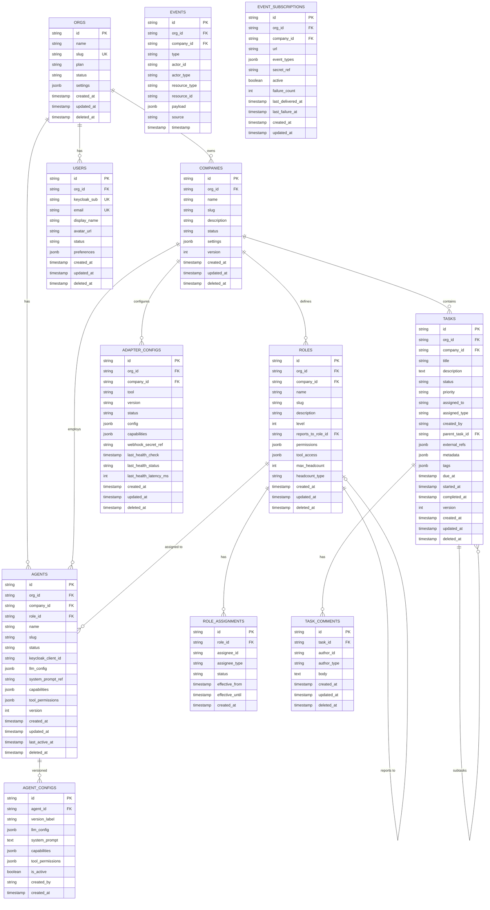

# AgentCompany — Data Model

**Version**: 1.0.0
**Date**: 2026-04-18
**Status**: Authoritative Design Document
**Database**: PostgreSQL 16

---

## 1. Design Principles

- **ULID primary keys** throughout. ULIDs are sortable, URL-safe, and collision-resistant. Format: `{entity_prefix}_{ulid}` (e.g., `cmp_01HXK2J3M4N5P6Q7R8S9T0UVWX`).
- **Soft deletes** on all business entities. Records are never hard-deleted unless legally required. `deleted_at IS NULL` is included in all default queries via row-level security or application-layer filtering.
- **Audit trail is immutable**. The `audit_log` table is append-only and has no `UPDATE` or `DELETE` permissions granted.
- **JSON columns for extension**. Frequently-varying config and metadata are stored as `JSONB` rather than creating schema migrations for every new field.
- **Optimistic concurrency** via `version` integer column. All `UPDATE` statements must include `WHERE version = :expected_version`.
- **Multi-tenancy via `org_id`**. Every row that belongs to a tenant carries `org_id`. Postgres Row-Level Security policies enforce tenant isolation.

---

## 2. Database Layout

```
PostgreSQL 16
├── Database: agentcompany
│   ├── Schema: public          (core platform tables)
│   ├── Schema: audit           (immutable audit log)
│   └── Schema: metrics         (time-series token usage)
│
├── Database: keycloak           (managed by Keycloak)
├── Database: plane              (managed by Plane)
├── Database: outline            (managed by Outline)
└── Database: mattermost         (managed by Mattermost)
```

Each application has its own database. AgentCompany never writes directly to Plane, Outline, or Mattermost databases — it interacts only through their REST APIs.

---

## 3. Core Schema: Entity-Relationship Diagram



---

## 4. Table Definitions

### 4.1 `public.orgs`

Top-level tenant. One org can have many companies.

```sql
CREATE TABLE public.orgs (
    id          TEXT PRIMARY KEY,           -- 'org_' + ULID
    name        TEXT NOT NULL,
    slug        TEXT NOT NULL UNIQUE,
    plan        TEXT NOT NULL DEFAULT 'free',  -- 'free', 'team', 'enterprise'
    status      TEXT NOT NULL DEFAULT 'active',
    settings    JSONB NOT NULL DEFAULT '{}',
    created_at  TIMESTAMPTZ NOT NULL DEFAULT now(),
    updated_at  TIMESTAMPTZ NOT NULL DEFAULT now(),
    deleted_at  TIMESTAMPTZ
);

CREATE INDEX idx_orgs_slug ON public.orgs (slug) WHERE deleted_at IS NULL;
```

### 4.2 `public.companies`

A virtual AI-powered company within an org.

```sql
CREATE TABLE public.companies (
    id          TEXT PRIMARY KEY,           -- 'cmp_' + ULID
    org_id      TEXT NOT NULL REFERENCES public.orgs(id),
    name        TEXT NOT NULL,
    slug        TEXT NOT NULL,
    description TEXT,
    status      TEXT NOT NULL DEFAULT 'provisioning',
    settings    JSONB NOT NULL DEFAULT '{}',
    version     INTEGER NOT NULL DEFAULT 1,
    created_at  TIMESTAMPTZ NOT NULL DEFAULT now(),
    updated_at  TIMESTAMPTZ NOT NULL DEFAULT now(),
    deleted_at  TIMESTAMPTZ,
    UNIQUE (org_id, slug)
);

CREATE INDEX idx_companies_org_id ON public.companies (org_id) WHERE deleted_at IS NULL;
```

### 4.3 `public.users`

Human participants. Keycloak is the system of record; this table caches profile data.

```sql
CREATE TABLE public.users (
    id              TEXT PRIMARY KEY,       -- 'usr_' + ULID
    org_id          TEXT NOT NULL REFERENCES public.orgs(id),
    keycloak_sub    TEXT NOT NULL UNIQUE,   -- Keycloak subject claim
    email           TEXT NOT NULL UNIQUE,
    display_name    TEXT NOT NULL,
    avatar_url      TEXT,
    status          TEXT NOT NULL DEFAULT 'active',
    preferences     JSONB NOT NULL DEFAULT '{}',
    created_at      TIMESTAMPTZ NOT NULL DEFAULT now(),
    updated_at      TIMESTAMPTZ NOT NULL DEFAULT now(),
    deleted_at      TIMESTAMPTZ
);

CREATE INDEX idx_users_keycloak_sub ON public.users (keycloak_sub);
CREATE INDEX idx_users_org_id ON public.users (org_id) WHERE deleted_at IS NULL;
```

### 4.4 `public.agents`

AI agents. Each agent has a Keycloak service account for its own JWT.

```sql
CREATE TABLE public.agents (
    id                  TEXT PRIMARY KEY,   -- 'agt_' + ULID
    org_id              TEXT NOT NULL REFERENCES public.orgs(id),
    company_id          TEXT NOT NULL REFERENCES public.companies(id),
    role_id             TEXT REFERENCES public.roles(id),
    name                TEXT NOT NULL,
    slug                TEXT NOT NULL,
    status              TEXT NOT NULL DEFAULT 'idle',
    keycloak_client_id  TEXT UNIQUE,        -- Keycloak client ID for this agent
    llm_config          JSONB NOT NULL DEFAULT '{}',
    system_prompt_ref   TEXT,               -- Reference to versioned config
    capabilities        JSONB NOT NULL DEFAULT '[]',
    tool_permissions    JSONB NOT NULL DEFAULT '{}',
    version             INTEGER NOT NULL DEFAULT 1,
    created_at          TIMESTAMPTZ NOT NULL DEFAULT now(),
    updated_at          TIMESTAMPTZ NOT NULL DEFAULT now(),
    last_active_at      TIMESTAMPTZ,
    deleted_at          TIMESTAMPTZ,
    UNIQUE (company_id, slug)
);

CREATE INDEX idx_agents_company_id ON public.agents (company_id) WHERE deleted_at IS NULL;
CREATE INDEX idx_agents_status ON public.agents (status) WHERE deleted_at IS NULL;
```

### 4.5 `public.roles`

Role definitions with permissions and org chart position.

```sql
CREATE TABLE public.roles (
    id                  TEXT PRIMARY KEY,   -- 'rol_' + ULID
    org_id              TEXT NOT NULL REFERENCES public.orgs(id),
    company_id          TEXT NOT NULL REFERENCES public.companies(id),
    name                TEXT NOT NULL,
    slug                TEXT NOT NULL,
    description         TEXT,
    level               INTEGER NOT NULL DEFAULT 0,
    reports_to_role_id  TEXT REFERENCES public.roles(id),
    permissions         JSONB NOT NULL DEFAULT '[]',
    tool_access         JSONB NOT NULL DEFAULT '{}',
    max_headcount       INTEGER NOT NULL DEFAULT 1,
    headcount_type      TEXT NOT NULL DEFAULT 'agent',   -- 'agent', 'human', 'mixed'
    created_at          TIMESTAMPTZ NOT NULL DEFAULT now(),
    updated_at          TIMESTAMPTZ NOT NULL DEFAULT now(),
    deleted_at          TIMESTAMPTZ,
    UNIQUE (company_id, slug)
);
```

### 4.6 `public.role_assignments`

Assigns agents or humans to roles, optionally time-bounded.

```sql
CREATE TABLE public.role_assignments (
    id              TEXT PRIMARY KEY,       -- 'asgn_' + ULID
    role_id         TEXT NOT NULL REFERENCES public.roles(id),
    assignee_id     TEXT NOT NULL,          -- agent ID or user ID
    assignee_type   TEXT NOT NULL,          -- 'agent' or 'human'
    status          TEXT NOT NULL DEFAULT 'active',
    effective_from  TIMESTAMPTZ NOT NULL DEFAULT now(),
    effective_until TIMESTAMPTZ,
    created_at      TIMESTAMPTZ NOT NULL DEFAULT now(),
    UNIQUE (role_id, assignee_id)
);

CREATE INDEX idx_role_assignments_assignee ON public.role_assignments (assignee_id, status);
```

### 4.7 `public.tasks`

Tasks are the primary unit of work. Mirrored to Plane.

```sql
CREATE TABLE public.tasks (
    id              TEXT PRIMARY KEY,       -- 'tsk_' + ULID
    org_id          TEXT NOT NULL REFERENCES public.orgs(id),
    company_id      TEXT NOT NULL REFERENCES public.companies(id),
    title           TEXT NOT NULL,
    description     TEXT,
    status          TEXT NOT NULL DEFAULT 'open',
    priority        TEXT NOT NULL DEFAULT 'medium',
    assigned_to     TEXT,                   -- agent ID or user ID
    assigned_type   TEXT,                   -- 'agent' or 'human'
    created_by      TEXT NOT NULL,          -- agent ID or user ID
    parent_task_id  TEXT REFERENCES public.tasks(id),
    external_refs   JSONB NOT NULL DEFAULT '{}',
    metadata        JSONB NOT NULL DEFAULT '{}',
    tags            JSONB NOT NULL DEFAULT '[]',
    due_at          TIMESTAMPTZ,
    started_at      TIMESTAMPTZ,
    completed_at    TIMESTAMPTZ,
    version         INTEGER NOT NULL DEFAULT 1,
    created_at      TIMESTAMPTZ NOT NULL DEFAULT now(),
    updated_at      TIMESTAMPTZ NOT NULL DEFAULT now(),
    deleted_at      TIMESTAMPTZ
);

CREATE INDEX idx_tasks_company_id ON public.tasks (company_id, status) WHERE deleted_at IS NULL;
CREATE INDEX idx_tasks_assigned_to ON public.tasks (assigned_to, status) WHERE deleted_at IS NULL;
CREATE INDEX idx_tasks_due_at ON public.tasks (due_at) WHERE status NOT IN ('done', 'cancelled') AND deleted_at IS NULL;
```

### 4.8 `public.events`

Immutable event log. All platform events are recorded here.

```sql
CREATE TABLE public.events (
    id              TEXT PRIMARY KEY,       -- 'evt_' + ULID
    org_id          TEXT NOT NULL,
    company_id      TEXT,
    type            TEXT NOT NULL,
    actor_id        TEXT,
    actor_type      TEXT,
    resource_type   TEXT,
    resource_id     TEXT,
    payload         JSONB NOT NULL DEFAULT '{}',
    source          TEXT NOT NULL DEFAULT 'core-api',
    timestamp       TIMESTAMPTZ NOT NULL DEFAULT now()
);

-- Partition by month for efficient time-range queries
-- Apply partition via pg_partman in production
CREATE INDEX idx_events_company_timestamp ON public.events (company_id, timestamp DESC);
CREATE INDEX idx_events_type ON public.events (type, timestamp DESC);
CREATE INDEX idx_events_resource ON public.events (resource_type, resource_id, timestamp DESC);
```

### 4.9 `public.adapter_configs`

Configuration for each tool adapter, per company.

```sql
CREATE TABLE public.adapter_configs (
    id                      TEXT PRIMARY KEY,   -- 'adp_' + ULID
    org_id                  TEXT NOT NULL REFERENCES public.orgs(id),
    company_id              TEXT NOT NULL REFERENCES public.companies(id),
    tool                    TEXT NOT NULL,       -- 'plane', 'outline', 'mattermost', 'meilisearch'
    version                 TEXT NOT NULL,
    status                  TEXT NOT NULL DEFAULT 'disconnected',
    config                  JSONB NOT NULL DEFAULT '{}',   -- no secrets; only refs
    capabilities            JSONB NOT NULL DEFAULT '[]',
    webhook_secret_ref      TEXT,               -- pointer to secret in vault
    last_health_check       TIMESTAMPTZ,
    last_health_status      TEXT,
    last_health_latency_ms  INTEGER,
    created_at              TIMESTAMPTZ NOT NULL DEFAULT now(),
    updated_at              TIMESTAMPTZ NOT NULL DEFAULT now(),
    deleted_at              TIMESTAMPTZ,
    UNIQUE (company_id, tool)
);
```

### 4.10 `public.agent_configs`

Versioned snapshots of agent configuration. Enables rollback and audit.

```sql
CREATE TABLE public.agent_configs (
    id              TEXT PRIMARY KEY,       -- 'agcfg_' + ULID
    agent_id        TEXT NOT NULL REFERENCES public.agents(id),
    version_label   TEXT NOT NULL,          -- e.g., 'v1', 'v2'
    llm_config      JSONB NOT NULL,
    system_prompt   TEXT NOT NULL,
    capabilities    JSONB NOT NULL,
    tool_permissions JSONB NOT NULL,
    is_active       BOOLEAN NOT NULL DEFAULT false,
    created_by      TEXT NOT NULL,
    created_at      TIMESTAMPTZ NOT NULL DEFAULT now(),
    UNIQUE (agent_id, version_label)
);

CREATE INDEX idx_agent_configs_agent_active ON public.agent_configs (agent_id) WHERE is_active = true;
```

### 4.11 `public.event_subscriptions`

Outbound webhook subscriptions.

```sql
CREATE TABLE public.event_subscriptions (
    id                  TEXT PRIMARY KEY,   -- 'sub_' + ULID
    org_id              TEXT NOT NULL REFERENCES public.orgs(id),
    company_id          TEXT NOT NULL REFERENCES public.companies(id),
    url                 TEXT NOT NULL,
    event_types         JSONB NOT NULL DEFAULT '[]',
    secret_ref          TEXT,
    active              BOOLEAN NOT NULL DEFAULT true,
    failure_count       INTEGER NOT NULL DEFAULT 0,
    last_delivered_at   TIMESTAMPTZ,
    last_failure_at     TIMESTAMPTZ,
    created_at          TIMESTAMPTZ NOT NULL DEFAULT now(),
    updated_at          TIMESTAMPTZ NOT NULL DEFAULT now()
);
```

---

## 5. Audit Schema

```sql
-- Schema: audit
-- GRANT INSERT ON audit.log TO agentcompany_app;
-- REVOKE UPDATE, DELETE ON audit.log FROM agentcompany_app;

CREATE TABLE audit.log (
    id              BIGSERIAL PRIMARY KEY,
    event_time      TIMESTAMPTZ NOT NULL DEFAULT now(),
    org_id          TEXT NOT NULL,
    company_id      TEXT,
    actor_id        TEXT NOT NULL,
    actor_type      TEXT NOT NULL,   -- 'human', 'agent', 'system'
    action          TEXT NOT NULL,   -- 'task.create', 'agent.configure', 'adapter.delete'
    resource_type   TEXT NOT NULL,
    resource_id     TEXT NOT NULL,
    before_state    JSONB,
    after_state     JSONB,
    ip_address      INET,
    user_agent      TEXT,
    request_id      TEXT,
    outcome         TEXT NOT NULL DEFAULT 'success',  -- 'success', 'failure', 'denied'
    error_code      TEXT
);

CREATE INDEX idx_audit_log_org_time ON audit.log (org_id, event_time DESC);
CREATE INDEX idx_audit_log_actor ON audit.log (actor_id, event_time DESC);
CREATE INDEX idx_audit_log_resource ON audit.log (resource_type, resource_id, event_time DESC);
```

---

## 6. Metrics Schema

```sql
-- Schema: metrics
-- Append-only token usage records

CREATE TABLE metrics.token_usage (
    id              BIGSERIAL PRIMARY KEY,
    recorded_at     TIMESTAMPTZ NOT NULL DEFAULT now(),
    org_id          TEXT NOT NULL,
    company_id      TEXT NOT NULL,
    agent_id        TEXT NOT NULL,
    task_id         TEXT,
    provider        TEXT NOT NULL,     -- 'anthropic', 'openai', 'ollama'
    model           TEXT NOT NULL,
    prompt_tokens   INTEGER NOT NULL,
    completion_tokens INTEGER NOT NULL,
    total_tokens    INTEGER NOT NULL,
    cost_usd        NUMERIC(10, 6) NOT NULL,
    duration_ms     INTEGER,
    tool_calls      INTEGER NOT NULL DEFAULT 0
);

-- Partition by month
CREATE INDEX idx_token_usage_org_time ON metrics.token_usage (org_id, recorded_at DESC);
CREATE INDEX idx_token_usage_agent_time ON metrics.token_usage (agent_id, recorded_at DESC);

-- Materialized view for fast dashboard queries
CREATE MATERIALIZED VIEW metrics.daily_usage AS
SELECT
    date_trunc('day', recorded_at) AS day,
    org_id,
    company_id,
    agent_id,
    provider,
    model,
    SUM(prompt_tokens) AS prompt_tokens,
    SUM(completion_tokens) AS completion_tokens,
    SUM(total_tokens) AS total_tokens,
    SUM(cost_usd) AS cost_usd,
    COUNT(*) AS call_count
FROM metrics.token_usage
GROUP BY 1, 2, 3, 4, 5, 6;

CREATE UNIQUE INDEX ON metrics.daily_usage (day, org_id, company_id, agent_id, provider, model);
```

---

## 7. Indexes and Performance

### 7.1 Critical Query Patterns

| Query | Table | Index |
|---|---|---|
| List tasks for a company by status | `tasks` | `idx_tasks_company_id` (company_id, status) |
| Get tasks assigned to agent | `tasks` | `idx_tasks_assigned_to` (assigned_to, status) |
| Upcoming due tasks | `tasks` | `idx_tasks_due_at` (due_at) partial |
| Event stream for company | `events` | `idx_events_company_timestamp` (company_id, timestamp DESC) |
| Audit trail for actor | `audit.log` | `idx_audit_log_actor` (actor_id, event_time DESC) |
| Daily metrics | `metrics.daily_usage` | Materialized view with unique index |

### 7.2 Connection Pooling

PgBouncer runs as a sidecar to Core API and Agent Runtime in production:
- Pool mode: `transaction`
- `max_client_conn`: 500
- `default_pool_size`: 20 per database
- Application code uses asyncpg connection pools, max 10 connections per Core API replica.

---

## 8. Row-Level Security (RLS)

RLS is enabled on all tables in the `public` schema to enforce tenant isolation at the database level as a defense-in-depth measure.

```sql
-- Enable RLS
ALTER TABLE public.companies ENABLE ROW LEVEL SECURITY;
ALTER TABLE public.agents ENABLE ROW LEVEL SECURITY;
ALTER TABLE public.tasks ENABLE ROW LEVEL SECURITY;
-- ... (all tables)

-- Policy: app role can only see rows matching their org_id
-- The application sets the org_id on the session before queries
CREATE POLICY tenant_isolation ON public.companies
    USING (org_id = current_setting('app.current_org_id'));

-- App sets this at the start of each request:
-- SET LOCAL app.current_org_id = 'org_01HX...';
```

---

## 9. Migration Strategy

### 9.1 Tooling

- **Alembic** (Python) is used for all schema migrations.
- Migrations are auto-generated from SQLAlchemy model changes and then reviewed before committing.
- Each migration file is named `{timestamp}_{description}.py`.
- Migrations run at application startup via Alembic's `upgrade head` command (idempotent).

### 9.2 Migration Rules

1. Never drop a column in the same migration that removes it from the application code. Two-phase: (1) deploy code that no longer uses the column, then (2) drop the column in a subsequent migration.
2. New columns must have a default value or be nullable — no non-nullable additions without defaults.
3. Index creation uses `CREATE INDEX CONCURRENTLY` to avoid table locks.
4. Large table backfills run as background jobs, not inline in migrations.

### 9.3 Rollback Procedure

Each Alembic migration includes a `downgrade()` function. The rollback procedure is:
1. Stop the new application version.
2. Run `alembic downgrade -1`.
3. Deploy the previous application version.

---

## 10. Data Retention Policy

| Data Type | Retention | Action |
|---|---|---|
| Audit log | 7 years | Compress monthly partitions after 90 days |
| Events | 1 year | Delete partitions older than 1 year |
| Token usage (raw) | 90 days | Summarize into daily_usage materialized view |
| Daily usage metrics | 3 years | Keep in metrics schema |
| Deleted entities | 30 days | Hard delete rows where `deleted_at < now() - interval '30 days'` |
| Task comments | Same as parent task | Cascade soft delete |

A scheduled `pg_cron` job runs retention policies nightly at 03:00 UTC.
