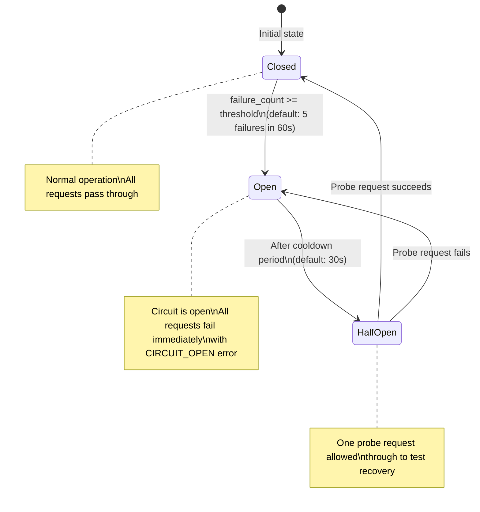
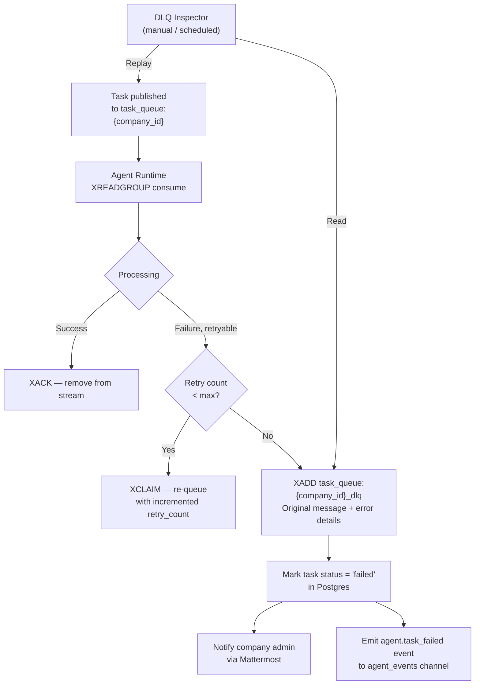

# AgentCompany — Error Handling and Observability

**Version**: 1.0.0
**Date**: 2026-04-18
**Status**: Authoritative Design Document

---

## 1. Design Philosophy

Error handling in AgentCompany must account for three distinct failure domains:
1. **Infrastructure failures** — databases, message queues, network partitions.
2. **Tool failures** — Plane, Outline, Mattermost APIs returning errors, being slow, or being down.
3. **Agent/LLM failures** — LLM providers returning errors, agents producing invalid output, prompt failures.

The guiding principles:
- **Fail visibly, not silently**. Every error produces a log entry, a metric increment, and (where appropriate) a task status update.
- **Classify before handling**. Not all errors deserve a retry. Retrying a 4xx response wastes resources and can amplify problems.
- **Bounded retries with backoff**. All retry logic has a maximum attempt count and exponential backoff.
- **Humans see agent errors**. When an agent task fails after exhausting retries, the assigned human (or company admin) is notified.
- **Graceful degradation over cascading failure**. A broken Mattermost adapter should not prevent task execution or Outline document creation.

---

## 2. Error Taxonomy

```mermaid
graph TD
    Error["Error"]
    Error --> InfraError["InfrastructureError"]
    Error --> ToolError["ToolError"]
    Error --> AgentError["AgentError"]
    Error --> AuthError["AuthorizationError"]
    Error --> ValidationError["ValidationError"]

    InfraError --> DBError["DatabaseError\n(connection, timeout, constraint)"]
    InfraError --> QueueError["QueueError\n(Redis unavailable)"]
    InfraError --> StorageError["StorageError\n(MinIO unavailable)"]

    ToolError --> AdapterConnError["AdapterConnectionError\n(retryable)"]
    ToolError --> AdapterAuthError["AdapterAuthError\n(not retryable)"]
    ToolError --> AdapterRateLimit["AdapterRateLimitError\n(retryable, respect Retry-After)"]
    ToolError --> AdapterServerError["AdapterServerError\n(retryable)"]
    ToolError --> AdapterClientError["AdapterClientError\n(not retryable)"]

    AgentError --> LLMProviderError["LLMProviderError\n(retryable)"]
    AgentError --> LLMRateLimitError["LLMRateLimitError\n(retryable, respect Retry-After)"]
    AgentError --> LLMOutputError["LLMOutputError\n(invalid JSON, wrong schema)"]
    AgentError --> AgentLoopError["AgentLoopError\n(exceeded max iterations)"]
    AgentError --> AgentTimeoutError["AgentTimeoutError\n(task exceeded wall-clock limit)"]

    AuthError --> PermissionDenied["PermissionDenied\n(not retryable)"]
    AuthError --> TokenExpired["TokenExpired\n(retryable after refresh)"]

    ValidationError --> InputValidation["InputValidationError\n(not retryable)"]
    ValidationError --> SchemaValidation["SchemaValidationError\n(not retryable)"]
```



### 2.1 Error Classification Table

| Error Class | Retryable | Max Retries | Backoff | Human Notification |
|---|---|---|---|---|
| `DatabaseError` (connection) | Yes | 5 | Exponential, 1s base | After 3 failures |
| `DatabaseError` (constraint) | No | 0 | N/A | No |
| `QueueError` | Yes | 10 | Exponential, 500ms base | After 5 failures |
| `AdapterConnectionError` | Yes | 3 | Exponential, 2s base | After 3 failures |
| `AdapterAuthError` | No | 0 | N/A | Immediately |
| `AdapterRateLimitError` | Yes | 5 | Fixed (Retry-After header) | After 5 failures |
| `AdapterServerError` | Yes | 3 | Exponential, 5s base | After 3 failures |
| `AdapterClientError` | No | 0 | N/A | No |
| `LLMProviderError` | Yes | 3 | Exponential, 2s base | After 3 failures |
| `LLMRateLimitError` | Yes | 5 | Fixed (Retry-After header) | After 5 failures |
| `LLMOutputError` | Yes (re-prompt) | 2 | None | After 2 failures |
| `AgentLoopError` | No | 0 | N/A | Immediately |
| `AgentTimeoutError` | No | 0 | N/A | Immediately |
| `PermissionDenied` | No | 0 | N/A | Log only |
| `TokenExpired` | Yes (1, after refresh) | 1 | None | No |
| `InputValidationError` | No | 0 | N/A | No |

---

## 3. Retry Strategy

### 3.1 Core Retry Implementation

```python
# agentcompany/utils/retry.py

import asyncio
import random
from dataclasses import dataclass
from typing import Callable, Awaitable, TypeVar, Optional
import logging

logger = logging.getLogger(__name__)

T = TypeVar("T")


@dataclass
class RetryConfig:
    max_attempts: int
    base_delay_seconds: float
    max_delay_seconds: float
    backoff_multiplier: float = 2.0
    jitter: bool = True            # Add ±20% random jitter to prevent thundering herd


async def retry_async(
    operation: Callable[[], Awaitable[T]],
    config: RetryConfig,
    operation_name: str,
    is_retryable: Callable[[Exception], bool] = lambda e: True,
    on_retry: Optional[Callable[[int, Exception], Awaitable[None]]] = None,
) -> T:
    """
    Execute an async operation with configurable retry logic.
    
    Raises the last exception if all attempts are exhausted.
    Logs each retry attempt at WARNING level.
    """
    last_exception: Optional[Exception] = None

    for attempt in range(1, config.max_attempts + 1):
        try:
            return await operation()
        except Exception as exc:
            last_exception = exc

            if not is_retryable(exc):
                logger.info(
                    "Non-retryable error in %s (attempt %d): %s",
                    operation_name, attempt, exc,
                )
                raise

            if attempt == config.max_attempts:
                logger.error(
                    "Exhausted %d retries for %s. Last error: %s",
                    config.max_attempts, operation_name, exc,
                )
                break

            delay = min(
                config.base_delay_seconds * (config.backoff_multiplier ** (attempt - 1)),
                config.max_delay_seconds,
            )
            if config.jitter:
                delay *= (0.8 + random.random() * 0.4)  # ±20%

            # Honor Retry-After if present
            if hasattr(exc, "retry_after_seconds") and exc.retry_after_seconds:
                delay = max(delay, exc.retry_after_seconds)

            logger.warning(
                "Retrying %s after %.1fs (attempt %d/%d): %s",
                operation_name, delay, attempt, config.max_attempts, exc,
            )
            if on_retry:
                await on_retry(attempt, exc)
            await asyncio.sleep(delay)

    raise last_exception


# Standard retry configs
RETRY_TOOL_CALL = RetryConfig(
    max_attempts=3, base_delay_seconds=2.0, max_delay_seconds=30.0
)

RETRY_LLM_CALL = RetryConfig(
    max_attempts=3, base_delay_seconds=2.0, max_delay_seconds=60.0
)

RETRY_DB_CONNECT = RetryConfig(
    max_attempts=5, base_delay_seconds=1.0, max_delay_seconds=30.0
)

RETRY_RATE_LIMITED = RetryConfig(
    max_attempts=5, base_delay_seconds=60.0, max_delay_seconds=300.0, jitter=False
)
```

### 3.2 LLM Output Retry (Re-prompt)

When the LLM returns output that fails schema validation, the agent re-prompts with the validation error as context — rather than treating it as a hard failure:

```python
async def invoke_with_output_validation(
    agent: AgentExecutor,
    task: Task,
    output_schema: type[BaseModel],
    max_reprompt_attempts: int = 2,
) -> BaseModel:
    prompt = build_task_prompt(task)
    
    for attempt in range(1, max_reprompt_attempts + 1):
        raw_output = await agent.invoke_llm(prompt)
        try:
            return output_schema.model_validate_json(raw_output)
        except ValidationError as e:
            if attempt == max_reprompt_attempts:
                raise LLMOutputError(
                    f"LLM output failed validation after {attempt} attempts: {e}"
                )
            # Inject the validation error into the next prompt
            prompt = build_correction_prompt(task, raw_output, str(e))
            logger.warning(
                "LLM output validation failed on attempt %d for task %s, re-prompting",
                attempt, task.id,
            )
```

---

## 4. Circuit Breaker

The circuit breaker prevents cascading failures when a downstream tool is unhealthy. It is implemented per `(company_id, tool)` pair — a broken Plane adapter for Company A does not affect Company B.



```python
# agentcompany/utils/circuit_breaker.py

import asyncio
import time
from dataclasses import dataclass, field
from enum import Enum
from typing import Callable, Awaitable, TypeVar

T = TypeVar("T")


class CircuitState(str, Enum):
    CLOSED = "closed"
    OPEN = "open"
    HALF_OPEN = "half_open"


@dataclass
class CircuitBreakerConfig:
    failure_threshold: int = 5        # Failures within window to open
    failure_window_seconds: float = 60.0
    cooldown_seconds: float = 30.0    # How long to stay open before half-open


class CircuitBreaker:
    def __init__(self, name: str, config: CircuitBreakerConfig = None):
        self.name = name
        self._config = config or CircuitBreakerConfig()
        self._state = CircuitState.CLOSED
        self._failure_count = 0
        self._last_failure_time: float = 0
        self._opened_at: float = 0
        self._lock = asyncio.Lock()

    async def call(
        self,
        operation: Callable[[], Awaitable[T]],
        operation_name: str,
    ) -> T:
        async with self._lock:
            state = self._get_current_state()

        if state == CircuitState.OPEN:
            from agentcompany.adapters.base import AdapterError, AdapterErrorCode
            raise AdapterError(
                code=AdapterErrorCode.CIRCUIT_OPEN,
                message=f"Circuit breaker {self.name} is open. Cooldown expires in "
                        f"{self._cooldown_remaining():.0f}s",
                tool=self.name,
                operation=operation_name,
                retryable=True,
                retry_after_seconds=int(self._cooldown_remaining()),
            )

        try:
            result = await operation()
            async with self._lock:
                self._on_success()
            return result
        except Exception as exc:
            async with self._lock:
                self._on_failure()
            raise

    def _get_current_state(self) -> CircuitState:
        if self._state == CircuitState.OPEN:
            if time.monotonic() - self._opened_at >= self._config.cooldown_seconds:
                self._state = CircuitState.HALF_OPEN
        return self._state

    def _on_success(self) -> None:
        self._failure_count = 0
        self._state = CircuitState.CLOSED

    def _on_failure(self) -> None:
        now = time.monotonic()
        # Reset counter if outside failure window
        if now - self._last_failure_time > self._config.failure_window_seconds:
            self._failure_count = 0
        self._failure_count += 1
        self._last_failure_time = now
        if self._failure_count >= self._config.failure_threshold:
            self._state = CircuitState.OPEN
            self._opened_at = now

    def _cooldown_remaining(self) -> float:
        return max(
            0.0,
            self._config.cooldown_seconds - (time.monotonic() - self._opened_at),
        )

    @property
    def state(self) -> CircuitState:
        return self._state
```

---

## 5. Dead Letter Queue

Failed events — those that cannot be processed after all retries — are moved to a dead letter queue for manual inspection and replay.

### 5.1 Redis Streams Architecture

```
Redis Streams:
├── task_queue:{company_id}          Main task queue (XADD, XREADGROUP)
├── task_queue:{company_id}_dlq      Dead letter queue (failed tasks)
├── agent_events:{company_id}        Event pub/sub channel
└── webhook_events:{company_id}      Inbound webhooks awaiting routing
```

### 5.2 DLQ Workflow



### 5.3 DLQ Record Schema

```json
{
  "original_stream": "task_queue:cmp_01HX...",
  "original_message_id": "1713434400000-0",
  "failure_reason": "AdapterRateLimitError: Plane rate limit exceeded after 5 attempts",
  "failure_code": "rate_limited",
  "retry_count": 5,
  "first_failed_at": "2026-04-18T11:00:00Z",
  "last_failed_at": "2026-04-18T11:45:00Z",
  "original_payload": { ... },
  "task_id": "tsk_01HXK2J3M4N5P6Q7R8S9T0UVWX",
  "agent_id": "agt_01HXK2J3M4N5P6Q7R8S9T0UVWX"
}
```

### 5.4 DLQ Management API

```
GET  /api/v1/dlq?company_id=...         List failed events
POST /api/v1/dlq/{event_id}/replay      Replay a specific failed event
POST /api/v1/dlq/replay-all             Replay all DLQ events (admin only)
DELETE /api/v1/dlq/{event_id}           Discard a failed event
```

---

## 6. Observability

### 6.1 Metrics

All services expose Prometheus metrics at `/metrics` (internal only, not behind Traefik).

#### Core API Metrics

```
# Request metrics
http_requests_total{method, endpoint, status_code}
http_request_duration_seconds{method, endpoint} (histogram)
http_request_size_bytes{method, endpoint} (histogram)

# Business metrics
agentcompany_tasks_created_total{company_id}
agentcompany_tasks_completed_total{company_id, outcome}
agentcompany_tasks_failed_total{company_id, error_code}
agentcompany_webhooks_received_total{tool, status}
agentcompany_events_published_total{type}

# Auth metrics
agentcompany_auth_success_total{actor_type}
agentcompany_auth_failure_total{reason}
```

#### Agent Runtime Metrics

```
# LLM metrics
agentcompany_llm_calls_total{provider, model, outcome}
agentcompany_llm_call_duration_seconds{provider, model} (histogram)
agentcompany_llm_tokens_total{provider, model, type}  # type: prompt|completion
agentcompany_llm_cost_usd_total{provider, model}

# Adapter metrics
agentcompany_adapter_calls_total{tool, operation, status}
agentcompany_adapter_call_duration_seconds{tool, operation} (histogram)
agentcompany_adapter_errors_total{tool, error_code}
agentcompany_circuit_breaker_state{tool, company_id, state}

# Queue metrics
agentcompany_task_queue_depth{company_id}
agentcompany_task_queue_age_seconds{company_id} (oldest unprocessed)
agentcompany_dlq_depth{company_id}
```

### 6.2 Alerting Rules

```yaml
# prometheus/alerts.yml

groups:
  - name: agentcompany.critical
    rules:
      - alert: CoreAPIDown
        expr: up{job="core-api"} == 0
        for: 1m
        labels:
          severity: critical
        annotations:
          summary: "Core API is down"

      - alert: AgentRuntimeDown
        expr: up{job="agent-runtime"} == 0
        for: 1m
        labels:
          severity: critical
        annotations:
          summary: "Agent Runtime is down"

      - alert: PostgresDown
        expr: up{job="postgres"} == 0
        for: 1m
        labels:
          severity: critical

      - alert: RedisDown
        expr: up{job="redis"} == 0
        for: 1m
        labels:
          severity: critical

  - name: agentcompany.high
    rules:
      - alert: HighTaskFailureRate
        expr: |
          rate(agentcompany_tasks_failed_total[5m]) /
          rate(agentcompany_tasks_completed_total[5m]) > 0.1
        for: 5m
        labels:
          severity: high
        annotations:
          summary: "Task failure rate > 10% for 5 minutes"

      - alert: DLQDepthHigh
        expr: agentcompany_dlq_depth > 10
        for: 10m
        labels:
          severity: high
        annotations:
          summary: "Dead letter queue has {{ $value }} items"

      - alert: CircuitBreakerOpen
        expr: agentcompany_circuit_breaker_state{state="open"} == 1
        for: 2m
        labels:
          severity: high
        annotations:
          summary: "Circuit breaker open for {{ $labels.tool }} ({{ $labels.company_id }})"

      - alert: LLMErrorRateHigh
        expr: rate(agentcompany_llm_calls_total{outcome="error"}[5m]) > 0.1
        for: 5m
        labels:
          severity: high

  - name: agentcompany.medium
    rules:
      - alert: HighAPILatency
        expr: |
          histogram_quantile(0.99, rate(http_request_duration_seconds_bucket[5m])) > 2.0
        for: 5m
        labels:
          severity: medium

      - alert: TaskQueueDepthHigh
        expr: agentcompany_task_queue_depth > 100
        for: 5m
        labels:
          severity: medium

      - alert: LLMCostSpikeHourly
        expr: |
          increase(agentcompany_llm_cost_usd_total[1h]) > 50
        labels:
          severity: medium
        annotations:
          summary: "LLM costs >$50 in the last hour"
```

### 6.3 Structured Logging

All services log JSON to stdout. The log format is consistent across all services:

```json
{
  "timestamp": "2026-04-18T11:45:00.123Z",
  "level": "ERROR",
  "service": "core-api",
  "version": "1.0.0",
  "request_id": "req_01HXK2J3M4N5P6Q7R8S9T0UVWX",
  "org_id": "org_01HXK2J3M4N5P6Q7R8S9T0UVWX",
  "company_id": "cmp_01HXK2J3M4N5P6Q7R8S9T0UVWX",
  "actor_id": "agt_01HXK2J3M4N5P6Q7R8S9T0UVWX",
  "actor_type": "agent",
  "message": "Adapter call failed after 3 retries",
  "error": {
    "code": "adapter_server_error",
    "tool": "plane",
    "operation": "update_issue",
    "retryable": true
  },
  "duration_ms": 5420
}
```

**Sensitive data is never logged**:
- API keys, tokens, passwords — even partially
- Full JWT payloads (log only `sub` and `org_id` from claims)
- LLM prompts in full (log token counts and task_id only)
- Webhook payloads in full (log event type and resource_id only)

Log shipping: Loki collects logs from Docker container stdout via Promtail. Loki labels: `{service, level, org_id, company_id}`.

### 6.4 Distributed Tracing

Every request is assigned a `request_id` (ULID) at the Traefik ingress and propagated as an HTTP header (`X-Request-Id`). All downstream service calls carry this header. The `request_id` is indexed in Loki for log correlation.

For production, OpenTelemetry traces (OTLP format) are emitted by the Core API and Agent Runtime, collected by an OpenTelemetry Collector, and shipped to a compatible backend (Tempo or Jaeger).

### 6.5 Grafana Dashboards

Pre-built dashboards are committed to `infra/grafana/dashboards/`:

| Dashboard | Key Panels |
|---|---|
| **System Overview** | Service health, request rate, error rate, latency P50/P99 |
| **Agent Performance** | Tasks per agent, token usage, cost, error rate, queue depth |
| **Tool Adapters** | Adapter health by tool, call latency, error rate, circuit breaker state |
| **Business Metrics** | Tasks created/completed/failed over time, per-company breakdown |
| **Cost Tracking** | LLM spend by model, by agent, by company, daily trend |
| **Security Events** | Auth failures, permission denials, cross-tenant attempts, audit log volume |

---

## 7. Graceful Degradation Matrix

When a component is unavailable, the system should degrade gracefully rather than fail entirely:

| Component Down | Impact | Degraded Behavior |
|---|---|---|
| **Meilisearch** | Search unavailable | `/api/v1/search` returns empty results with `degraded: true` flag; no other functionality affected |
| **Plane** | Task sync broken | Tasks exist in AgentCompany DB; sync queued in Redis for when Plane recovers |
| **Outline** | Document creation fails | Agent skips document step; logs warning; task completes partially |
| **Mattermost** | Chat notifications fail | Agent continues task; human notifications queued for delivery when Mattermost recovers |
| **Redis** | Queue/cache unavailable | Core API switches to direct DB queries (no cache); Agent Runtime pauses, waits for Redis recovery (max 5 min) |
| **Postgres primary** | All writes fail | Core API returns 503; reads continue from replica if available |
| **Keycloak** | No new logins | Existing tokens continue working until expiry (JWKS cached); no new sessions possible |
| **Agent Runtime** | No agent execution | Tasks queue up in Redis; Core API continues serving human requests |

---

## 8. Incident Response Runbooks

### 8.1 High DLQ Depth

1. Check Grafana `Tool Adapters` dashboard for circuit breaker state.
2. If circuit is open: check tool health (`GET /api/v1/adapters/{id}/test`). Wait for recovery.
3. If tool is healthy: inspect DLQ records (`GET /api/v1/dlq?company_id=...`) for error pattern.
4. If error is transient: replay all (`POST /api/v1/dlq/replay-all`).
5. If error is systematic (auth failure, config issue): fix the root cause, then replay.
6. If DLQ grows beyond 1000 items: page on-call.

### 8.2 LLM Provider Outage

1. Alert fires: `LLMErrorRateHigh`.
2. Identify affected provider from metrics label.
3. Check provider status page.
4. If extended outage: switch affected agents to fallback provider via `PATCH /api/v1/agents/{id}` with updated `llm_config.provider`.
5. Tasks queued during outage will process automatically when agents resume.
