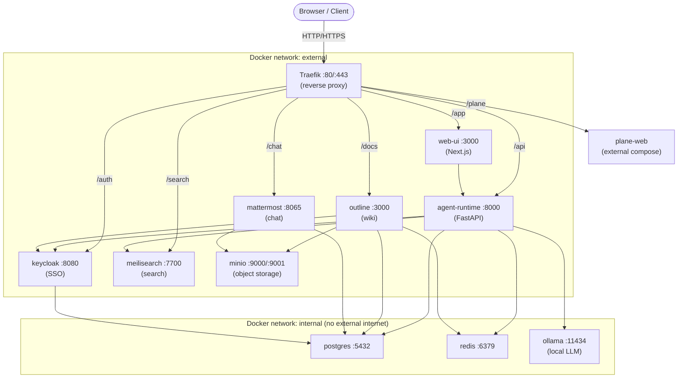

# AgentCompany — Infrastructure Architecture

## Overview

AgentCompany is deployed as a set of Docker Compose services behind a Traefik
reverse proxy.  All services communicate over a private Docker bridge network
(`internal`).  Only Traefik and services that need to receive routed traffic
are also attached to the `external` network.

---

## Network diagram



---

## Port mapping table

| Host port | Service | Container port | Protocol | Purpose |
|-----------|---------|----------------|----------|---------|
| 80 | traefik | 80 | HTTP | Public ingress |
| 443 | traefik | 443 | HTTPS | Public ingress (TLS) |
| 8080 | traefik | 8080 | HTTP | Traefik dashboard (dev only) |
| 11434 (configurable) | ollama | 11434 | HTTP | Ollama REST API (dev only) |

`OLLAMA_PORT` defaults to `11434` and can be changed in `.env`.  The Ollama
port is intentionally bound to the host during development so you can call the
API with curl or the Ollama CLI.  Remove the `ports:` entry from
`docker-compose.yml` (or set `OLLAMA_PORT` to an unused port) in production.

All other service ports are bound only to the internal Docker network and are
not accessible from the host.  To inspect a service directly during development
you can temporarily add a `ports:` entry to docker-compose.yml or use:

```bash
docker compose exec postgres psql -U agentcompany agentcompany_core
```

---

## Volume mapping table

| Volume name | Container path | Contents |
|-------------|---------------|---------|
| `postgres_data` | `/var/lib/postgresql/data` | All PostgreSQL databases |
| `redis_data` | `/data` | Redis AOF journal and RDB snapshots |
| `minio_data` | `/data` | MinIO object buckets (Outline attachments, Mattermost files) |
| `meilisearch_data` | `/meili_data` | Search indexes |
| `mattermost_config` | `/mattermost/config` | Mattermost `config.json` |
| `mattermost_data` | `/mattermost/data` | Mattermost local file storage (fallback) |
| `mattermost_logs` | `/mattermost/logs` | Mattermost log files |
| `mattermost_plugins` | `/mattermost/plugins` | Mattermost server-side plugins |
| `mattermost_client_plugins` | `/mattermost/client/plugins` | Mattermost client-side plugins |
| `traefik_certs` | `/certs` | ACME certificate JSON (Let's Encrypt) |
| `ollama_data` | `/root/.ollama` | Downloaded model weights (can be several GB per model) |

---

## Service dependency graph

Services start in the order dictated by `depends_on` with `condition: service_healthy`.

```
postgres ──────────────────────────────┐
redis ─────────────────────────────────┤
minio ──────────┬──────────────────────┤
                │                      │
            minio-init             keycloak
                                       │
              ┌────────────────────────┤
              │            ┌───────────┘
           outline      mattermost
              │
          (keycloak, postgres, redis, minio)

meilisearch ───────────────────────────┐
postgres ──────────────────────────────┤──▶ agent-runtime ──▶ web-ui
redis ─────────────────────────────────┘         │
                                                  │
ollama ────────────────────────────────────────────┘
```

Traefik starts independently and begins routing immediately; it will return 502
for any service that is not yet healthy, which is acceptable during boot.

---

## Resource requirements

Estimates are for a single-developer / small team deployment.

| Service | Min RAM | Recommended RAM | CPU (steady state) |
|---------|---------|-----------------|-------------------|
| traefik | 64 MB | 128 MB | < 0.1 core |
| postgres | 256 MB | 512 MB | 0.1 – 0.5 core |
| redis | 64 MB | 256 MB | < 0.1 core |
| minio | 128 MB | 512 MB | 0.1 – 0.3 core |
| keycloak | 512 MB | 1 GB | 0.2 – 0.5 core |
| outline | 256 MB | 512 MB | 0.1 – 0.3 core |
| mattermost | 512 MB | 1 GB | 0.2 – 0.5 core |
| meilisearch | 256 MB | 512 MB | 0.1 – 0.5 core |
| agent-runtime | 256 MB | 512 MB | 0.2 – 1.0 core |
| web-ui | 128 MB | 256 MB | 0.1 – 0.3 core |
| ollama (CPU) | 4 GB* | 8 GB* | 4 – 8 cores |
| **Total (no Ollama)** | **~2.4 GB** | **~5.2 GB** | **~1.5 – 4.1 cores** |
| **Total (with Ollama, CPU)** | **~6.4 GB** | **~13.2 GB** | **~5.5 – 12.1 cores** |

*Ollama RAM requirements depend heavily on the model.  `gemma3` requires ~5 GB
of RAM on CPU.  With an NVIDIA GPU the model is loaded into VRAM and CPU RAM
usage drops significantly.

Minimum recommended host (without Ollama): 4 vCPU, 8 GB RAM, 40 GB SSD.

Minimum recommended host (with Ollama + gemma3, CPU-only): 8 vCPU, 16 GB RAM, 60 GB SSD.

For a full team (10–50 users) with Plane also running: 8 vCPU, 16 GB RAM, 100 GB SSD.

### GPU requirements for Ollama

Ollama supports NVIDIA GPUs via the NVIDIA Container Toolkit.  GPU inference is
optional — the service falls back to CPU if no GPU is detected.

| Setup | Configuration |
|-------|--------------|
| No GPU (default) | `docker-compose.override.yml` strips the `deploy.resources` GPU reservation. No extra setup needed. |
| NVIDIA GPU | Remove or rename `docker-compose.override.yml`.  Install the [NVIDIA Container Toolkit](https://docs.nvidia.com/datacenter/cloud-native/container-toolkit/install-guide.html) on the host. |

After starting with GPU support, verify Ollama sees the GPU:
```bash
docker compose exec ollama ollama run gemma3 "Hello"
docker compose exec ollama nvidia-smi
```

---

## Scaling considerations

### Horizontal scaling (multiple replicas)

The following services are stateless and can be scaled horizontally by
increasing the `replicas` count (requires Docker Swarm or Kubernetes):

- `agent-runtime` — stateless FastAPI; all state lives in Postgres/Redis
- `web-ui` — Next.js; stateless if session data is stored in agent-runtime

The following services require additional configuration before scaling:

- `outline` — Redis-based pub/sub is already configured; file storage is
  delegated to MinIO, so multiple replicas are safe.
- `mattermost` — Requires the cluster-mode license (Enterprise) to run more
  than one replica.
- `keycloak` — Supports clustering (Infinispan cache); set
  `KC_CACHE=ispn` and configure a shared cache.

The following services should remain single-instance or use managed alternatives:

- `postgres` — Use a managed database (RDS, Cloud SQL) or set up streaming
  replication + pgBouncer for high availability.
- `redis` — Use Redis Sentinel or a managed Redis service for HA.
- `minio` — MinIO supports distributed mode; in production use at least 4 nodes
  or replace with AWS S3 / GCS.
- `meilisearch` — Single-instance in v1; multi-node federation is on the roadmap.

### Production hardening checklist

- [ ] Replace `start-dev` with `start` in the Keycloak command + configure TLS
- [ ] Enable HTTPS in Traefik and point `KEYCLOAK_HOSTNAME` to your domain
- [ ] Set `MEILISEARCH_ENV=production` (disables the search preview UI)
- [ ] Restrict Traefik dashboard access with Basic Auth or IP allowlist
- [ ] Move Postgres, Redis, and MinIO to managed cloud services
- [ ] Configure SMTP for email notifications in Outline and Mattermost
- [ ] Enable log aggregation (ship container logs to Loki, Datadog, etc.)
- [ ] Set resource limits (`mem_limit`, `cpus`) on all containers

---

## Plane integration

Plane ships its own docker-compose with ~15 tightly-coupled services and is
excluded from the main docker-compose.yml to avoid merge conflicts when
upgrading Plane independently.

**Recommended integration steps:**

1. Clone the Plane repository alongside this repo:
   ```bash
   git clone https://github.com/makeplane/plane.git ../plane
   ```
2. Follow Plane's setup guide (`make setup`) to generate its `.env`.
3. Add the `agentcompany_external` network to Plane's `proxy` service:
   ```yaml
   networks:
     - default
     - agentcompany_external
   ```
4. Add the external network to Plane's `docker-compose.yml` bottom section:
   ```yaml
   networks:
     agentcompany_external:
       external: true
   ```
5. Start Plane: `docker compose -f ../plane/docker-compose.yml up -d`
6. Update `docker/traefik/dynamic.yml` to point the Plane service URL at
   the correct container name (e.g. `http://plane-proxy:80`).
