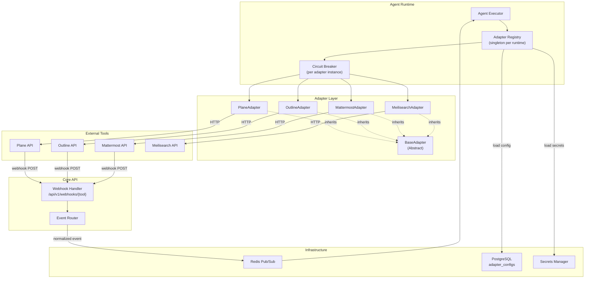
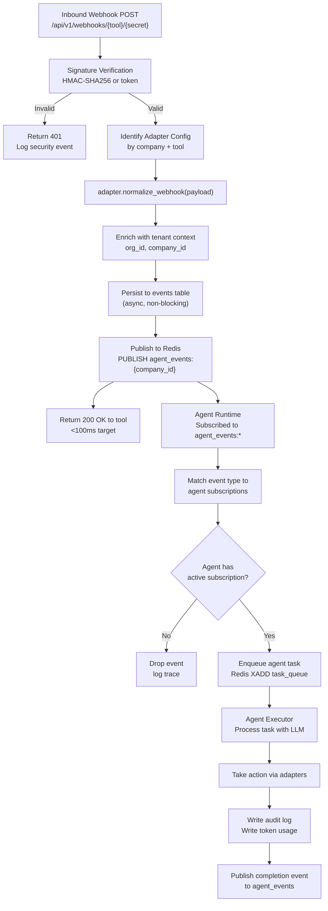

# AgentCompany — Integration Layer

**Version**: 1.0.0
**Date**: 2026-04-18
**Status**: Authoritative Design Document

---

## 1. Design Goals

The integration layer isolates AgentCompany's core logic from the specifics of any individual tool. Requirements:

- **Swappable tools**: Replace Plane with Linear, or Mattermost with Slack, by writing a new adapter — zero changes to core platform code.
- **Uniform error surface**: All adapter errors are translated to a standard `AdapterError` taxonomy before reaching the agent runtime.
- **Capability declaration**: Adapters declare what they can do. The agent runtime queries capabilities before calling an adapter operation.
- **Health awareness**: Every adapter reports its own health. The circuit breaker uses this signal.
- **Event normalization**: Raw webhooks from tools are transformed into a canonical `AgentCompanyEvent` schema before publication to Redis.

---

## 2. Adapter Architecture Overview



---

## 3. BaseAdapter Interface

Every adapter implements the `BaseAdapter` abstract class. This is the only contract the agent runtime uses.

```python
# agentcompany/adapters/base.py

from abc import ABC, abstractmethod
from dataclasses import dataclass
from enum import Enum
from typing import Any, Optional
import httpx


class AdapterStatus(str, Enum):
    CONNECTED = "connected"
    DISCONNECTED = "disconnected"
    DEGRADED = "degraded"
    ERROR = "error"


class AdapterErrorCode(str, Enum):
    # Connectivity
    CONNECTION_TIMEOUT = "connection_timeout"
    CONNECTION_REFUSED = "connection_refused"
    # Authentication
    AUTH_FAILED = "auth_failed"
    AUTH_EXPIRED = "auth_expired"
    # Authorization
    PERMISSION_DENIED = "permission_denied"
    # Request errors
    RESOURCE_NOT_FOUND = "resource_not_found"
    VALIDATION_ERROR = "validation_error"
    RATE_LIMITED = "rate_limited"
    # Server errors
    SERVER_ERROR = "server_error"
    UNAVAILABLE = "unavailable"
    # Adapter errors
    CAPABILITY_NOT_SUPPORTED = "capability_not_supported"
    CIRCUIT_OPEN = "circuit_open"


@dataclass
class AdapterError(Exception):
    code: AdapterErrorCode
    message: str
    tool: str
    operation: str
    retryable: bool
    retry_after_seconds: Optional[int] = None
    details: Optional[dict] = None


@dataclass
class HealthCheckResult:
    status: AdapterStatus
    latency_ms: int
    capabilities_verified: list[str]
    error: Optional[str] = None
    checked_at: Optional[str] = None


@dataclass
class AdapterConfig:
    adapter_id: str
    tool: str
    company_id: str
    org_id: str
    config: dict          # Non-secret config (URLs, workspace IDs)
    secrets: dict         # Resolved secrets (API keys, tokens) — never logged


class BaseAdapter(ABC):
    """
    Abstract base class for all tool adapters.
    
    Implementations must not store secrets in instance attributes directly.
    Use self._config.secrets['key'] and access only within method calls.
    """

    TOOL_NAME: str = ""          # Override in subclass: 'plane', 'outline', etc.
    ADAPTER_VERSION: str = "1.0.0"

    def __init__(self, config: AdapterConfig) -> None:
        self._config = config
        self._http_client: Optional[httpx.AsyncClient] = None

    # ------------------------------------------------------------------ #
    # Lifecycle                                                            #
    # ------------------------------------------------------------------ #

    @abstractmethod
    async def connect(self) -> None:
        """
        Initialize the adapter. Called once after construction.
        Should verify credentials and connectivity.
        Raises AdapterError on failure.
        """
        ...

    @abstractmethod
    async def disconnect(self) -> None:
        """
        Gracefully shut down the adapter.
        Close HTTP clients, clear sensitive state.
        """
        ...

    @abstractmethod
    async def health_check(self) -> HealthCheckResult:
        """
        Verify that the tool is reachable and the credentials are valid.
        Must complete within 5 seconds.
        Must NOT raise; return HealthCheckResult with error field set on failure.
        """
        ...

    # ------------------------------------------------------------------ #
    # Capability declaration                                               #
    # ------------------------------------------------------------------ #

    @abstractmethod
    def get_capabilities(self) -> list[str]:
        """
        Return a list of capability strings this adapter supports.
        Examples: ['issue:create', 'issue:read', 'webhook:receive']
        The agent runtime checks this before calling any operation.
        """
        ...

    def supports(self, capability: str) -> bool:
        return capability in self.get_capabilities()

    # ------------------------------------------------------------------ #
    # Webhook normalization                                                #
    # ------------------------------------------------------------------ #

    @abstractmethod
    def normalize_webhook(
        self,
        raw_payload: dict,
        headers: dict,
        event_type_hint: Optional[str] = None,
    ) -> "NormalizedEvent":
        """
        Transform a raw webhook payload from the tool into a
        canonical AgentCompanyEvent. Called by the webhook handler
        in Core API on every inbound webhook.
        """
        ...

    @abstractmethod
    def verify_webhook_signature(
        self,
        raw_body: bytes,
        headers: dict,
        secret: str,
    ) -> bool:
        """
        Verify the webhook signature/token from the tool.
        Return True if valid, False if not.
        Must NOT raise on invalid signatures — return False.
        """
        ...

    # ------------------------------------------------------------------ #
    # Error translation                                                    #
    # ------------------------------------------------------------------ #

    def translate_http_error(
        self,
        response: httpx.Response,
        operation: str,
    ) -> AdapterError:
        """
        Translate an HTTP error response from a tool into an AdapterError.
        Subclasses should call super() and override only tool-specific status codes.
        """
        status = response.status_code
        retryable = status in (429, 500, 502, 503, 504)
        retry_after = None

        if status == 429:
            retry_after = int(response.headers.get("Retry-After", "60"))
            code = AdapterErrorCode.RATE_LIMITED
        elif status == 401:
            code = AdapterErrorCode.AUTH_FAILED
        elif status == 403:
            code = AdapterErrorCode.PERMISSION_DENIED
        elif status == 404:
            code = AdapterErrorCode.RESOURCE_NOT_FOUND
            retryable = False
        elif status == 422:
            code = AdapterErrorCode.VALIDATION_ERROR
            retryable = False
        elif status >= 500:
            code = AdapterErrorCode.SERVER_ERROR
        else:
            code = AdapterErrorCode.SERVER_ERROR

        return AdapterError(
            code=code,
            message=f"HTTP {status} from {self.TOOL_NAME}.{operation}",
            tool=self.TOOL_NAME,
            operation=operation,
            retryable=retryable,
            retry_after_seconds=retry_after,
            details={"status_code": status, "response_body": response.text[:500]},
        )
```

---

## 4. Normalized Event Schema

All inbound webhooks and internal events are normalized to `NormalizedEvent` before entering the event bus.

```python
# agentcompany/adapters/events.py

from dataclasses import dataclass, field
from enum import Enum
from typing import Any, Optional
import uuid
from datetime import datetime, timezone


class EventSource(str, Enum):
    PLANE = "plane"
    OUTLINE = "outline"
    MATTERMOST = "mattermost"
    INTERNAL = "internal"


class EventCategory(str, Enum):
    TASK = "task"
    DOCUMENT = "document"
    MESSAGE = "message"
    USER = "user"
    AGENT = "agent"
    SYSTEM = "system"


@dataclass
class NormalizedEvent:
    # Identity
    id: str = field(default_factory=lambda: f"evt_{uuid.uuid4().hex}")
    correlation_id: Optional[str] = None  # For event chains

    # Classification
    source: EventSource = EventSource.INTERNAL
    category: EventCategory = EventCategory.SYSTEM
    type: str = ""  # e.g., 'task.created', 'document.updated', 'message.posted'

    # Tenant context
    org_id: str = ""
    company_id: str = ""

    # Actor
    actor_id: Optional[str] = None
    actor_type: Optional[str] = None  # 'human', 'agent', 'system'

    # Subject resource
    resource_type: Optional[str] = None
    resource_id: Optional[str] = None
    resource_external_id: Optional[str] = None  # ID in the tool's system

    # Payload
    payload: dict = field(default_factory=dict)

    # Timestamps
    occurred_at: str = field(
        default_factory=lambda: datetime.now(timezone.utc).isoformat()
    )
    received_at: str = field(
        default_factory=lambda: datetime.now(timezone.utc).isoformat()
    )
```

### 4.1 Event Type Registry

| Event Type | Source | Description |
|---|---|---|
| `task.created` | internal / plane | A task was created |
| `task.updated` | internal / plane | Task fields changed |
| `task.status_changed` | internal / plane | Task status transitioned |
| `task.assigned` | internal / plane | Task assigned to new actor |
| `task.completed` | internal / plane | Task moved to done state |
| `task.commented` | internal / plane | Comment added to task |
| `document.created` | internal / outline | New document created |
| `document.updated` | internal / outline | Document content updated |
| `document.published` | outline | Document moved to published |
| `message.posted` | mattermost | Message sent in channel |
| `message.mentioned` | mattermost | Agent or human @mentioned |
| `agent.started` | internal | Agent runtime started |
| `agent.stopped` | internal | Agent runtime stopped |
| `agent.error` | internal | Agent encountered an error |
| `adapter.connected` | internal | Adapter connected successfully |
| `adapter.health_failed` | internal | Adapter health check failed |

---

## 5. PlaneAdapter

```python
# agentcompany/adapters/plane.py

import hashlib
import hmac
import json
from typing import Optional
import httpx

from .base import BaseAdapter, AdapterConfig, AdapterError, AdapterErrorCode, HealthCheckResult, AdapterStatus
from .events import NormalizedEvent, EventSource, EventCategory


class PlaneAdapter(BaseAdapter):
    """
    Adapter for Plane project management (plane.so).
    
    Config keys:
        base_url: str       - e.g., 'https://plane.example.com'
        workspace_slug: str - Plane workspace identifier
        project_id: str     - Target project ID
    
    Secret keys:
        api_key: str        - Plane API key
        webhook_secret: str - HMAC secret for webhook verification
    """

    TOOL_NAME = "plane"
    ADAPTER_VERSION = "1.0.0"

    def get_capabilities(self) -> list[str]:
        return [
            "issue:create",
            "issue:read",
            "issue:update",
            "issue:delete",
            "issue:comment",
            "issue:assign",
            "cycle:read",
            "module:read",
            "webhook:receive",
        ]

    async def connect(self) -> None:
        self._http_client = httpx.AsyncClient(
            base_url=self._config.config["base_url"],
            headers={
                "X-API-Key": self._config.secrets["api_key"],
                "Content-Type": "application/json",
            },
            timeout=httpx.Timeout(10.0),
        )
        result = await self.health_check()
        if result.status != AdapterStatus.CONNECTED:
            raise AdapterError(
                code=AdapterErrorCode.CONNECTION_REFUSED,
                message=f"Plane health check failed: {result.error}",
                tool=self.TOOL_NAME,
                operation="connect",
                retryable=True,
            )

    async def disconnect(self) -> None:
        if self._http_client:
            await self._http_client.aclose()
            self._http_client = None

    async def health_check(self) -> HealthCheckResult:
        import time
        start = time.monotonic()
        try:
            response = await self._http_client.get(
                f"/api/v1/workspaces/{self._config.config['workspace_slug']}/"
            )
            latency_ms = int((time.monotonic() - start) * 1000)
            if response.status_code == 200:
                return HealthCheckResult(
                    status=AdapterStatus.CONNECTED,
                    latency_ms=latency_ms,
                    capabilities_verified=["issue:read"],
                )
            return HealthCheckResult(
                status=AdapterStatus.ERROR,
                latency_ms=latency_ms,
                capabilities_verified=[],
                error=f"HTTP {response.status_code}",
            )
        except Exception as e:
            return HealthCheckResult(
                status=AdapterStatus.DISCONNECTED,
                latency_ms=0,
                capabilities_verified=[],
                error=str(e),
            )

    async def create_issue(self, title: str, description: str, priority: str = "medium",
                           assignee_ids: list[str] = None, labels: list[str] = None) -> dict:
        if not self.supports("issue:create"):
            raise AdapterError(
                code=AdapterErrorCode.CAPABILITY_NOT_SUPPORTED,
                message="issue:create not supported",
                tool=self.TOOL_NAME,
                operation="create_issue",
                retryable=False,
            )
        payload = {
            "name": title,
            "description_html": description,
            "priority": priority,
        }
        if assignee_ids:
            payload["assignees"] = assignee_ids
        if labels:
            payload["label_ids"] = labels

        ws = self._config.config["workspace_slug"]
        proj = self._config.config["project_id"]
        response = await self._http_client.post(
            f"/api/v1/workspaces/{ws}/projects/{proj}/issues/",
            content=json.dumps(payload),
        )
        if not response.is_success:
            raise self.translate_http_error(response, "create_issue")
        return response.json()

    async def update_issue(self, issue_id: str, updates: dict) -> dict:
        ws = self._config.config["workspace_slug"]
        proj = self._config.config["project_id"]
        response = await self._http_client.patch(
            f"/api/v1/workspaces/{ws}/projects/{proj}/issues/{issue_id}/",
            content=json.dumps(updates),
        )
        if not response.is_success:
            raise self.translate_http_error(response, "update_issue")
        return response.json()

    def verify_webhook_signature(self, raw_body: bytes, headers: dict, secret: str) -> bool:
        signature_header = headers.get("X-Plane-Signature", "")
        if not signature_header:
            return False
        expected = hmac.new(secret.encode(), raw_body, hashlib.sha256).hexdigest()
        return hmac.compare_digest(f"sha256={expected}", signature_header)

    def normalize_webhook(self, raw_payload: dict, headers: dict,
                          event_type_hint: Optional[str] = None) -> NormalizedEvent:
        """
        Map Plane webhook events to NormalizedEvent.
        Plane event type is in the 'event' field of the payload.
        """
        event_map = {
            "issue.created": "task.created",
            "issue.updated": "task.updated",
            "issue.deleted": "task.deleted",
            "issue_comment.created": "task.commented",
            "cycle.created": "cycle.created",
        }
        plane_event = raw_payload.get("event", "")
        normalized_type = event_map.get(plane_event, f"plane.{plane_event}")

        issue = raw_payload.get("data", {})

        return NormalizedEvent(
            source=EventSource.PLANE,
            category=EventCategory.TASK,
            type=normalized_type,
            resource_type="task",
            resource_external_id=issue.get("id"),
            payload={
                "plane_issue": issue,
                "workspace": self._config.config.get("workspace_slug"),
                "project_id": self._config.config.get("project_id"),
            },
        )
```

---

## 6. OutlineAdapter

```python
# agentcompany/adapters/outline.py

import hashlib
import hmac
import json
from typing import Optional
import httpx

from .base import BaseAdapter, AdapterConfig, AdapterError, AdapterErrorCode, HealthCheckResult, AdapterStatus
from .events import NormalizedEvent, EventSource, EventCategory


class OutlineAdapter(BaseAdapter):
    """
    Adapter for Outline wiki/knowledge base.
    
    Config keys:
        base_url: str           - e.g., 'https://docs.example.com'
        collection_id: str      - Default collection for new documents
    
    Secret keys:
        api_key: str            - Outline API token
        webhook_secret: str     - HMAC secret for webhook verification
    """

    TOOL_NAME = "outline"
    ADAPTER_VERSION = "1.0.0"

    def get_capabilities(self) -> list[str]:
        return [
            "document:create",
            "document:read",
            "document:update",
            "document:delete",
            "document:publish",
            "document:archive",
            "collection:read",
            "search:query",
            "webhook:receive",
        ]

    async def connect(self) -> None:
        self._http_client = httpx.AsyncClient(
            base_url=self._config.config["base_url"],
            headers={
                "Authorization": f"Bearer {self._config.secrets['api_key']}",
                "Content-Type": "application/json",
                "Accept": "application/json",
            },
            timeout=httpx.Timeout(15.0),
        )
        result = await self.health_check()
        if result.status != AdapterStatus.CONNECTED:
            raise AdapterError(
                code=AdapterErrorCode.CONNECTION_REFUSED,
                message=f"Outline health check failed: {result.error}",
                tool=self.TOOL_NAME,
                operation="connect",
                retryable=True,
            )

    async def disconnect(self) -> None:
        if self._http_client:
            await self._http_client.aclose()
            self._http_client = None

    async def health_check(self) -> HealthCheckResult:
        import time
        start = time.monotonic()
        try:
            response = await self._http_client.post(
                "/api/auth.info", content=json.dumps({})
            )
            latency_ms = int((time.monotonic() - start) * 1000)
            if response.status_code == 200:
                return HealthCheckResult(
                    status=AdapterStatus.CONNECTED,
                    latency_ms=latency_ms,
                    capabilities_verified=["document:read"],
                )
            return HealthCheckResult(
                status=AdapterStatus.ERROR,
                latency_ms=latency_ms,
                capabilities_verified=[],
                error=f"HTTP {response.status_code}",
            )
        except Exception as e:
            return HealthCheckResult(
                status=AdapterStatus.DISCONNECTED,
                latency_ms=0,
                capabilities_verified=[],
                error=str(e),
            )

    async def create_document(self, title: str, text: str,
                               collection_id: Optional[str] = None,
                               parent_document_id: Optional[str] = None,
                               publish: bool = False) -> dict:
        payload = {
            "title": title,
            "text": text,
            "collectionId": collection_id or self._config.config.get("collection_id"),
            "publish": publish,
        }
        if parent_document_id:
            payload["parentDocumentId"] = parent_document_id

        response = await self._http_client.post(
            "/api/documents.create", content=json.dumps(payload)
        )
        if not response.is_success:
            raise self.translate_http_error(response, "create_document")
        return response.json().get("data", {})

    async def update_document(self, document_id: str, title: Optional[str] = None,
                               text: Optional[str] = None, publish: bool = False) -> dict:
        payload = {"id": document_id, "publish": publish}
        if title:
            payload["title"] = title
        if text is not None:
            payload["text"] = text

        response = await self._http_client.post(
            "/api/documents.update", content=json.dumps(payload)
        )
        if not response.is_success:
            raise self.translate_http_error(response, "update_document")
        return response.json().get("data", {})

    async def search_documents(self, query: str, collection_id: Optional[str] = None,
                                limit: int = 10) -> list[dict]:
        payload = {"query": query, "limit": limit}
        if collection_id:
            payload["collectionId"] = collection_id

        response = await self._http_client.post(
            "/api/documents.search", content=json.dumps(payload)
        )
        if not response.is_success:
            raise self.translate_http_error(response, "search_documents")
        return response.json().get("data", [])

    def verify_webhook_signature(self, raw_body: bytes, headers: dict, secret: str) -> bool:
        signature_header = headers.get("X-Outline-Signature", "")
        if not signature_header:
            return False
        expected = hmac.new(secret.encode(), raw_body, hashlib.sha256).hexdigest()
        return hmac.compare_digest(f"sha256={expected}", signature_header)

    def normalize_webhook(self, raw_payload: dict, headers: dict,
                          event_type_hint: Optional[str] = None) -> NormalizedEvent:
        event_map = {
            "documents.create": "document.created",
            "documents.update": "document.updated",
            "documents.publish": "document.published",
            "documents.archive": "document.archived",
            "documents.delete": "document.deleted",
        }
        outline_event = raw_payload.get("event", "")
        normalized_type = event_map.get(outline_event, f"outline.{outline_event}")
        document = raw_payload.get("payload", {}).get("model", {})

        return NormalizedEvent(
            source=EventSource.OUTLINE,
            category=EventCategory.DOCUMENT,
            type=normalized_type,
            resource_type="document",
            resource_external_id=document.get("id"),
            payload={
                "outline_document": document,
                "actor": raw_payload.get("actorId"),
            },
        )
```

---

## 7. MattermostAdapter

```python
# agentcompany/adapters/mattermost.py

import json
from typing import Optional
import httpx

from .base import BaseAdapter, AdapterConfig, AdapterError, AdapterErrorCode, HealthCheckResult, AdapterStatus
from .events import NormalizedEvent, EventSource, EventCategory


class MattermostAdapter(BaseAdapter):
    """
    Adapter for Mattermost team chat.
    
    Config keys:
        base_url: str       - e.g., 'https://chat.example.com'
        team_id: str        - Mattermost team ID
        bot_user_id: str    - Bot user ID for the agent
    
    Secret keys:
        bot_token: str      - Mattermost bot access token
        webhook_token: str  - Outgoing webhook verification token (shared token, not HMAC)
    """

    TOOL_NAME = "mattermost"
    ADAPTER_VERSION = "1.0.0"

    def get_capabilities(self) -> list[str]:
        return [
            "message:post",
            "message:update",
            "message:delete",
            "channel:read",
            "channel:create",
            "channel:join",
            "user:read",
            "file:upload",
            "webhook:receive",
        ]

    async def connect(self) -> None:
        self._http_client = httpx.AsyncClient(
            base_url=self._config.config["base_url"],
            headers={
                "Authorization": f"Bearer {self._config.secrets['bot_token']}",
                "Content-Type": "application/json",
            },
            timeout=httpx.Timeout(10.0),
        )
        result = await self.health_check()
        if result.status != AdapterStatus.CONNECTED:
            raise AdapterError(
                code=AdapterErrorCode.CONNECTION_REFUSED,
                message=f"Mattermost health check failed: {result.error}",
                tool=self.TOOL_NAME,
                operation="connect",
                retryable=True,
            )

    async def disconnect(self) -> None:
        if self._http_client:
            await self._http_client.aclose()
            self._http_client = None

    async def health_check(self) -> HealthCheckResult:
        import time
        start = time.monotonic()
        try:
            response = await self._http_client.get("/api/v4/system/ping")
            latency_ms = int((time.monotonic() - start) * 1000)
            if response.status_code == 200:
                return HealthCheckResult(
                    status=AdapterStatus.CONNECTED,
                    latency_ms=latency_ms,
                    capabilities_verified=["message:post"],
                )
            return HealthCheckResult(
                status=AdapterStatus.ERROR,
                latency_ms=latency_ms,
                capabilities_verified=[],
                error=f"HTTP {response.status_code}",
            )
        except Exception as e:
            return HealthCheckResult(
                status=AdapterStatus.DISCONNECTED,
                latency_ms=0,
                capabilities_verified=[],
                error=str(e),
            )

    async def post_message(self, channel_id: str, message: str,
                            root_post_id: Optional[str] = None,
                            props: Optional[dict] = None) -> dict:
        payload = {"channel_id": channel_id, "message": message}
        if root_post_id:
            payload["root_id"] = root_post_id
        if props:
            payload["props"] = props

        response = await self._http_client.post(
            "/api/v4/posts", content=json.dumps(payload)
        )
        if not response.is_success:
            raise self.translate_http_error(response, "post_message")
        return response.json()

    async def get_channel_by_name(self, team_id: str, channel_name: str) -> dict:
        response = await self._http_client.get(
            f"/api/v4/teams/{team_id}/channels/name/{channel_name}"
        )
        if not response.is_success:
            raise self.translate_http_error(response, "get_channel_by_name")
        return response.json()

    def verify_webhook_signature(self, raw_body: bytes, headers: dict, secret: str) -> bool:
        # Mattermost uses a token in the payload body, not HMAC
        try:
            body = json.loads(raw_body)
            return body.get("token") == secret
        except (json.JSONDecodeError, AttributeError):
            return False

    def normalize_webhook(self, raw_payload: dict, headers: dict,
                          event_type_hint: Optional[str] = None) -> NormalizedEvent:
        """
        Normalize Mattermost outgoing webhook payload.
        Mattermost sends channel_id, user_id, text, and trigger_word.
        """
        text = raw_payload.get("text", "")
        channel_id = raw_payload.get("channel_id", "")
        user_id = raw_payload.get("user_id", "")

        # Detect if this is a mention (@agent_name)
        event_type = "message.mentioned" if raw_payload.get("trigger_word") else "message.posted"

        return NormalizedEvent(
            source=EventSource.MATTERMOST,
            category=EventCategory.MESSAGE,
            type=event_type,
            actor_id=user_id,
            actor_type="human",
            resource_type="message",
            resource_external_id=raw_payload.get("post_id"),
            payload={
                "channel_id": channel_id,
                "text": text,
                "user_id": user_id,
                "team_id": raw_payload.get("team_id"),
                "trigger_word": raw_payload.get("trigger_word"),
            },
        )
```

---

## 8. MeilisearchAdapter

```python
# agentcompany/adapters/meilisearch.py

from typing import Optional
import httpx

from .base import BaseAdapter, AdapterConfig, AdapterError, AdapterErrorCode, HealthCheckResult, AdapterStatus
from .events import NormalizedEvent


class MeilisearchAdapter(BaseAdapter):
    """
    Adapter for Meilisearch full-text search.
    Meilisearch does not produce webhooks; it is call-only.
    
    Config keys:
        base_url: str       - e.g., 'http://meilisearch:7700'
        indexes: list[str]  - Index names to search across
    
    Secret keys:
        master_key: str     - Meilisearch master key
        search_key: str     - Read-only search key for agent queries
    """

    TOOL_NAME = "meilisearch"
    ADAPTER_VERSION = "1.0.0"

    # Index names within Meilisearch
    INDEX_TASKS = "tasks"
    INDEX_DOCUMENTS = "documents"
    INDEX_MESSAGES = "messages"

    def get_capabilities(self) -> list[str]:
        return [
            "search:query",
            "search:multi_index",
            "document:index",
            "document:delete_index",
        ]

    async def connect(self) -> None:
        self._http_client = httpx.AsyncClient(
            base_url=self._config.config["base_url"],
            headers={"Authorization": f"Bearer {self._config.secrets['master_key']}"},
            timeout=httpx.Timeout(5.0),
        )
        result = await self.health_check()
        if result.status != AdapterStatus.CONNECTED:
            raise AdapterError(
                code=AdapterErrorCode.CONNECTION_REFUSED,
                message=f"Meilisearch health check failed: {result.error}",
                tool=self.TOOL_NAME,
                operation="connect",
                retryable=True,
            )
        await self._ensure_indexes()

    async def disconnect(self) -> None:
        if self._http_client:
            await self._http_client.aclose()

    async def health_check(self) -> HealthCheckResult:
        import time
        start = time.monotonic()
        try:
            response = await self._http_client.get("/health")
            latency_ms = int((time.monotonic() - start) * 1000)
            if response.status_code == 200 and response.json().get("status") == "available":
                return HealthCheckResult(
                    status=AdapterStatus.CONNECTED,
                    latency_ms=latency_ms,
                    capabilities_verified=["search:query"],
                )
            return HealthCheckResult(
                status=AdapterStatus.ERROR,
                latency_ms=latency_ms,
                capabilities_verified=[],
                error="Meilisearch not available",
            )
        except Exception as e:
            return HealthCheckResult(
                status=AdapterStatus.DISCONNECTED,
                latency_ms=0,
                capabilities_verified=[],
                error=str(e),
            )

    async def multi_search(self, query: str, company_id: str,
                            scopes: list[str] = None, limit: int = 20) -> dict:
        """
        Search across multiple indexes simultaneously.
        Each query includes a company_id filter to enforce tenant isolation.
        """
        scopes = scopes or [self.INDEX_TASKS, self.INDEX_DOCUMENTS, self.INDEX_MESSAGES]
        queries = [
            {
                "indexUid": scope,
                "q": query,
                "filter": f"company_id = '{company_id}'",
                "limit": limit,
                "attributesToHighlight": ["title", "description", "text"],
            }
            for scope in scopes if scope in self.get_capabilities()
        ]
        response = await self._http_client.post(
            "/multi-search", json={"queries": queries}
        )
        if not response.is_success:
            raise self.translate_http_error(response, "multi_search")
        return response.json()

    async def index_document(self, index: str, document: dict) -> dict:
        """Index a single document. document must include 'id' and 'company_id'."""
        response = await self._http_client.post(
            f"/indexes/{index}/documents", json=[document]
        )
        if not response.is_success:
            raise self.translate_http_error(response, "index_document")
        return response.json()

    async def _ensure_indexes(self) -> None:
        """Create indexes with correct settings if they don't exist."""
        for index_name in [self.INDEX_TASKS, self.INDEX_DOCUMENTS, self.INDEX_MESSAGES]:
            await self._http_client.post(
                "/indexes",
                json={"uid": index_name, "primaryKey": "id"},
            )
            # Set filterable attributes for tenant isolation
            await self._http_client.patch(
                f"/indexes/{index_name}/settings",
                json={
                    "filterableAttributes": ["company_id", "org_id", "status", "type"],
                    "sortableAttributes": ["created_at", "updated_at"],
                },
            )

    def verify_webhook_signature(self, raw_body: bytes, headers: dict, secret: str) -> bool:
        # Meilisearch does not send webhooks
        return False

    def normalize_webhook(self, raw_payload: dict, headers: dict,
                          event_type_hint: Optional[str] = None) -> NormalizedEvent:
        # Meilisearch does not send webhooks
        raise AdapterError(
            code=AdapterErrorCode.CAPABILITY_NOT_SUPPORTED,
            message="Meilisearch does not support webhooks",
            tool=self.TOOL_NAME,
            operation="normalize_webhook",
            retryable=False,
        )
```

---

## 9. Adapter Registry

The `AdapterRegistry` is a singleton within each Agent Runtime process. It holds live adapter instances and manages their lifecycle.

```python
# agentcompany/adapters/registry.py

import asyncio
from typing import Optional
from .base import BaseAdapter, AdapterError, AdapterErrorCode
from .plane import PlaneAdapter
from .outline import OutlineAdapter
from .mattermost import MattermostAdapter
from .meilisearch import MeilisearchAdapter


ADAPTER_CLASS_MAP = {
    "plane": PlaneAdapter,
    "outline": OutlineAdapter,
    "mattermost": MattermostAdapter,
    "meilisearch": MeilisearchAdapter,
}


class AdapterRegistry:
    """
    Manages the lifecycle of all adapter instances.
    Key: (company_id, tool_name) -> BaseAdapter instance
    """

    def __init__(self):
        self._adapters: dict[tuple[str, str], BaseAdapter] = {}
        self._lock = asyncio.Lock()

    async def get(self, company_id: str, tool: str) -> BaseAdapter:
        key = (company_id, tool)
        async with self._lock:
            if key not in self._adapters:
                raise AdapterError(
                    code=AdapterErrorCode.CONNECTION_REFUSED,
                    message=f"No adapter registered for {tool} in company {company_id}",
                    tool=tool,
                    operation="get",
                    retryable=False,
                )
            return self._adapters[key]

    async def register(self, config: "AdapterConfig") -> BaseAdapter:
        cls = ADAPTER_CLASS_MAP.get(config.tool)
        if not cls:
            raise ValueError(f"Unknown adapter type: {config.tool}")
        adapter = cls(config)
        await adapter.connect()
        key = (config.company_id, config.tool)
        async with self._lock:
            # Disconnect old adapter if re-registering
            if key in self._adapters:
                await self._adapters[key].disconnect()
            self._adapters[key] = adapter
        return adapter

    async def deregister(self, company_id: str, tool: str) -> None:
        key = (company_id, tool)
        async with self._lock:
            if key in self._adapters:
                await self._adapters[key].disconnect()
                del self._adapters[key]

    async def health_check_all(self) -> dict[str, "HealthCheckResult"]:
        results = {}
        for (company_id, tool), adapter in self._adapters.items():
            key = f"{company_id}/{tool}"
            results[key] = await adapter.health_check()
        return results
```

---

## 10. Event Routing

### 10.1 Routing Pipeline



### 10.2 Agent Event Subscription

Agents declare which event types they react to when configured:

```json
{
  "event_subscriptions": [
    {
      "type": "message.mentioned",
      "filter": {
        "channel_ids": ["channel_marketing_general"]
      },
      "action": "respond_to_mention"
    },
    {
      "type": "task.assigned",
      "filter": {
        "assigned_to": "self"
      },
      "action": "execute_task"
    },
    {
      "type": "document.published",
      "filter": {},
      "action": "summarize_and_notify"
    }
  ]
}
```

---

## 11. Adding a New Adapter

To integrate a new tool (e.g., GitHub):

1. Create `agentcompany/adapters/github.py` implementing `BaseAdapter`.
2. Define `TOOL_NAME = "github"` and implement all abstract methods.
3. Register the class in `ADAPTER_CLASS_MAP` in `registry.py`.
4. Add the tool to the `adapter_configs.tool` check constraint in the database migration.
5. Write an `event_map` in `normalize_webhook` for the tool's webhook event types.
6. Add adapter documentation to this file.
7. Write tests: unit tests with mocked HTTP client, integration tests against a real instance.

No changes are required to Core API, Agent Runtime business logic, or the data model.
