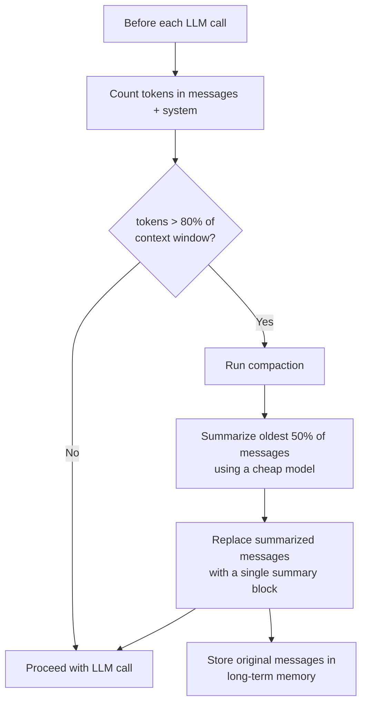
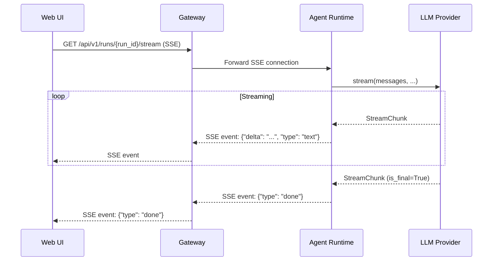

# LLM Adapters Architecture

**Status**: Draft  
**Date**: 2026-04-18  
**Scope**: LLM adapter interface, provider implementations, token counting, cost calculation, prompt management, context window management, and streaming

---

## Table of Contents

1. [Overview](#overview)
2. [Adapter Interface](#adapter-interface)
3. [Provider Implementations](#provider-implementations)
4. [Token Counting and Cost Calculation](#token-counting-and-cost-calculation)
5. [Prompt Template Management](#prompt-template-management)
6. [Context Window Management](#context-window-management)
7. [Streaming Support](#streaming-support)
8. [Adapter Registry](#adapter-registry)
9. [Error Handling and Retry](#error-handling-and-retry)
10. [Design Decisions](#design-decisions)

---

## Overview

The LLM adapter layer abstracts all interactions with language model providers behind a single interface. The decision loop (see `agent-framework.md`) calls `adapter.complete(...)` without knowing which provider is underneath. This enables:

- Switching an agent from Claude to GPT without changing any agent logic
- Running cost experiments (same task, multiple providers)
- Supporting local models for development environments
- Adding new providers without touching the decision loop

The adapters live at `services/agent-runtime/app/adapters/llm/`.

---

## Adapter Interface

```python
# adapters/llm/base.py

from abc import ABC, abstractmethod
from dataclasses import dataclass, field
from typing import AsyncIterator, Optional
from enum import Enum


class StopReason(str, Enum):
    END_TURN = "end_turn"
    TOOL_USE = "tool_use"
    MAX_TOKENS = "max_tokens"
    STOP_SEQUENCE = "stop_sequence"


@dataclass
class ToolCall:
    """A single tool invocation requested by the LLM."""
    id: str              # Provider-generated call ID
    name: str            # Tool name from the tool registry
    arguments: dict      # Parsed JSON arguments


@dataclass
class LLMResponse:
    content: str                           # Text content of the response
    tool_calls: list[ToolCall]             # Tool calls requested (may be empty)
    stop_reason: StopReason
    input_tokens: int
    output_tokens: int
    tokens_used: int                       # input + output
    model: str                             # The exact model string used
    cost_usd: float                        # Calculated cost for this call
    raw_response: Optional[dict] = None   # Original provider response for debugging


@dataclass
class StreamChunk:
    """A single chunk from a streaming response."""
    delta: str
    tool_call_delta: Optional[dict] = None
    is_final: bool = False
    stop_reason: Optional[StopReason] = None


@dataclass
class ToolDefinition:
    """A tool description passed to the LLM for tool calling."""
    name: str
    description: str
    input_schema: dict   # JSON Schema for the tool's input


class LLMAdapter(ABC):
    """
    Base class for all LLM provider adapters.
    All methods are async. Implementations must be thread-safe
    (multiple coroutines may call the same adapter concurrently).
    """

    @abstractmethod
    async def complete(
        self,
        messages: list[dict],
        system: str,
        tools: Optional[list[ToolDefinition]] = None,
        max_tokens: int = 4096,
        temperature: float = 0.3,
        stop_sequences: Optional[list[str]] = None,
    ) -> LLMResponse:
        """
        Send a completion request. Returns a full response.
        messages format: [{"role": "user"|"assistant"|"tool", "content": str}, ...]
        """
        ...

    @abstractmethod
    async def stream(
        self,
        messages: list[dict],
        system: str,
        tools: Optional[list[ToolDefinition]] = None,
        max_tokens: int = 4096,
    ) -> AsyncIterator[StreamChunk]:
        """
        Send a streaming completion request.
        Yields StreamChunk objects until is_final=True.
        """
        ...

    @abstractmethod
    def count_tokens(self, messages: list[dict], system: str = "") -> int:
        """
        Count tokens for the given messages without making an API call.
        Used for context window management decisions.
        """
        ...

    @abstractmethod
    def max_context_tokens(self) -> int:
        """Return the maximum context window size for the configured model."""
        ...

    @abstractmethod
    def name(self) -> str:
        """Return the adapter identifier, e.g. 'anthropic_claude'."""
        ...
```

---

## Provider Implementations

### AnthropicAdapter

The default adapter. Uses Claude's native tool use API (not OpenAI-compatible function calling).

```python
# adapters/llm/anthropic_adapter.py

import anthropic
from anthropic import AsyncAnthropic
from .base import LLMAdapter, LLMResponse, StreamChunk, StopReason, ToolCall, ToolDefinition
from ..pricing import ANTHROPIC_PRICING


# Context window sizes by model
ANTHROPIC_CONTEXT_WINDOWS = {
    "claude-opus-4-5":    200_000,
    "claude-sonnet-4-6":  200_000,
    "claude-haiku-4-5":   200_000,
    "claude-3-5-haiku":    200_000,
}


class AnthropicAdapter(LLMAdapter):
    def __init__(self, api_key: str, model: str = "claude-sonnet-4-6"):
        self._client = AsyncAnthropic(api_key=api_key)
        self._model = model
        self._pricing = ANTHROPIC_PRICING.get(model, ANTHROPIC_PRICING["claude-sonnet-4-6"])

    def name(self) -> str:
        return "anthropic_claude"

    def max_context_tokens(self) -> int:
        return ANTHROPIC_CONTEXT_WINDOWS.get(self._model, 200_000)

    def count_tokens(self, messages: list[dict], system: str = "") -> int:
        # Use anthropic's token counting API
        # This is a synchronous estimate; use the async API for exact counts
        return sum(len(m.get("content", "")) // 4 for m in messages) + len(system) // 4

    async def complete(
        self,
        messages: list[dict],
        system: str,
        tools: Optional[list[ToolDefinition]] = None,
        max_tokens: int = 4096,
        temperature: float = 0.3,
        stop_sequences: Optional[list[str]] = None,
    ) -> LLMResponse:
        kwargs = {
            "model": self._model,
            "max_tokens": max_tokens,
            "system": system,
            "messages": self._normalize_messages(messages),
            "temperature": temperature,
        }
        if tools:
            kwargs["tools"] = [self._format_tool(t) for t in tools]
        if stop_sequences:
            kwargs["stop_sequences"] = stop_sequences

        response = await self._client.messages.create(**kwargs)

        tool_calls = []
        text_content = ""
        for block in response.content:
            if block.type == "text":
                text_content = block.text
            elif block.type == "tool_use":
                tool_calls.append(ToolCall(
                    id=block.id,
                    name=block.name,
                    arguments=block.input,
                ))

        stop_reason = self._map_stop_reason(response.stop_reason)
        input_tokens = response.usage.input_tokens
        output_tokens = response.usage.output_tokens
        cost = self._calculate_cost(input_tokens, output_tokens)

        return LLMResponse(
            content=text_content,
            tool_calls=tool_calls,
            stop_reason=stop_reason,
            input_tokens=input_tokens,
            output_tokens=output_tokens,
            tokens_used=input_tokens + output_tokens,
            model=self._model,
            cost_usd=cost,
            raw_response=response.model_dump(),
        )

    async def stream(self, messages, system, tools=None, max_tokens=4096):
        kwargs = {
            "model": self._model,
            "max_tokens": max_tokens,
            "system": system,
            "messages": self._normalize_messages(messages),
        }
        if tools:
            kwargs["tools"] = [self._format_tool(t) for t in tools]

        async with self._client.messages.stream(**kwargs) as stream:
            async for event in stream:
                if hasattr(event, "type"):
                    if event.type == "content_block_delta":
                        if hasattr(event.delta, "text"):
                            yield StreamChunk(delta=event.delta.text)
                    elif event.type == "message_stop":
                        yield StreamChunk(delta="", is_final=True)

    def _normalize_messages(self, messages: list[dict]) -> list[dict]:
        """Convert internal message format to Anthropic's format."""
        normalized = []
        for msg in messages:
            if msg["role"] == "tool":
                # Anthropic uses "user" role with tool_result content blocks
                normalized.append({
                    "role": "user",
                    "content": [{
                        "type": "tool_result",
                        "tool_use_id": msg.get("tool_call_id"),
                        "content": msg["content"],
                    }]
                })
            else:
                normalized.append({"role": msg["role"], "content": msg["content"]})
        return normalized

    def _format_tool(self, tool: ToolDefinition) -> dict:
        return {
            "name": tool.name,
            "description": tool.description,
            "input_schema": tool.input_schema,
        }

    def _calculate_cost(self, input_tokens: int, output_tokens: int) -> float:
        return (
            input_tokens * self._pricing["input_per_million"] / 1_000_000
            + output_tokens * self._pricing["output_per_million"] / 1_000_000
        )

    def _map_stop_reason(self, reason: str) -> StopReason:
        mapping = {
            "end_turn": StopReason.END_TURN,
            "tool_use": StopReason.TOOL_USE,
            "max_tokens": StopReason.MAX_TOKENS,
            "stop_sequence": StopReason.STOP_SEQUENCE,
        }
        return mapping.get(reason, StopReason.END_TURN)
```

### OpenAIAdapter

Uses OpenAI's chat completions API with function calling.

```python
# adapters/llm/openai_adapter.py

from openai import AsyncOpenAI
import json
from .base import LLMAdapter, LLMResponse, StreamChunk, StopReason, ToolCall, ToolDefinition
from ..pricing import OPENAI_PRICING


OPENAI_CONTEXT_WINDOWS = {
    "gpt-4o":        128_000,
    "gpt-4o-mini":   128_000,
    "gpt-4-turbo":   128_000,
    "o3":            200_000,
    "o4-mini":       200_000,
}


class OpenAIAdapter(LLMAdapter):
    def __init__(self, api_key: str, model: str = "gpt-4o", base_url: Optional[str] = None):
        self._client = AsyncOpenAI(api_key=api_key, base_url=base_url)
        self._model = model
        self._pricing = OPENAI_PRICING.get(model, OPENAI_PRICING["gpt-4o"])

    def name(self) -> str:
        return "openai_gpt"

    def max_context_tokens(self) -> int:
        return OPENAI_CONTEXT_WINDOWS.get(self._model, 128_000)

    def count_tokens(self, messages: list[dict], system: str = "") -> int:
        # tiktoken-based counting
        try:
            import tiktoken
            enc = tiktoken.encoding_for_model(self._model)
            total = len(enc.encode(system))
            for m in messages:
                total += len(enc.encode(m.get("content", ""))) + 4  # per-message overhead
            return total
        except Exception:
            return sum(len(m.get("content", "")) // 4 for m in messages)

    async def complete(
        self,
        messages: list[dict],
        system: str,
        tools: Optional[list[ToolDefinition]] = None,
        max_tokens: int = 4096,
        temperature: float = 0.3,
        stop_sequences: Optional[list[str]] = None,
    ) -> LLMResponse:
        openai_messages = [{"role": "system", "content": system}] + messages
        kwargs = {
            "model": self._model,
            "messages": openai_messages,
            "max_tokens": max_tokens,
            "temperature": temperature,
        }
        if tools:
            kwargs["tools"] = [self._format_tool(t) for t in tools]
            kwargs["tool_choice"] = "auto"

        response = await self._client.chat.completions.create(**kwargs)
        choice = response.choices[0]
        message = choice.message

        tool_calls = []
        if message.tool_calls:
            for tc in message.tool_calls:
                tool_calls.append(ToolCall(
                    id=tc.id,
                    name=tc.function.name,
                    arguments=json.loads(tc.function.arguments),
                ))

        input_tokens = response.usage.prompt_tokens
        output_tokens = response.usage.completion_tokens
        cost = self._calculate_cost(input_tokens, output_tokens)

        return LLMResponse(
            content=message.content or "",
            tool_calls=tool_calls,
            stop_reason=self._map_stop_reason(choice.finish_reason),
            input_tokens=input_tokens,
            output_tokens=output_tokens,
            tokens_used=input_tokens + output_tokens,
            model=self._model,
            cost_usd=cost,
        )

    async def stream(self, messages, system, tools=None, max_tokens=4096):
        openai_messages = [{"role": "system", "content": system}] + messages
        async with self._client.chat.completions.stream(
            model=self._model,
            messages=openai_messages,
            max_tokens=max_tokens,
        ) as stream:
            async for chunk in stream:
                delta = chunk.choices[0].delta if chunk.choices else None
                if delta and delta.content:
                    yield StreamChunk(delta=delta.content)
                if chunk.choices and chunk.choices[0].finish_reason:
                    yield StreamChunk(delta="", is_final=True)

    def _format_tool(self, tool: ToolDefinition) -> dict:
        return {
            "type": "function",
            "function": {
                "name": tool.name,
                "description": tool.description,
                "parameters": tool.input_schema,
            },
        }

    def _calculate_cost(self, input_tokens: int, output_tokens: int) -> float:
        return (
            input_tokens * self._pricing["input_per_million"] / 1_000_000
            + output_tokens * self._pricing["output_per_million"] / 1_000_000
        )

    def _map_stop_reason(self, reason: str) -> StopReason:
        mapping = {
            "stop": StopReason.END_TURN,
            "tool_calls": StopReason.TOOL_USE,
            "length": StopReason.MAX_TOKENS,
        }
        return mapping.get(reason, StopReason.END_TURN)
```

### OllamaAdapter

For local models running via Ollama. Uses the OpenAI-compatible API that Ollama exposes.

```python
# adapters/llm/ollama_adapter.py

from .openai_adapter import OpenAIAdapter


class OllamaAdapter(OpenAIAdapter):
    """
    Ollama exposes an OpenAI-compatible API.
    This adapter is a thin wrapper that sets the base_url and
    disables cost calculation (local models have no API cost).
    """

    def __init__(self, base_url: str = "http://localhost:11434/v1", model: str = "llama3.2"):
        # Ollama does not require a real API key
        super().__init__(api_key="ollama", model=model, base_url=base_url)
        self._base_url = base_url

    def name(self) -> str:
        return "ollama"

    def max_context_tokens(self) -> int:
        # Ollama context window depends on the loaded model and configuration.
        # Default to a conservative 8192 for safety. Can be overridden in config.
        return 8_192

    def _calculate_cost(self, input_tokens: int, output_tokens: int) -> float:
        return 0.0  # Local model, no API cost

    def count_tokens(self, messages: list[dict], system: str = "") -> int:
        # No tiktoken support for arbitrary local models; use character-based estimate
        return sum(len(m.get("content", "")) // 4 for m in messages) + len(system) // 4
```

### CustomAdapter

For any OpenAI-compatible endpoint (e.g., vLLM, Together, Groq, Mistral).

```python
# adapters/llm/custom_adapter.py

from .openai_adapter import OpenAIAdapter
from ..pricing import PricingConfig


class CustomAdapter(OpenAIAdapter):
    """
    Adapter for any OpenAI-compatible endpoint.
    Pricing must be provided explicitly since there is no built-in pricing table.
    """

    def __init__(
        self,
        base_url: str,
        api_key: str,
        model: str,
        context_window: int = 8_192,
        pricing: Optional[PricingConfig] = None,
        adapter_name: str = "custom",
    ):
        super().__init__(api_key=api_key, model=model, base_url=base_url)
        self._context_window = context_window
        self._custom_pricing = pricing
        self._adapter_name = adapter_name

    def name(self) -> str:
        return self._adapter_name

    def max_context_tokens(self) -> int:
        return self._context_window

    def _calculate_cost(self, input_tokens: int, output_tokens: int) -> float:
        if not self._custom_pricing:
            return 0.0
        return (
            input_tokens * self._custom_pricing.input_per_million / 1_000_000
            + output_tokens * self._custom_pricing.output_per_million / 1_000_000
        )
```

---

## Token Counting and Cost Calculation

### Pricing Table

```python
# adapters/pricing.py

from dataclasses import dataclass
from typing import Optional


@dataclass
class PricingConfig:
    input_per_million: float    # USD per million input tokens
    output_per_million: float   # USD per million output tokens
    cache_write_per_million: Optional[float] = None
    cache_read_per_million: Optional[float] = None


# Prices as of April 2026 — update when providers change pricing
ANTHROPIC_PRICING: dict[str, PricingConfig] = {
    "claude-opus-4-5":    PricingConfig(input_per_million=15.0,  output_per_million=75.0,  cache_write_per_million=18.75, cache_read_per_million=1.50),
    "claude-sonnet-4-6":  PricingConfig(input_per_million=3.0,   output_per_million=15.0,  cache_write_per_million=3.75,  cache_read_per_million=0.30),
    "claude-haiku-4-5":   PricingConfig(input_per_million=0.80,  output_per_million=4.0,   cache_write_per_million=1.00,  cache_read_per_million=0.08),
}

OPENAI_PRICING: dict[str, PricingConfig] = {
    "gpt-4o":       PricingConfig(input_per_million=2.50,  output_per_million=10.0),
    "gpt-4o-mini":  PricingConfig(input_per_million=0.15,  output_per_million=0.60),
    "o3":           PricingConfig(input_per_million=10.0,  output_per_million=40.0),
    "o4-mini":      PricingConfig(input_per_million=1.10,  output_per_million=4.40),
}
```

### Cost Tracking Flow

Every `LLMResponse` includes `cost_usd`. The decision loop passes this to `BudgetService.record_usage()`, which:

1. Increments Redis counters for the agent's daily/monthly usage (fast)
2. Enqueues a DB write to the `token_usage` table (durable, for reporting)

```sql
CREATE TABLE token_usage (
    usage_id        TEXT PRIMARY KEY DEFAULT gen_random_uuid()::text,
    agent_id        TEXT NOT NULL REFERENCES agents(agent_id),
    company_id      TEXT NOT NULL,
    run_id          TEXT,
    model           TEXT NOT NULL,
    adapter         TEXT NOT NULL,
    input_tokens    INTEGER NOT NULL,
    output_tokens   INTEGER NOT NULL,
    cost_usd        NUMERIC(10, 6) NOT NULL,
    recorded_at     TIMESTAMPTZ NOT NULL DEFAULT NOW()
);

CREATE INDEX idx_token_usage_agent_date ON token_usage (agent_id, recorded_at DESC);
CREATE INDEX idx_token_usage_company_date ON token_usage (company_id, recorded_at DESC);
```

---

## Prompt Template Management

System prompts are role-specific templates rendered at agent activation time. They are stored as Jinja2 templates in the database (or in the `prompts/` directory for default roles).

```python
# adapters/prompts.py

from jinja2 import Environment, BaseLoader
from dataclasses import dataclass


@dataclass
class PromptContext:
    agent_name: str
    company_name: str
    role: str
    authority_level: int
    manager_name: Optional[str]
    today_date: str
    company_description: str
    custom_instructions: str = ""


class PromptTemplateManager:
    DEFAULT_TEMPLATES_DIR = "prompts/roles/"

    def __init__(self, db_pool):
        self._db = db_pool
        self._jinja = Environment(loader=BaseLoader(), autoescape=False)

    async def render_system_prompt(self, role: str, context: PromptContext) -> str:
        template_str = await self._load_template(role)
        template = self._jinja.from_string(template_str)
        return template.render(**context.__dict__)

    async def _load_template(self, role: str) -> str:
        # Check DB for company-customized template first
        row = await self._db.fetchrow(
            "SELECT template FROM prompt_templates WHERE role = $1", role
        )
        if row:
            return row["template"]
        # Fall back to built-in default
        return self._load_default_template(role)

    def _load_default_template(self, role: str) -> str:
        path = f"{self.DEFAULT_TEMPLATES_DIR}{role}.jinja2"
        try:
            with open(path) as f:
                return f.read()
        except FileNotFoundError:
            return self._generic_template()

    def _generic_template(self) -> str:
        return """You are {{ agent_name }}, the {{ role }} at {{ company_name }}.
{{ company_description }}

Today is {{ today_date }}.
You report to {{ manager_name }}.
Your authority level is {{ authority_level }} out of 5.

{{ custom_instructions }}

Always act in the best interest of the company. When you are uncertain, escalate to your manager rather than guessing.
"""
```

### Default Role Templates

Templates reside at `services/agent-runtime/prompts/roles/{role}.jinja2`. Each template covers:

- Role responsibilities and decision authority
- Communication style matching the agent's personality config
- Tool usage guidelines (what to use and when)
- Escalation triggers (when to stop and escalate)
- Output format expectations (structured updates, concise summaries)

---

## Context Window Management

As conversation history grows, the context window fills up. The adapter layer manages this transparently so the decision loop does not need to worry about it.

### Compaction Strategy



```python
# adapters/llm/context_manager.py

from dataclasses import dataclass


COMPACTION_THRESHOLD = 0.80  # Compact when over 80% full
COMPACTION_TARGET = 0.50     # Compact down to 50% of window


@dataclass
class CompactionResult:
    original_message_count: int
    compacted_message_count: int
    tokens_before: int
    tokens_after: int
    summary: str


class ContextWindowManager:
    def __init__(self, adapter: "LLMAdapter", memory_service):
        self._adapter = adapter
        self._memory = memory_service

    async def maybe_compact(
        self,
        messages: list[dict],
        system: str,
        agent_id: str,
        run_id: str,
    ) -> list[dict]:
        current_tokens = self._adapter.count_tokens(messages, system)
        max_tokens = self._adapter.max_context_tokens()
        threshold = int(max_tokens * COMPACTION_THRESHOLD)

        if current_tokens <= threshold:
            return messages

        return await self._compact(messages, system, agent_id, run_id, current_tokens, max_tokens)

    async def _compact(
        self,
        messages: list[dict],
        system: str,
        agent_id: str,
        run_id: str,
        current_tokens: int,
        max_tokens: int,
    ) -> list[dict]:
        target_tokens = int(max_tokens * COMPACTION_TARGET)

        # Identify messages to summarize (oldest half, preserve system context)
        # Always keep the last 4 messages intact for coherence
        split_point = max(1, len(messages) - 4)
        to_summarize = messages[:split_point]
        to_keep = messages[split_point:]

        summary = await self._summarize(to_summarize)

        # Store original messages in long-term memory before discarding
        full_text = "\n".join(
            f"{m['role'].upper()}: {m['content']}" for m in to_summarize
        )
        await self._memory.store(MemoryEntry(
            memory_id=f"compact_{run_id}_{len(messages)}",
            agent_id=agent_id,
            category="conversation",
            content=full_text[:2000],  # Store a truncated version
            metadata={"run_id": run_id, "compacted": True},
        ))

        summary_message = {
            "role": "user",
            "content": f"[Context Summary - earlier conversation compressed]\n{summary}",
        }
        compacted = [summary_message] + to_keep
        return compacted

    async def _summarize(self, messages: list[dict]) -> str:
        summary_prompt = "Summarize the following conversation history in 3-5 sentences, preserving key decisions, facts, and action items:\n\n"
        for m in messages:
            summary_prompt += f"{m['role'].upper()}: {m['content']}\n"

        response = await self._adapter.complete(
            messages=[{"role": "user", "content": summary_prompt}],
            system="You are a concise summarizer. Output only the summary, no preamble.",
            max_tokens=500,
        )
        return response.content
```

---

## Streaming Support

Streaming is used by the web UI to display agent activity in real time. The decision loop itself runs non-streaming for simplicity (tool calls require a complete response). Streaming is used exclusively for the web UI "watch an agent think" feature.

### Streaming Architecture



```python
# api/runs.py (streaming endpoint)

from fastapi import APIRouter
from fastapi.responses import StreamingResponse
import asyncio
import json

router = APIRouter()


@router.get("/runs/{run_id}/stream")
async def stream_run(run_id: str, request: Request):
    """Server-Sent Events stream for a running agent."""

    async def event_generator():
        redis = request.app.state.redis
        stream_key = f"run_stream:{run_id}"
        last_id = "0"

        while True:
            messages = await redis.xread({stream_key: last_id}, count=10, block=1000)
            if not messages:
                continue

            for _stream, entries in messages:
                for msg_id, data in entries:
                    last_id = msg_id
                    event_data = json.loads(data.get("event", "{}"))
                    yield f"data: {json.dumps(event_data)}\n\n"
                    if event_data.get("type") == "done":
                        return

    return StreamingResponse(
        event_generator(),
        media_type="text/event-stream",
        headers={
            "Cache-Control": "no-cache",
            "X-Accel-Buffering": "no",
        },
    )
```

---

## Adapter Registry

Adapters are registered at startup and resolved by the agent config's `llm_adapter_id` field.

```python
# adapters/llm/registry.py

from typing import Optional
from .base import LLMAdapter
from .anthropic_adapter import AnthropicAdapter
from .openai_adapter import OpenAIAdapter
from .ollama_adapter import OllamaAdapter
from .custom_adapter import CustomAdapter


class LLMAdapterRegistry:
    def __init__(self):
        self._adapters: dict[str, LLMAdapter] = {}

    def register(self, adapter_id: str, adapter: LLMAdapter) -> None:
        self._adapters[adapter_id] = adapter

    def get(self, adapter_id: str) -> Optional[LLMAdapter]:
        return self._adapters.get(adapter_id)

    def get_for_agent(self, agent_config: "AgentConfig") -> LLMAdapter:
        adapter = self.get(agent_config.llm_adapter_id)
        if not adapter:
            raise ValueError(f"LLM adapter '{agent_config.llm_adapter_id}' not found in registry")
        return adapter


def build_registry(settings) -> LLMAdapterRegistry:
    registry = LLMAdapterRegistry()

    if settings.ANTHROPIC_API_KEY:
        registry.register("anthropic_claude", AnthropicAdapter(
            api_key=settings.ANTHROPIC_API_KEY,
            model="claude-sonnet-4-6",
        ))
        registry.register("anthropic_claude_opus", AnthropicAdapter(
            api_key=settings.ANTHROPIC_API_KEY,
            model="claude-opus-4-5",
        ))
        registry.register("anthropic_claude_haiku", AnthropicAdapter(
            api_key=settings.ANTHROPIC_API_KEY,
            model="claude-haiku-4-5",
        ))

    if settings.OPENAI_API_KEY:
        registry.register("openai_gpt4o", OpenAIAdapter(
            api_key=settings.OPENAI_API_KEY,
            model="gpt-4o",
        ))
        registry.register("openai_gpt4o_mini", OpenAIAdapter(
            api_key=settings.OPENAI_API_KEY,
            model="gpt-4o-mini",
        ))

    if settings.OLLAMA_BASE_URL:
        registry.register("ollama_llama3", OllamaAdapter(
            base_url=settings.OLLAMA_BASE_URL,
            model="llama3.2",
        ))

    return registry
```

---

## Error Handling and Retry

LLM API calls fail for many reasons: rate limits, service outages, malformed responses. The adapter layer handles these transparently.

```python
# adapters/llm/retry.py

import asyncio
import logging
import random
from functools import wraps
from typing import TypeVar, Callable, Awaitable

logger = logging.getLogger(__name__)
T = TypeVar("T")

RETRYABLE_STATUS_CODES = {429, 500, 502, 503, 529}


def with_retry(max_attempts: int = 3, base_delay: float = 1.0):
    """Decorator that retries LLM calls with exponential backoff + jitter."""
    def decorator(func: Callable[..., Awaitable[T]]) -> Callable[..., Awaitable[T]]:
        @wraps(func)
        async def wrapper(*args, **kwargs) -> T:
            last_exception = None
            for attempt in range(1, max_attempts + 1):
                try:
                    return await func(*args, **kwargs)
                except RateLimitError as e:
                    # Respect Retry-After header if present
                    retry_after = getattr(e, "retry_after", None)
                    delay = retry_after or (base_delay * 2 ** (attempt - 1) + random.uniform(0, 1))
                    logger.warning("Rate limited (attempt %d/%d). Waiting %.1fs", attempt, max_attempts, delay)
                    await asyncio.sleep(delay)
                    last_exception = e
                except APIStatusError as e:
                    if e.status_code in RETRYABLE_STATUS_CODES:
                        delay = base_delay * 2 ** (attempt - 1) + random.uniform(0, 1)
                        logger.warning("Retryable API error %d (attempt %d/%d). Waiting %.1fs",
                                       e.status_code, attempt, max_attempts, delay)
                        await asyncio.sleep(delay)
                        last_exception = e
                    else:
                        raise  # Non-retryable (400, 401, 403) — propagate immediately
            raise last_exception
        return wrapper
    return decorator
```

---

## Design Decisions

### Why a custom abstract interface rather than LiteLLM?

LiteLLM is an excellent library but it abstracts over provider differences in ways that can hide useful information. For example, Anthropic's tool use API and OpenAI's function calling API have different semantics around multi-turn tool results. Our interface is thin and exposes the underlying model's behavior clearly. We import provider SDKs directly, keeping upgrade paths per-provider straightforward.

### Why include cost_usd in every LLMResponse?

Cost is a first-class concern in AgentCompany. By calculating cost at the call site (in the adapter, where we have token counts and the pricing table), the budget service gets an accurate figure without needing to know which model was used. This also enables the analytics layer to attribute costs precisely.

### Why Jinja2 for prompt templates?

Prompt templates are text files with variable substitution. Jinja2 is the industry standard for this in Python, is secure when configured correctly (no arbitrary code execution), and allows template inheritance for role hierarchies (a `developer.jinja2` can extend `employee.jinja2`). The templates are stored in the DB for per-company customization, with file-based defaults that ship with the service.

### Why 80% compaction threshold?

Waiting until the context is 100% full risks an API error on the next call. 80% provides a buffer for the response tokens plus overhead. The target of 50% gives room for the conversation to grow naturally before the next compaction is needed.
