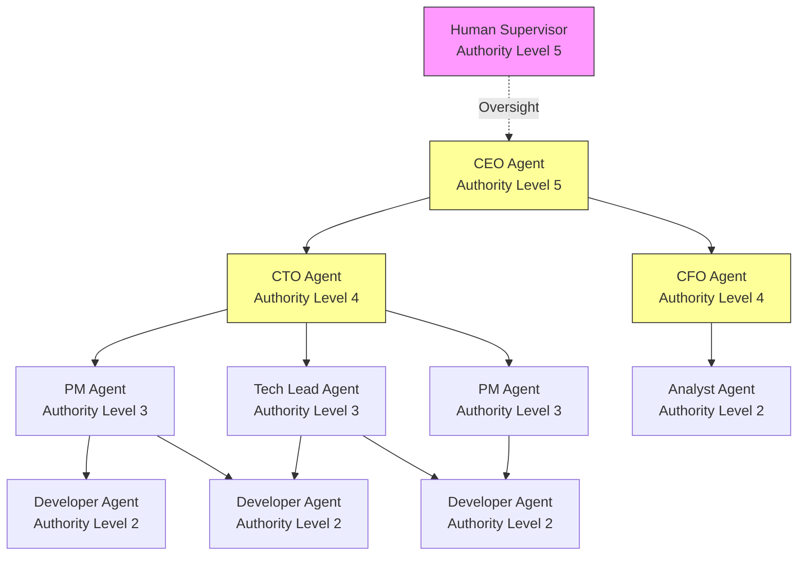
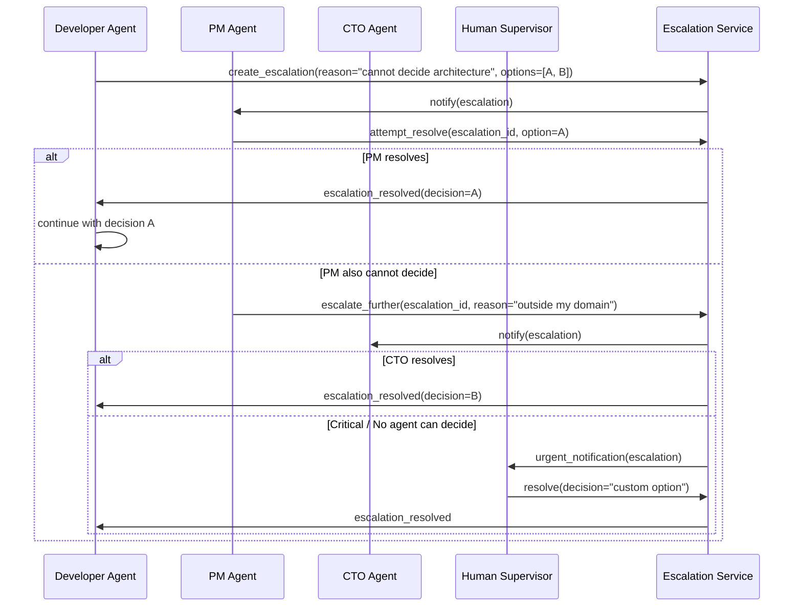
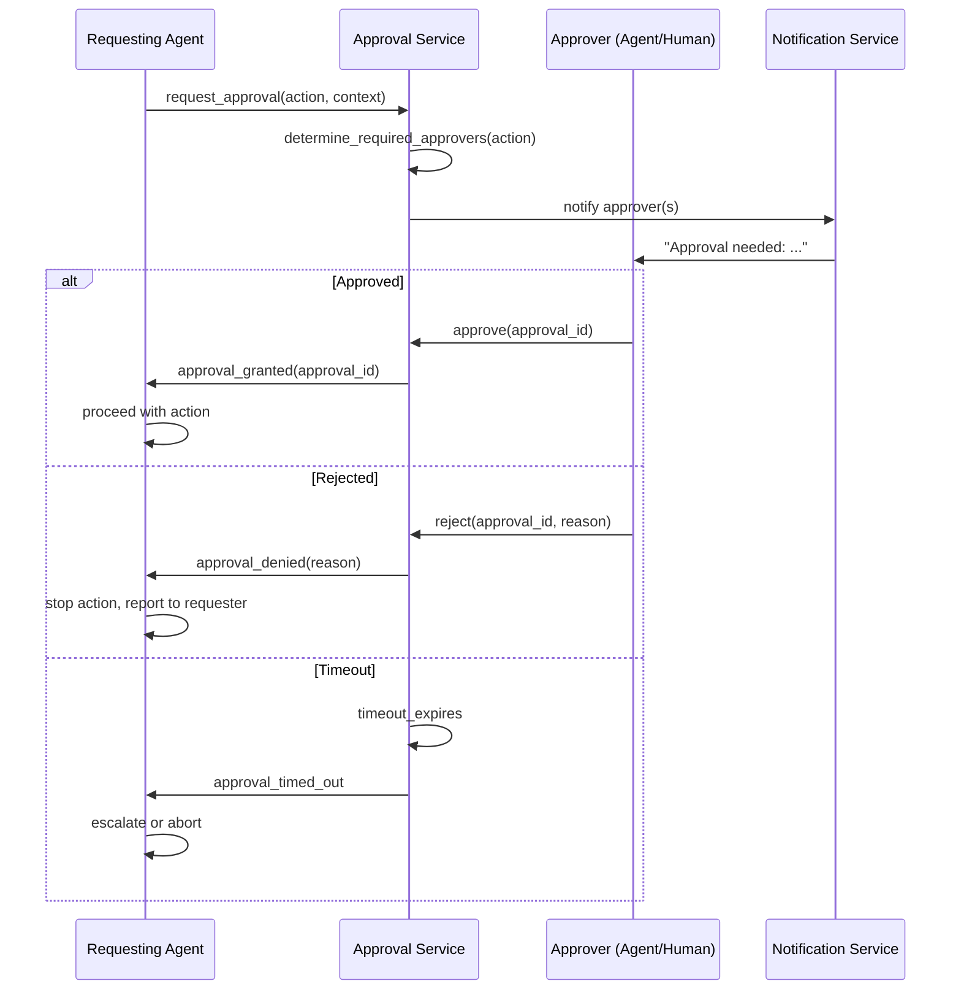
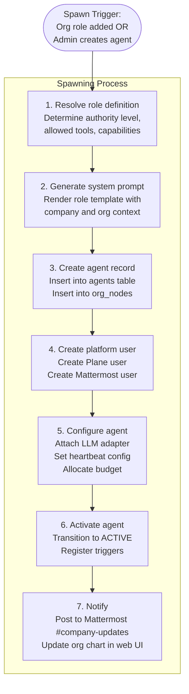

# Org Hierarchy Engine Architecture

**Status**: Draft  
**Date**: 2026-04-18  
**Scope**: Org hierarchy representation, authority and delegation model, escalation paths, approval workflows, and agent spawning

---

## Table of Contents

1. [Overview](#overview)
2. [Org Hierarchy Representation](#org-hierarchy-representation)
3. [Authority and Delegation Model](#authority-and-delegation-model)
4. [Escalation Paths](#escalation-paths)
5. [Approval Workflows](#approval-workflows)
6. [Agent Spawning](#agent-spawning)
7. [Org Change Events](#org-change-events)
8. [Security Considerations](#security-considerations)
9. [Design Decisions](#design-decisions)

---

## Overview

The org hierarchy engine is the component that understands the organizational structure of each company in AgentCompany. It answers questions like:

- Who does this agent report to?
- Does this agent have the authority to approve this budget?
- Where should this task escalate if the assigned agent cannot resolve it?
- When a new PM role is added, what does the agent need to be configured with?

The engine is not a separate service. It is a domain module within the agent-runtime at `app/services/org_hierarchy.py`. It reads from the `org_nodes` and `reporting_relationships` tables in PostgreSQL.

---

## Org Hierarchy Representation

### Data Model

The org is a directed acyclic graph (DAG), not a strict tree. A PM might report to both a CTO and a COO. An agent might be a member of multiple teams.

```sql
-- Core org node (each person or agent in the company)
CREATE TABLE org_nodes (
    node_id         TEXT PRIMARY KEY,
    company_id      TEXT NOT NULL,
    node_type       TEXT NOT NULL,   -- "agent" | "human"
    role            TEXT NOT NULL,   -- "ceo" | "cto" | "pm" | "developer" | "analyst" | ...
    display_name    TEXT NOT NULL,
    agent_id        TEXT REFERENCES agents(agent_id),    -- null if human
    human_user_id   TEXT,                                -- null if agent
    authority_level INTEGER NOT NULL DEFAULT 1,          -- 1 (IC) to 5 (CEO)
    department      TEXT,
    is_active       BOOLEAN NOT NULL DEFAULT TRUE,
    created_at      TIMESTAMPTZ NOT NULL DEFAULT NOW(),
    metadata        JSONB DEFAULT '{}'
);

-- Reporting relationships (manager -> report)
CREATE TABLE reporting_relationships (
    relationship_id TEXT PRIMARY KEY DEFAULT gen_random_uuid()::text,
    company_id      TEXT NOT NULL,
    manager_node_id TEXT NOT NULL REFERENCES org_nodes(node_id),
    report_node_id  TEXT NOT NULL REFERENCES org_nodes(node_id),
    relationship_type TEXT NOT NULL DEFAULT "direct",  -- "direct" | "dotted_line" | "functional"
    created_at      TIMESTAMPTZ NOT NULL DEFAULT NOW(),
    UNIQUE (manager_node_id, report_node_id)
);

-- Role definitions: what authority a role has
CREATE TABLE role_definitions (
    role            TEXT NOT NULL,
    company_id      TEXT NOT NULL,
    authority_level INTEGER NOT NULL,
    -- Decisions this role can make without escalation
    autonomous_decisions JSONB DEFAULT '[]',
    -- Decisions this role must escalate
    escalation_required JSONB DEFAULT '[]',
    -- Maximum budget this role can approve (null = none)
    max_budget_approval_usd NUMERIC,
    PRIMARY KEY (role, company_id)
);
```

### In-Code Representation

```python
# services/org_hierarchy.py

from dataclasses import dataclass, field
from typing import Optional
from enum import Enum


class NodeType(str, Enum):
    AGENT = "agent"
    HUMAN = "human"


class RelationshipType(str, Enum):
    DIRECT = "direct"
    DOTTED_LINE = "dotted_line"
    FUNCTIONAL = "functional"


@dataclass
class OrgNode:
    node_id: str
    company_id: str
    node_type: NodeType
    role: str
    display_name: str
    authority_level: int           # 1 (IC) to 5 (CEO)
    agent_id: Optional[str] = None
    human_user_id: Optional[str] = None
    department: Optional[str] = None
    is_active: bool = True
    metadata: dict = field(default_factory=dict)


@dataclass
class ReportingRelationship:
    relationship_id: str
    manager_node_id: str
    report_node_id: str
    relationship_type: RelationshipType


@dataclass
class OrgPath:
    """The chain of authority from a node up to the root."""
    node_id: str
    path: list[OrgNode]   # Ordered from the node itself to the root (CEO/human admin)

    @property
    def immediate_manager(self) -> Optional[OrgNode]:
        return self.path[1] if len(self.path) > 1 else None

    @property
    def root(self) -> OrgNode:
        return self.path[-1]
```

### Org Hierarchy Visualization



### OrgHierarchyService

```python
class OrgHierarchyService:
    def __init__(self, db_pool):
        self._db = db_pool

    async def get_node(self, node_id: str) -> Optional[OrgNode]:
        row = await self._db.fetchrow(
            "SELECT * FROM org_nodes WHERE node_id = $1", node_id
        )
        return OrgNode(**row) if row else None

    async def get_node_for_agent(self, agent_id: str) -> Optional[OrgNode]:
        row = await self._db.fetchrow(
            "SELECT * FROM org_nodes WHERE agent_id = $1", agent_id
        )
        return OrgNode(**row) if row else None

    async def get_managers(self, node_id: str, relationship_type: str = "direct") -> list[OrgNode]:
        """Return all managers of a node."""
        rows = await self._db.fetch(
            """
            SELECT n.* FROM org_nodes n
            JOIN reporting_relationships r ON r.manager_node_id = n.node_id
            WHERE r.report_node_id = $1
              AND r.relationship_type = $2
              AND n.is_active = TRUE
            ORDER BY n.authority_level DESC
            """,
            node_id, relationship_type,
        )
        return [OrgNode(**row) for row in rows]

    async def get_reports(self, node_id: str) -> list[OrgNode]:
        """Return all direct reports of a node."""
        rows = await self._db.fetch(
            """
            SELECT n.* FROM org_nodes n
            JOIN reporting_relationships r ON r.report_node_id = n.node_id
            WHERE r.manager_node_id = $1
              AND r.relationship_type = 'direct'
              AND n.is_active = TRUE
            ORDER BY n.authority_level DESC
            """,
            node_id,
        )
        return [OrgNode(**row) for row in rows]

    async def get_authority_path(self, node_id: str) -> OrgPath:
        """
        Walk the reporting chain from node up to the root.
        Uses a recursive CTE to traverse the graph efficiently.
        """
        rows = await self._db.fetch(
            """
            WITH RECURSIVE authority_chain AS (
                -- Base: the starting node
                SELECT node_id, display_name, role, authority_level, 0 AS depth
                FROM org_nodes
                WHERE node_id = $1 AND is_active = TRUE

                UNION ALL

                -- Recursive: walk up via direct reporting relationships
                SELECT n.node_id, n.display_name, n.role, n.authority_level, ac.depth + 1
                FROM org_nodes n
                JOIN reporting_relationships r ON r.manager_node_id = n.node_id
                JOIN authority_chain ac ON ac.node_id = r.report_node_id
                WHERE r.relationship_type = 'direct'
                  AND n.is_active = TRUE
                  AND ac.depth < 10   -- Safety: prevent infinite loops
            )
            SELECT * FROM authority_chain ORDER BY depth ASC
            """,
            node_id,
        )
        nodes = [OrgNode(**row) for row in rows]
        return OrgPath(node_id=node_id, path=nodes)

    async def can_assign_to(self, assigning_node_id: str, target_node_id: str) -> bool:
        """
        Check if a node can assign tasks to another.
        Rules: managers can assign to all their direct and indirect reports.
        Peers cannot assign to peers (must go through manager).
        """
        assigning_node = await self.get_node(assigning_node_id)
        target_node = await self.get_node(target_node_id)
        if not assigning_node or not target_node:
            return False
        # CEO can assign to anyone
        if assigning_node.authority_level >= 5:
            return True
        # Check if target is a report (direct or indirect)
        return await self._is_in_subtree(assigning_node_id, target_node_id)

    async def _is_in_subtree(self, root_node_id: str, candidate_node_id: str) -> bool:
        """Check if candidate is a report (at any depth) of root."""
        row = await self._db.fetchrow(
            """
            WITH RECURSIVE subtree AS (
                SELECT node_id FROM org_nodes WHERE node_id = $1
                UNION ALL
                SELECT n.node_id FROM org_nodes n
                JOIN reporting_relationships r ON r.report_node_id = n.node_id
                JOIN subtree s ON s.node_id = r.manager_node_id
                WHERE r.relationship_type = 'direct'
            )
            SELECT node_id FROM subtree WHERE node_id = $2
            """,
            root_node_id, candidate_node_id,
        )
        return row is not None
```

---

## Authority and Delegation Model

### Authority Levels

| Level | Roles | Key Authorities |
|---|---|---|
| 5 | CEO, Board, Human Supervisors | Full authority. Can assign to any role. Can spawn/terminate agents. Can approve any budget. |
| 4 | CTO, CFO, COO | Authority over their domain. Can assign within their org subtree. Can approve department budgets. |
| 3 | PM, Tech Lead, Senior Dev | Authority over sprint and technical decisions within their team. Can assign to their direct reports. |
| 2 | Developer, Analyst, Specialist | Execute assigned work. Can create tasks but not assign to others. |
| 1 | Intern, Read-only Observer | Read access only. Cannot create or modify work items. |

### Delegation

Authority can be temporarily delegated when a manager is paused (e.g., budget exceeded) or terminated. Delegation is a first-class record:

```python
@dataclass
class AuthorityDelegation:
    delegation_id: str
    company_id: str
    delegating_node_id: str   # The manager delegating authority
    delegate_node_id: str     # Who receives it (must be in authority chain)
    scope: str                # "full" | "task_assignment" | "approvals"
    expires_at: Optional[datetime]
    created_at: datetime
    reason: str
```

Delegation is checked in every permission decision:

```python
async def get_effective_authority_level(self, node_id: str) -> int:
    """
    Returns the effective authority level of a node,
    accounting for active delegations.
    """
    node = await self.get_node(node_id)
    base_level = node.authority_level

    # Check if this node has any active delegations from higher-authority nodes
    delegations = await self._get_active_delegations_to(node_id)
    if delegations:
        max_delegated = max(d.delegating_authority_level for d in delegations)
        return max(base_level, max_delegated)

    return base_level
```

---

## Escalation Paths

Escalation is the mechanism by which an agent passes a decision to a higher authority when it cannot or should not decide alone.

### Escalation Triggers

An agent should escalate when:

1. The required decision exceeds its `authority_level` (e.g., spending $5,000 when its approval ceiling is $1,000)
2. The decision falls outside its role definition's `autonomous_decisions` list
3. The agent has reached `max_steps` without a satisfying answer
4. The task involves a domain outside its capability set
5. The task has been attempted and failed more than `max_retry_escalation_threshold` times
6. A critical deadline is approaching and a human must be notified

### Escalation Flow



### Escalation Service

```python
# services/escalation.py

from dataclasses import dataclass, field
from datetime import datetime, timedelta
from typing import Optional
from enum import Enum
import uuid


class EscalationStatus(str, Enum):
    OPEN = "open"
    IN_REVIEW = "in_review"
    RESOLVED = "resolved"
    EXPIRED = "expired"


class EscalationUrgency(str, Enum):
    LOW = "low"
    MEDIUM = "medium"
    HIGH = "high"
    CRITICAL = "critical"   # Always routes to a human


@dataclass
class Escalation:
    escalation_id: str = field(default_factory=lambda: f"esc_{uuid.uuid4().hex[:12]}")
    company_id: str = ""
    from_agent_id: str = ""
    from_node_id: str = ""
    assigned_to_node_id: Optional[str] = None
    run_id: str = ""
    task_description: str = ""
    reason: str = ""
    urgency: EscalationUrgency = EscalationUrgency.MEDIUM
    decision_options: list[str] = field(default_factory=list)
    context_summary: str = ""
    status: EscalationStatus = EscalationStatus.OPEN
    resolution: Optional[str] = None
    resolved_by_node_id: Optional[str] = None
    created_at: datetime = field(default_factory=datetime.utcnow)
    expires_at: Optional[datetime] = None
    resolved_at: Optional[datetime] = None


class EscalationService:
    # How long before an unresolved escalation auto-routes to the next level
    AUTO_ESCALATE_HOURS = {
        EscalationUrgency.LOW: 24,
        EscalationUrgency.MEDIUM: 8,
        EscalationUrgency.HIGH: 2,
        EscalationUrgency.CRITICAL: 0.25,  # 15 minutes
    }

    def __init__(self, db_pool, org_hierarchy, notification_service, event_bus):
        self._db = db_pool
        self._org = org_hierarchy
        self._notify = notification_service
        self._bus = event_bus

    async def create(self, escalation: Escalation) -> Escalation:
        # Determine who to escalate to
        assigned_to = await self._find_escalation_target(
            from_node_id=escalation.from_node_id,
            urgency=escalation.urgency,
        )
        escalation.assigned_to_node_id = assigned_to.node_id

        # Set TTL
        hours = self.AUTO_ESCALATE_HOURS[escalation.urgency]
        escalation.expires_at = datetime.utcnow() + timedelta(hours=hours)

        await self._persist(escalation)
        await self._notify_assignee(escalation, assigned_to)
        await self._bus.publish("escalation.created", {"escalation_id": escalation.escalation_id})

        return escalation

    async def resolve(
        self,
        escalation_id: str,
        resolution: str,
        resolved_by_node_id: str,
    ) -> Escalation:
        escalation = await self._get(escalation_id)
        if escalation.status != EscalationStatus.OPEN:
            raise ValueError(f"Escalation {escalation_id} is not open")

        escalation.resolution = resolution
        escalation.resolved_by_node_id = resolved_by_node_id
        escalation.status = EscalationStatus.RESOLVED
        escalation.resolved_at = datetime.utcnow()

        await self._update(escalation)
        await self._bus.publish("escalation.resolved", {
            "escalation_id": escalation_id,
            "from_agent_id": escalation.from_agent_id,
            "resolution": resolution,
        })
        return escalation

    async def _find_escalation_target(self, from_node_id: str, urgency: EscalationUrgency) -> OrgNode:
        """
        Find the appropriate escalation target:
        - CRITICAL: always a human
        - Others: immediate manager (agent or human)
        - If no manager: escalate to company admin human
        """
        if urgency == EscalationUrgency.CRITICAL:
            return await self._find_highest_human(from_node_id)

        managers = await self._org.get_managers(from_node_id, relationship_type="direct")
        if not managers:
            return await self._find_highest_human(from_node_id)

        # Prefer agent managers first (faster), then human if no agent available
        agent_managers = [m for m in managers if m.node_type == NodeType.AGENT]
        if agent_managers:
            return agent_managers[0]
        return managers[0]

    async def _find_highest_human(self, from_node_id: str) -> OrgNode:
        """Walk the authority path until we find a human node."""
        path = await self._org.get_authority_path(from_node_id)
        for node in path.path:
            if node.node_type == NodeType.HUMAN:
                return node
        # Fall back to company admin
        return await self._get_company_admin(from_node_id)
```

---

## Approval Workflows

Some actions require explicit approval before an agent can proceed. Approvals are distinct from escalations — they are not triggered by uncertainty but by policy (e.g., any budget spend over $500 requires CFO approval).

### Approval-Required Actions

| Action | Approval Required From | Timeout |
|---|---|---|
| Budget spend > $500 | CFO or CEO | 4 hours |
| Assign a task to a human | The human themselves or their manager | 24 hours |
| Terminate another agent | CEO or human admin | 1 hour |
| Create a new agent | CEO | 2 hours |
| Publish a public document | Agent's manager | 8 hours |
| Merge code to main branch | Tech Lead or CTO | 4 hours |
| Send an external email | Manager or human | 1 hour |

### Approval Flow



### Approval Implementation

```python
# services/approvals.py

from dataclasses import dataclass, field
from datetime import datetime, timedelta
from typing import Optional
from enum import Enum
import uuid


class ApprovalStatus(str, Enum):
    PENDING = "pending"
    APPROVED = "approved"
    REJECTED = "rejected"
    EXPIRED = "expired"


@dataclass
class ApprovalRequest:
    approval_id: str = field(default_factory=lambda: f"appr_{uuid.uuid4().hex[:12]}")
    company_id: str = ""
    requesting_agent_id: str = ""
    requesting_node_id: str = ""
    action_type: str = ""        # e.g. "budget_spend", "assign_human", "create_agent"
    action_description: str = ""
    action_metadata: dict = field(default_factory=dict)
    required_approver_node_ids: list[str] = field(default_factory=list)
    status: ApprovalStatus = ApprovalStatus.PENDING
    approved_by_node_id: Optional[str] = None
    rejection_reason: Optional[str] = None
    created_at: datetime = field(default_factory=datetime.utcnow)
    expires_at: Optional[datetime] = None
    resolved_at: Optional[datetime] = None


class ApprovalPolicy:
    """Defines which actions require approval and from whom."""

    POLICIES: dict[str, dict] = {
        "budget_spend": {
            "threshold_usd": 500,
            "approver_roles": ["cfo", "ceo"],
            "timeout_hours": 4,
        },
        "assign_human": {
            "threshold_usd": None,
            "approver_roles": ["manager", "human_self"],
            "timeout_hours": 24,
        },
        "create_agent": {
            "approver_roles": ["ceo", "human_admin"],
            "timeout_hours": 2,
        },
        "merge_to_main": {
            "approver_roles": ["tech_lead", "cto"],
            "timeout_hours": 4,
        },
    }

    def requires_approval(self, action_type: str, metadata: dict) -> bool:
        policy = self.POLICIES.get(action_type)
        if not policy:
            return False
        threshold = policy.get("threshold_usd")
        if threshold and metadata.get("amount_usd", 0) < threshold:
            return False
        return True

    def get_required_approver_roles(self, action_type: str) -> list[str]:
        policy = self.POLICIES.get(action_type, {})
        return policy.get("approver_roles", [])


class ApprovalService:
    def __init__(self, db_pool, org_hierarchy, notification_service, event_bus):
        self._db = db_pool
        self._org = org_hierarchy
        self._notify = notification_service
        self._bus = event_bus
        self._policy = ApprovalPolicy()

    async def request_approval(
        self,
        requesting_agent_id: str,
        action_type: str,
        action_description: str,
        action_metadata: dict,
    ) -> ApprovalRequest:
        if not self._policy.requires_approval(action_type, action_metadata):
            # No approval needed — return a pre-approved request
            return ApprovalRequest(
                requesting_agent_id=requesting_agent_id,
                action_type=action_type,
                status=ApprovalStatus.APPROVED,
            )

        node = await self._org.get_node_for_agent(requesting_agent_id)
        approver_nodes = await self._resolve_approvers(node, action_type, action_metadata)

        policy = self._policy.POLICIES[action_type]
        expires = datetime.utcnow() + timedelta(hours=policy.get("timeout_hours", 8))

        request = ApprovalRequest(
            company_id=node.company_id,
            requesting_agent_id=requesting_agent_id,
            requesting_node_id=node.node_id,
            action_type=action_type,
            action_description=action_description,
            action_metadata=action_metadata,
            required_approver_node_ids=[n.node_id for n in approver_nodes],
            expires_at=expires,
        )

        await self._persist(request)
        for approver_node in approver_nodes:
            await self._notify.notify_approval_request(approver_node, request)

        return request

    async def wait_for_approval(
        self,
        approval_id: str,
        poll_interval_seconds: float = 5.0,
    ) -> ApprovalRequest:
        """Poll until the approval is resolved or expired."""
        import asyncio
        while True:
            request = await self._get(approval_id)
            if request.status != ApprovalStatus.PENDING:
                return request
            if datetime.utcnow() > request.expires_at:
                await self._expire(request)
                return await self._get(approval_id)
            await asyncio.sleep(poll_interval_seconds)

    async def _resolve_approvers(
        self, requesting_node: OrgNode, action_type: str, metadata: dict
    ) -> list[OrgNode]:
        required_roles = self._policy.get_required_approver_roles(action_type)
        approvers = []
        for role_spec in required_roles:
            if role_spec == "manager":
                managers = await self._org.get_managers(requesting_node.node_id)
                approvers.extend(managers[:1])  # Immediate manager
            elif role_spec == "human_admin":
                human = await self._org.find_human_admin(requesting_node.company_id)
                if human:
                    approvers.append(human)
            else:
                # Find nearest node with this role in the authority chain
                role_node = await self._org.find_role_in_authority_chain(
                    requesting_node.node_id, role=role_spec
                )
                if role_node:
                    approvers.append(role_node)
        return approvers
```

### Human-in-the-Loop Interface

Approval requests surface in the web UI as an action panel. Humans can approve, reject, or request more information. They also receive Mattermost DMs for urgent approvals.

```
Web UI: /company/{company_id}/approvals
  - Pending approvals list with context
  - Approve / Reject buttons
  - "Delegate to agent" option (for approvals a human wants to handle via agent)

Mattermost: Direct message to approver with:
  - What is being requested
  - By which agent
  - Context summary
  - Approve / Reject links (deep links back to web UI)
```

---

## Agent Spawning

When a new role is added to the org, an agent must be created and configured for that role. This is a multi-step process.

### Spawning Flow



### Spawning Service

```python
# services/agent_spawner.py

from dataclasses import dataclass
from typing import Optional
import uuid


@dataclass
class SpawnRequest:
    company_id: str
    role: str
    display_name: str
    manager_node_id: Optional[str] = None
    llm_adapter_id: str = "anthropic_claude"
    llm_model: str = "claude-sonnet-4-6"
    heartbeat_mode: str = "event_triggered"
    heartbeat_cron: Optional[str] = None
    heartbeat_interval_seconds: Optional[int] = None
    token_budget_daily: int = 100_000
    token_budget_monthly: int = 2_000_000
    custom_instructions: str = ""
    metadata: dict = None


class AgentSpawnerService:
    def __init__(
        self,
        agent_repo,
        org_hierarchy,
        lifecycle_manager,
        prompt_template_manager,
        platform_user_provisioner,
        role_definition_repo,
        event_bus,
    ):
        self._agents = agent_repo
        self._org = org_hierarchy
        self._lifecycle = lifecycle_manager
        self._prompts = prompt_template_manager
        self._platform = platform_user_provisioner
        self._roles = role_definition_repo
        self._bus = event_bus

    async def spawn(self, request: SpawnRequest, triggered_by: str) -> "AgentConfig":
        # 1. Resolve role definition
        role_def = await self._roles.get(request.role, request.company_id)
        if not role_def:
            raise ValueError(f"No role definition found for '{request.role}'")

        # 2. Create platform user (Mattermost + Plane)
        platform_ids = await self._platform.create_user(
            display_name=request.display_name,
            role=request.role,
            company_id=request.company_id,
        )

        # 3. Determine manager
        manager_node = None
        if request.manager_node_id:
            manager_node = await self._org.get_node(request.manager_node_id)

        # 4. Generate system prompt
        company = await self._get_company(request.company_id)
        prompt_ctx = PromptContext(
            agent_name=request.display_name,
            company_name=company.name,
            role=request.role,
            authority_level=role_def.authority_level,
            manager_name=manager_node.display_name if manager_node else None,
            today_date=datetime.utcnow().strftime("%Y-%m-%d"),
            company_description=company.description,
            custom_instructions=request.custom_instructions,
        )
        system_prompt = await self._prompts.render_system_prompt(request.role, prompt_ctx)

        # 5. Build capabilities
        capabilities = AgentCapabilities(
            allowed_tools=role_def.default_allowed_tools,
            can_assign_tasks=role_def.authority_level >= 3,
            can_approve_prs=request.role in ("tech_lead", "cto"),
            can_spawn_agents=role_def.authority_level >= 5,
        )

        # 6. Build heartbeat config
        heartbeat_config = HeartbeatConfig(
            mode=HeartbeatMode(request.heartbeat_mode),
            interval_seconds=request.heartbeat_interval_seconds,
            cron=request.heartbeat_cron,
            event_filter=self._build_default_event_filter(request.role, platform_ids),
        )

        # 7. Create the agent
        config = AgentConfig(
            company_id=request.company_id,
            role=request.role,
            display_name=request.display_name,
            platform_user_id=platform_ids["mattermost_user_id"],
            system_prompt=system_prompt,
            capabilities=capabilities,
            heartbeat_config=heartbeat_config,
            llm_adapter_id=request.llm_adapter_id,
            llm_model=request.llm_model,
            authority_level=role_def.authority_level,
            manager_agent_id=manager_node.agent_id if manager_node and manager_node.agent_id else None,
            token_budget_daily=request.token_budget_daily,
            token_budget_monthly=request.token_budget_monthly,
            metadata=request.metadata or {},
        )
        await self._agents.create(config)

        # 8. Create org node
        node = OrgNode(
            node_id=f"node_{uuid.uuid4().hex[:12]}",
            company_id=request.company_id,
            node_type=NodeType.AGENT,
            role=request.role,
            display_name=request.display_name,
            agent_id=config.agent_id,
            authority_level=role_def.authority_level,
        )
        await self._org.create_node(node)

        # 9. Create reporting relationship
        if request.manager_node_id:
            await self._org.create_relationship(
                manager_node_id=request.manager_node_id,
                report_node_id=node.node_id,
            )

        # 10. Activate
        await self._lifecycle.transition(config.agent_id, AgentState.CONFIGURED, "spawn")
        await self._lifecycle.transition(config.agent_id, AgentState.ACTIVE, "auto_activate", triggered_by)

        # 11. Notify
        await self._bus.publish("agent.spawned", {
            "agent_id": config.agent_id,
            "role": request.role,
            "display_name": request.display_name,
            "company_id": request.company_id,
            "triggered_by": triggered_by,
        })

        return config

    def _build_default_event_filter(self, role: str, platform_ids: dict) -> EventFilter:
        """Build a sensible default event filter for a role."""
        base_events = ["task.assigned", "message.mention"]
        role_events = {
            "ceo": base_events + ["escalation.critical", "approval.pending"],
            "cto": base_events + ["escalation.created", "pr.review_requested"],
            "pm": base_events + ["sprint.started", "issue.blocked"],
            "developer": base_events + ["pr.assigned"],
        }
        return EventFilter(
            event_types=role_events.get(role, base_events),
            match_assigned_to_agent=True,
            sources=["all"],
        )
```

---

## Org Change Events

Changes to the org structure emit events that are consumed by agents and the web UI.

| Event | Payload | Consumers |
|---|---|---|
| `agent.spawned` | agent_id, role, company_id | Web UI (update org chart), manager agent (welcome new report) |
| `agent.terminated` | agent_id, role, reason | Web UI, manager agent (reassign work) |
| `org.reporting_changed` | manager_node_id, report_node_id | Affected agents (update system context) |
| `org.role_added` | role, company_id | Web UI, CEO agent |
| `escalation.created` | escalation_id, assigned_to | Assignee agent, web UI |
| `escalation.resolved` | escalation_id, resolution | Originating agent |
| `approval.pending` | approval_id, requesting_agent, action_type | Approver(s), web UI |
| `approval.resolved` | approval_id, status, reason | Requesting agent |

---

## Security Considerations

### Preventing Unauthorized Agent Spawning

The `can_spawn_agents` capability is required to spawn a new agent. This is only set for authority level 5 nodes (CEO and human admins). The spawner service validates this before creating the agent.

An agent cannot give itself higher authority than its own authority level. The spawning service caps the new agent's `authority_level` at `spawning_agent.authority_level - 1`.

### Preventing Circular Delegation

The authority path traversal uses a depth limit (10) and cycle detection in the recursive CTE. The `reporting_relationships` table has a unique constraint on `(manager_node_id, report_node_id)`.

### Approval Bypass Prevention

The tool sandbox calls `ApprovalService.request_approval()` before executing any approval-required action. The sandbox does not trust the LLM's judgment on whether approval is needed — it enforces policy independently.

An agent's `execute()` method should never call approval-required APIs directly. All such calls must route through tools, which route through the sandbox, which checks approvals.

---

## Design Decisions

### Why a DAG rather than a strict tree?

Real organizations have matrix structures — an engineer might report to both a tech lead (for technical work) and a PM (for project work). A DAG models this accurately. The escalation path always uses `direct` relationships to keep escalation chains simple and deterministic.

### Why is spawning a multi-step process?

Each step can fail independently. Creating the platform user might fail (Mattermost unreachable). Generating the prompt might fail (template invalid). By making each step explicit and ordered, we can resume from the failure point, and every failure is clearly attributed to a specific step.

### Why store authority level as an integer?

Numeric authority levels allow simple comparisons in permission checks without string matching against role names. Role names change (e.g., "developer" becomes "software engineer"). Authority levels are stable and role-agnostic.

### Why automatic activation after spawning?

Most spawning operations are triggered by a human or a CEO agent who has already made the decision to add this role. Requiring a second "activate" call would be friction without benefit. The lifecycle manager will reject the activation if the configuration is invalid (missing system prompt, invalid LLM adapter), so errors surface immediately.
