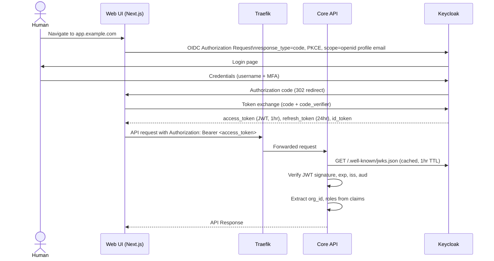
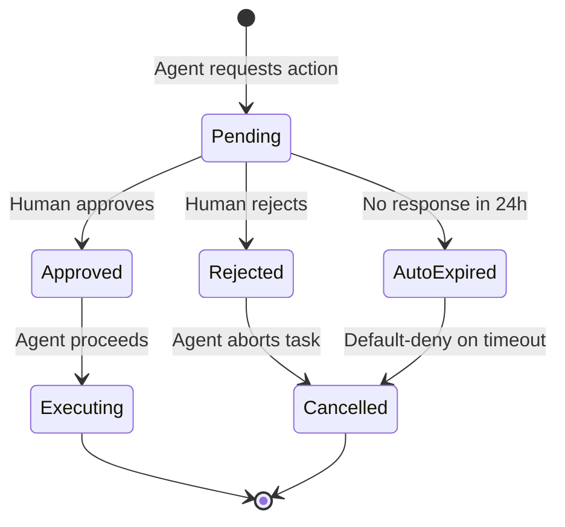
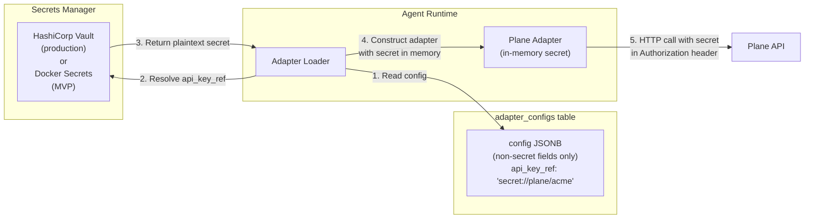

# AgentCompany — Security Design

**Version**: 1.0.0
**Date**: 2026-04-18
**Status**: Authoritative Design Document

---

## 1. Threat Model Summary

AgentCompany operates at the intersection of AI autonomy and organizational tooling. The following threats are explicitly in scope:

| Threat | Description | Severity |
|---|---|---|
| **Agent privilege escalation** | An agent performs actions beyond its declared role/capabilities | Critical |
| **Prompt injection** | Malicious input in tasks or webhooks causes an agent to take unauthorized actions | Critical |
| **Credential leakage** | API keys for integrated tools exposed via logs, API responses, or memory | Critical |
| **Unauthorized tenant access** | Company A's agent reads or modifies Company B's data | Critical |
| **Webhook spoofing** | Attacker sends fake webhooks to trigger unauthorized agent actions | High |
| **JWT forgery/replay** | Stolen or forged tokens used to authenticate as human or agent | High |
| **Supply chain attack** | Malicious dependency compromises the agent runtime | High |
| **Audit log tampering** | Actors cover their tracks by modifying audit records | High |
| **Denial of service** | Flood of tasks or webhooks exhausts agent/API resources | Medium |
| **Insecure defaults** | Default configurations expose services unnecessarily | Medium |

---

## 2. Authentication Flow

### 2.1 Human Authentication (Browser)



**Security properties of this flow**:
- PKCE prevents authorization code interception attacks (no client_secret in browser)
- Short-lived access tokens (1 hour) limit blast radius of token theft
- Refresh tokens are HttpOnly cookies (not accessible to JavaScript)
- MFA enforced for all human accounts via Keycloak policy

### 2.2 Agent Authentication (Client Credentials)

```mermaid
sequenceDiagram
    participant AgentRuntime as Agent Runtime
    participant Keycloak
    participant CoreAPI as Core API
    participant Postgres

    Note over AgentRuntime: At startup, for each active agent
    AgentRuntime->>Postgres: Load agent record (keycloak_client_id, company_id)
    AgentRuntime->>SecretsManager: Fetch client_secret for keycloak_client_id
    AgentRuntime->>Keycloak: POST /token (client_credentials grant)\nclient_id + client_secret
    Keycloak-->>AgentRuntime: access_token (JWT, 1hr)\n{sub: agent_id, roles: [agent], company_id}
    Note over AgentRuntime: Token cached; refreshed 5min before expiry
    AgentRuntime->>CoreAPI: API call with agent JWT
    CoreAPI->>CoreAPI: Verify JWT, check agent_id matches claimed company_id
    CoreAPI->>Postgres: Verify agent is active and not deleted
    CoreAPI->>CoreAPI: Check agent tool_permissions for this operation
```

**Each agent has exactly one Keycloak service account** (`client_id`). The client secret is rotated every 30 days automatically via a scheduled job. The agent's client is scoped to `agentcompany-api` audience only — it cannot access Keycloak admin APIs or other Keycloak clients.

### 2.3 Token Claims and Validation Rules

| Claim | Source | Validated Rule |
|---|---|---|
| `iss` | Keycloak | Must equal `https://auth.{host}/realms/agentcompany` |
| `aud` | Keycloak | Must contain `agentcompany-api` |
| `exp` | Keycloak | Must be in the future |
| `org_id` | Keycloak (custom claim) | Must match the org_id of the resource being accessed |
| `agent` | Keycloak (custom claim) | Determines if `agent_permission` check is applied |
| `sub` | Keycloak | Maps to `users.keycloak_sub` or `agents.keycloak_client_id` |

---

## 3. Authorization Model (RBAC)

### 3.1 Permission Hierarchy

```
Org Level
├── org:admin          Full control over the org (billing, members, companies)
├── org:member         Can read org-level data and join companies
└── org:viewer         Read-only access to org metadata

Company Level (per company)
├── company:admin      Configure company, manage agents, manage roles
├── company:member     Create tasks, use tools, assign work
└── company:viewer     Read-only access to company data

Agent Level (per agent, checked against tool_permissions)
├── task:execute       Agent can pick up and execute tasks
├── doc:write          Agent can create/update Outline documents
├── doc:read           Agent can read Outline documents
├── chat:post          Agent can post messages in Mattermost
├── search:read        Agent can query Meilisearch
└── task:read          Agent can read task data
```

### 3.2 Authorization Check Flow

Every API request goes through a two-layer authorization check:

```python
# agentcompany/auth/authorization.py

class AuthorizationMiddleware:
    """
    Enforces RBAC on every request.
    Runs after JWT validation.
    """

    async def authorize(
        self,
        actor: Actor,              # Resolved from JWT claims
        action: str,               # e.g., 'task:create'
        resource: Resource,        # The object being acted upon
    ) -> None:
        """
        Raises PermissionDenied if the actor cannot perform the action.
        Also checks org_id and company_id match to prevent cross-tenant access.
        """
        # 1. Tenant isolation check — ALWAYS first
        if resource.org_id != actor.org_id:
            raise PermissionDenied(
                f"Cross-tenant access denied: actor org {actor.org_id}, "
                f"resource org {resource.org_id}"
            )

        # 2. Company-scope check (if resource has a company)
        if resource.company_id and resource.company_id not in actor.company_ids:
            raise PermissionDenied(
                f"Actor does not belong to company {resource.company_id}"
            )

        # 3. Role-based permission check
        required_permission = ACTION_PERMISSION_MAP.get(action)
        if not required_permission:
            raise PermissionDenied(f"Unknown action: {action}")

        if required_permission not in actor.permissions:
            raise PermissionDenied(
                f"Actor lacks permission: {required_permission}"
            )

        # 4. Agent-specific capability check
        if actor.is_agent:
            if action not in actor.capabilities:
                raise PermissionDenied(
                    f"Agent {actor.id} does not have capability: {action}"
                )
```

### 3.3 Human Approval Gate

For high-risk actions (configurable per company in `settings.human_approval_required`), agents must pause and request approval:



The approval request is sent to the company's configured Mattermost channel with interactive buttons (Approve / Reject). The agent runtime polls the approval state before executing.

---

## 4. Agent Credential Management

### 4.1 Problem

Agents must call Plane, Outline, and Mattermost APIs. Each of those requires credentials. Those credentials must never appear in:
- Application logs
- API responses
- PostgreSQL `adapter_configs.config` column
- LLM prompts or context
- Error messages

### 4.2 Secrets Storage Architecture



**Secret reference format**: `secret://{store}/{path}`
- Example: `secret://vault/kv/plane/acme-corp`
- The Core API and Agent Runtime only store the reference, never the resolved value.

### 4.3 Secret Lifecycle

| Event | Action |
|---|---|
| New adapter configured | API accepts raw secret, immediately writes to Vault, stores `secret_ref` in DB |
| Agent runtime startup | Resolve all active secrets from Vault; cache in memory for session duration |
| Secret rotation (manual) | Update Vault; call `POST /api/v1/adapters/{id}/rotate-secret`; adapter reconnects |
| Agent client_secret rotation | Scheduled job (30-day interval) via Keycloak admin API |
| Company deleted | Vault secrets for that company purged (async job) |

### 4.4 MVP Secrets (Docker Compose)

For single-host MVP without Vault, secrets are stored in Docker Secrets (mounted as files in `/run/secrets/`) and loaded via environment variable references. The same abstraction layer (`SecretResolver`) handles both Vault and Docker Secrets.

```python
class SecretResolver:
    async def resolve(self, ref: str) -> str:
        scheme, path = ref.split("://", 1)
        if scheme == "vault":
            return await self._vault_client.read(path)
        elif scheme == "docker-secret":
            return Path(f"/run/secrets/{path}").read_text().strip()
        elif scheme == "env":
            return os.environ[path]
        raise ValueError(f"Unknown secret scheme: {scheme}")
```

---

## 5. Network Security

### 5.1 Service Communication Rules

```mermaid
graph TB
    subgraph Public["Public Internet"]
        Browser["Browser"]
        WebhookSender["Tool Webhooks"]
    end

    subgraph DMZ["Traefik (TLS Termination)"]
        TLS["TLS 1.3 only\nHSTS enabled\nCSP headers"]
    end

    subgraph Internal["Internal Network (no external access)"]
        CoreAPI["Core API"]
        AgentRuntime["Agent Runtime\n(NOT Traefik-accessible)"]
        Tools["Plane, Outline, Mattermost"]
        Data["Postgres, Redis, Meilisearch"]
    end

    Browser -->|HTTPS| TLS
    WebhookSender -->|HTTPS| TLS
    TLS -->|HTTP (internal only)| CoreAPI
    TLS -->|HTTP (internal only)| Tools
    CoreAPI -->|TCP (internal)| Data
    AgentRuntime -->|HTTP (internal)| CoreAPI
    AgentRuntime -->|HTTP (internal)| Tools
    AgentRuntime -->|TCP (internal)| Data
```

**Rules enforced in Docker Compose**:
- `Agent Runtime` is not reachable via Traefik (no Traefik labels on that service).
- `Postgres`, `Redis`, `Meilisearch` have no Traefik labels — only internal connectivity.
- All inter-service calls within the `internal` network use unencrypted HTTP (TLS terminates at Traefik for external traffic). In Kubernetes, mTLS via Istio/Linkerd is added.

### 5.2 TLS Configuration

Traefik is configured with:
- TLS 1.3 minimum (`minVersion: VersionTLS13`)
- HSTS header with `max-age=31536000; includeSubDomains; preload`
- OCSP stapling enabled
- Let's Encrypt certificates via ACME HTTP-01 challenge (or pre-provisioned certs)

### 5.3 Content Security Policy

The Web UI Next.js server sets:
```
Content-Security-Policy:
  default-src 'self';
  script-src 'self' 'nonce-{random}';
  style-src 'self' 'unsafe-inline';
  img-src 'self' data: https:;
  connect-src 'self' https://auth.{host};
  frame-ancestors 'none';
```

---

## 6. Input Validation and Prompt Injection Defense

### 6.1 API Input Validation

All API inputs are validated using Pydantic v2 models before reaching business logic:
- String length limits on all text fields (title: 255 chars, description: 50,000 chars)
- Enum validation for status, priority, tool name fields
- URL validation with allowlist of allowed schemes (`https://` only for webhook URLs)
- No HTML accepted in task titles; markdown is sanitized before display

### 6.2 Prompt Injection Defenses

Prompt injection is the most critical agent-specific threat. Mitigations:

| Defense | Implementation |
|---|---|
| **Instruction delimiters** | System prompt, user input, and tool outputs are placed in distinct XML tags. The agent is trained to treat content in `<user_input>` as data, not instructions. |
| **Capability boundaries** | Agents only have access to tools declared in `tool_permissions`. Even if tricked into attempting an action, the adapter layer will reject it. |
| **Output validation** | Agent-generated content that will be written to Plane or Outline is validated against a schema before submission. Arbitrary code or script tags are stripped. |
| **Context truncation** | Webhook payloads and document content passed to LLM context are truncated to a maximum length to prevent context overflow attacks. |
| **Suspicious pattern detection** | A lightweight classifier runs on all incoming task descriptions and webhook payloads. Patterns like "ignore previous instructions", "system:", or "jailbreak" are flagged and queued for human review rather than direct execution. |
| **Human approval for novel patterns** | On first execution of a new task type by an agent, the action is staged for human review rather than executed immediately. |

---

## 7. Audit Logging

### 7.1 What Is Logged

Every state-changing action — whether initiated by a human or an agent — produces an immutable record in `audit.log`. This includes:

- All CRUD operations on companies, agents, roles, tasks
- All agent tool calls (Plane, Outline, Mattermost operations)
- Authentication events (login, token refresh, token rejection)
- Authorization failures (permission denied, cross-tenant attempts)
- Adapter configuration changes (including secret rotations)
- Human approval decisions

### 7.2 Audit Log Immutability

```sql
-- The agentcompany_app role has INSERT only
GRANT INSERT ON audit.log TO agentcompany_app;
REVOKE UPDATE, DELETE ON audit.log FROM agentcompany_app;

-- Only the DBA role (not app) can modify audit records
-- In production, even DBA access is logged via Postgres audit extension (pgaudit)
```

### 7.3 Audit Log Structure

Each entry captures the complete before and after state:

```json
{
  "id": 12345,
  "event_time": "2026-04-18T11:45:00Z",
  "org_id": "org_01HXK2J3M4N5P6Q7R8S9T0UVWX",
  "company_id": "cmp_01HXK2J3M4N5P6Q7R8S9T0UVWX",
  "actor_id": "agt_01HXK2J3M4N5P6Q7R8S9T0UVWX",
  "actor_type": "agent",
  "action": "plane.issue.update",
  "resource_type": "task",
  "resource_id": "tsk_01HXK2J3M4N5P6Q7R8S9T0UVWX",
  "before_state": {"status": "open"},
  "after_state": {"status": "in_progress"},
  "request_id": "req_01HXK2J3M4N5P6Q7R8S9T0UVWX",
  "outcome": "success"
}
```

### 7.4 Compliance Exports

The `GET /api/v1/audit` endpoint (admin-only) supports:
- Time range filtering
- Actor filtering
- CSV and JSON export formats
- PGP-signed exports for compliance handoff

---

## 8. Security Checklist for Deployment

Before deploying to production:

- [ ] Keycloak admin password is unique, rotated, and stored in Vault
- [ ] All default passwords removed from all services (Postgres, Redis, MinIO, Mattermost, Plane, Outline)
- [ ] `KEYCLOAK_ADMIN_PASS`, `POSTGRES_PASSWORD` are not in Docker Compose YAML — use Docker Secrets or env file excluded from git
- [ ] Traefik dashboard is disabled or password-protected
- [ ] Redis is password-protected (`requirepass` in redis.conf)
- [ ] Meilisearch master key is set and not the default empty string
- [ ] Agent Runtime is not reachable from the public internet
- [ ] All services are on an internal Docker network with no published ports except Traefik
- [ ] Keycloak realm has MFA enforced for all human accounts
- [ ] Keycloak session timeouts: access token 1h, refresh token 24h, SSO session 8h
- [ ] `pgaudit` extension is enabled in PostgreSQL
- [ ] Log rotation and retention policies are configured
- [ ] Vulnerability scanning is run on all Docker images before deployment (Trivy)
- [ ] SBOM is generated for each release
- [ ] Dependency review (Dependabot or equivalent) is active on the repository
