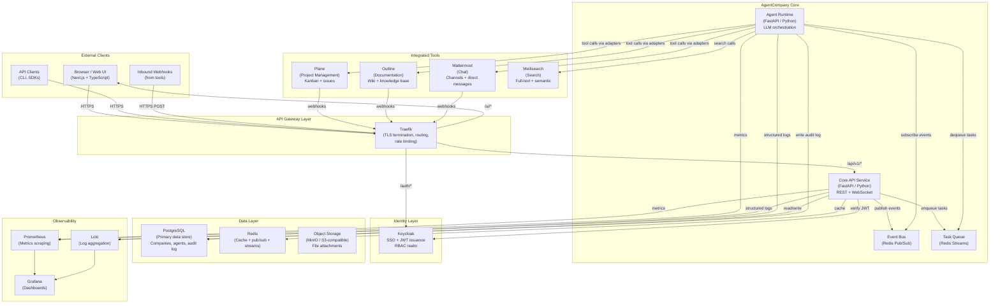
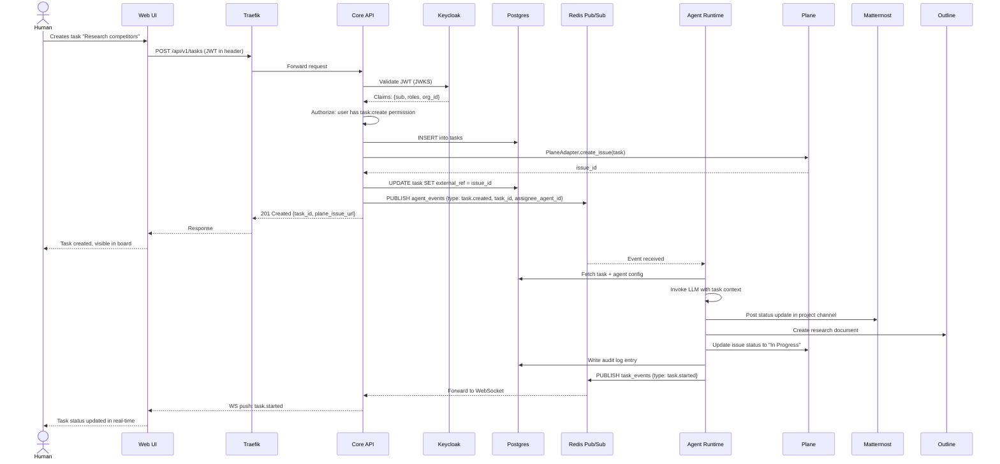
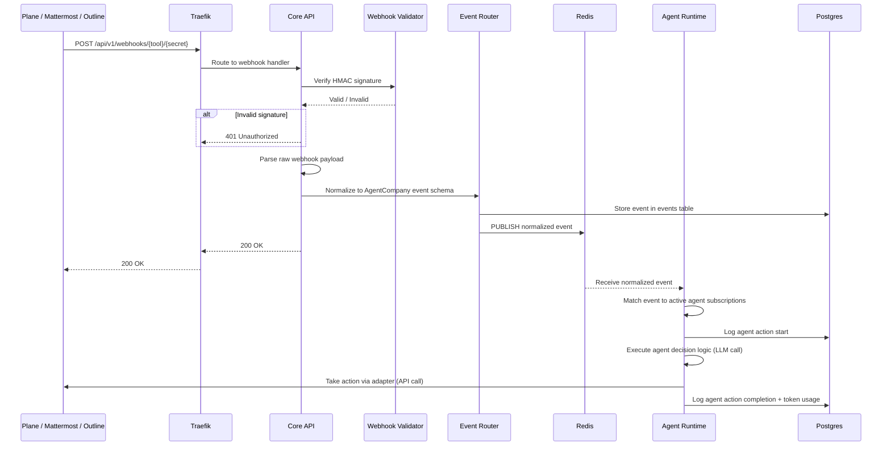
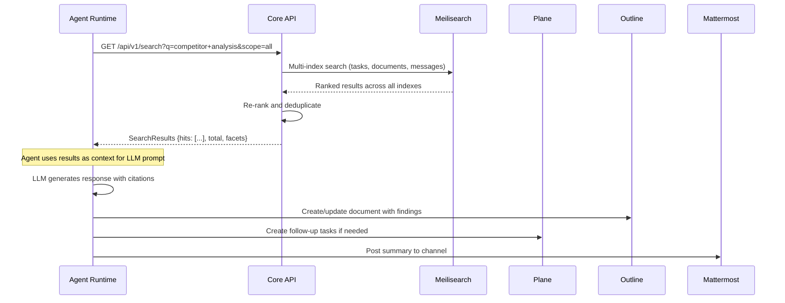
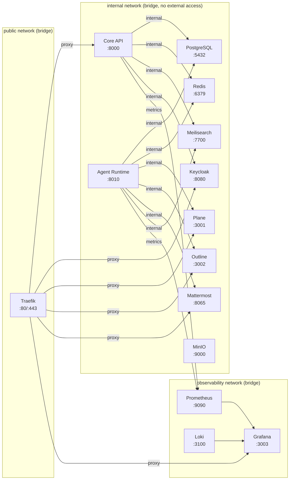
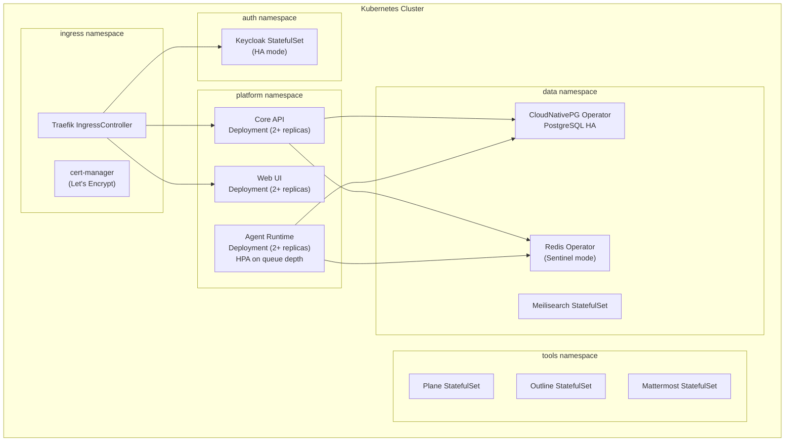

# AgentCompany — System Overview

**Version**: 1.0.0
**Date**: 2026-04-18
**Status**: Authoritative Design Document

---

## 1. Problem Statement

AgentCompany is an open-source platform that instantiates AI-powered companies where AI agents and humans collaborate to accomplish business goals. The system integrates proven open-source tools (Plane, Outline, Mattermost, Keycloak) under a unified orchestration layer, enabling agents to autonomously create tasks, write documentation, communicate in chat, and report results — all within a governed, auditable environment.

### Core Challenges

- **Integration complexity**: Five distinct open-source services each with their own APIs, data models, auth schemes, and webhook formats.
- **Agent orchestration**: Routing work to the right agent (or human), managing concurrency, handling failures.
- **Unified identity**: Humans and agents must coexist in a single identity plane with coherent RBAC.
- **Observability**: Token usage, costs, latency, and audit trails must be captured without instrumenting every individual tool.
- **Incremental adoption**: The platform must work with Docker Compose for a single developer and scale to Kubernetes for production.

### Design Constraints

| Constraint | Decision |
|---|---|
| All services are open-source | No proprietary SaaS dependencies at the infra layer |
| MVP runs on a single machine | Docker Compose with defined resource limits |
| Agents must be auditable | Every agent action produces an immutable audit log entry |
| Humans remain in control | Agent actions on high-risk operations require human approval |
| Extensible adapter model | New tools can be added without modifying core platform code |

---

## 2. High-Level Architecture



---

## 3. Component Inventory

### 3.1 First-Party Services

| Service | Language | Role | Exposes | Connects To |
|---|---|---|---|---|
| **Core API** | Python / FastAPI | Primary REST API, business logic, event routing | HTTP :8000, WS :8001 | Postgres, Redis, Keycloak, Meilisearch |
| **Agent Runtime** | Python / FastAPI | LLM agent execution, tool adapter calls | HTTP :8010 (internal) | Redis, Postgres, Plane, Outline, Mattermost, Meilisearch, LLM provider |
| **Web UI** | TypeScript / Next.js | Browser front-end | HTTP :3000 | Core API, Keycloak (OIDC) |

### 3.2 Third-Party Open-Source Services

| Service | Version Target | Role | Default Port | Persistence |
|---|---|---|---|---|
| **Keycloak** | 24.x | SSO, JWT, RBAC realm | 8080 | Postgres (dedicated schema) |
| **Plane** | 0.22.x | Kanban, issues, cycles, sprints | 3001 | Postgres + Redis |
| **Outline** | 0.78.x | Wiki, knowledge base | 3002 | Postgres + Redis + S3 |
| **Mattermost** | 9.x | Team chat, channels, DMs | 8065 | Postgres |
| **Meilisearch** | 1.8.x | Full-text search | 7700 | Local disk |
| **PostgreSQL** | 16.x | Relational data | 5432 | Persistent volume |
| **Redis** | 7.x | Cache, pub/sub, streams | 6379 | AOF persistence |
| **MinIO** | RELEASE.2024 | S3-compatible object store | 9000/9001 | Persistent volume |
| **Traefik** | 3.x | Reverse proxy / API gateway | 80/443 | — |
| **Prometheus** | 2.x | Metrics collection | 9090 | Persistent volume |
| **Grafana** | 10.x | Visualization | 3003 | Persistent volume |
| **Loki** | 3.x | Log aggregation | 3100 | Persistent volume |

### 3.3 Component Responsibilities

**Core API**
- Serves all `/api/v1/*` endpoints documented in `api-design.md`
- Validates JWT tokens against Keycloak JWKS endpoint
- Enforces RBAC policy — no business logic runs outside authorization check
- Routes inbound webhooks from tools to the appropriate event handler
- Maintains the canonical AgentCompany data model (companies, agents, roles, tasks)
- Publishes normalized events to Redis Pub/Sub for Agent Runtime consumption

**Agent Runtime**
- Subscribes to event channels on Redis
- Executes LLM inference calls (configurable provider: OpenAI, Anthropic, Ollama)
- Calls tool adapters (Plane, Outline, Mattermost) to take actions
- Records every action to the audit log before and after execution
- Reports token usage and cost per task completion
- Implements circuit-breaker and retry logic per adapter

**Web UI**
- Server-side rendered Next.js application
- Authenticates via Keycloak OIDC (authorization code flow with PKCE)
- Renders company dashboard, agent roster, task board, chat integration
- Connects to Core API via REST and WebSocket for real-time updates

---

## 4. Data Flow Diagrams

### 4.1 Human Creates a Task (Task Assignment Flow)



### 4.2 Inbound Webhook Flow (Tool Event to Agent Action)



### 4.3 Agent Search Flow



---

## 5. Network Topology

### 5.1 Docker Compose Network Design (MVP)



### 5.2 Service Communication Matrix

| From \ To | Core API | Agent Runtime | Keycloak | Plane | Outline | Mattermost | Meilisearch | Postgres | Redis |
|---|---|---|---|---|---|---|---|---|---|
| **Traefik** | PROXY | - | PROXY | PROXY | PROXY | PROXY | - | - | - |
| **Core API** | - | HTTP (internal) | HTTP JWKS | HTTP API | HTTP API | HTTP API | HTTP API | TCP 5432 | TCP 6379 |
| **Agent Runtime** | HTTP (internal) | - | - | HTTP API | HTTP API | HTTP API | HTTP API | TCP 5432 | TCP 6379 |
| **Web UI** | HTTP (via gateway) | - | OIDC | - | - | - | - | - | - |

### 5.3 Port Allocation

| Service | External (via Traefik) | Internal |
|---|---|---|
| Web UI | 443 (path /) | 3000 |
| Core API | 443 (path /api) | 8000 |
| Agent Runtime | Not exposed | 8010 |
| Keycloak | 443 (path /auth) | 8080 |
| Plane | 443 (path /plane) | 3001 |
| Outline | 443 (path /docs) | 3002 |
| Mattermost | 443 (path /chat) | 8065 |
| Grafana | 443 (path /metrics) | 3003 |
| PostgreSQL | Not exposed | 5432 |
| Redis | Not exposed | 6379 |
| Meilisearch | Not exposed | 7700 |
| MinIO API | Not exposed | 9000 |
| MinIO Console | 443 (path /storage, admin only) | 9001 |

---

## 6. Deployment Architecture

### 6.1 MVP — Docker Compose

Single-host deployment suitable for development and small teams.

```
docker-compose.yml
  ├── traefik
  ├── postgres (single instance, multiple databases)
  ├── redis
  ├── minio
  ├── keycloak
  ├── plane
  ├── outline
  ├── mattermost
  ├── meilisearch
  ├── agentcompany-core-api
  ├── agentcompany-agent-runtime
  ├── agentcompany-web-ui
  ├── prometheus
  ├── grafana
  └── loki
```

Resource requirements for MVP (single host): 8 CPU cores, 16 GB RAM, 100 GB SSD.

### 6.2 Production — Kubernetes (Future State)



---

## 7. Technology Decisions and Rationale

| Decision | Chosen | Alternatives Considered | Rationale |
|---|---|---|---|
| API framework | FastAPI (Python) | Django REST, Express.js, Go Fiber | Async-native, excellent OpenAPI generation, strong AI/ML ecosystem for agent code |
| Message queue | Redis Streams + Pub/Sub | Kafka, RabbitMQ, NATS | Sufficient throughput for MVP, already required for caching, single dependency |
| Auth | Keycloak | Auth0, Okta, custom JWT | Self-hosted, full OIDC/SAML support, enterprise-grade RBAC, no SaaS lock-in |
| Search | Meilisearch | Elasticsearch, OpenSearch, Typesense | Lowest operational overhead, sub-millisecond latency, excellent relevance out-of-box |
| Chat | Mattermost | Slack, Discord, Matrix | Open-source, self-hosted, webhooks/bot API, GDPR-friendly |
| Project mgmt | Plane | Linear, GitLab issues, Jira | Open-source, Jira-compatible UX, active development, REST API |
| Wiki | Outline | Confluence, Notion, BookStack | Clean UX, solid REST API, Markdown-native, S3 attachment support |
| Container orchestration | Docker Compose (MVP) | Nomad, Podman Compose | Industry standard, developer familiarity, smooth path to Kubernetes |
| Object storage | MinIO | AWS S3, Backblaze B2 | S3-compatible API, self-hosted, no egress costs, same SDK as cloud S3 |
| Observability | Prometheus + Grafana + Loki | Datadog, New Relic, ELK | Open-source PLG stack, zero licensing cost, Kubernetes-native, excellent community |

---

## 8. Scalability Considerations

### 8.1 Bottlenecks and Mitigations

| Bottleneck | Risk | Mitigation |
|---|---|---|
| LLM API rate limits | Agent tasks blocked | Per-provider rate limiter in Agent Runtime; queue backpressure |
| PostgreSQL single instance | Write contention | PgBouncer connection pooling; read replicas for reporting queries |
| Redis single node | Cache/queue unavailability | Redis Sentinel in production; graceful degradation |
| Meilisearch single node | Search unavailability | Search is non-critical path; Core API returns empty results on failure |
| Agent task fan-out | Redis Streams overload | Partition streams by company_id; horizontal scale of Agent Runtime |

### 8.2 Performance Targets (MVP)

| Operation | P50 Target | P99 Target |
|---|---|---|
| REST API response (non-LLM) | < 50ms | < 200ms |
| Task creation (with Plane sync) | < 500ms | < 2000ms |
| Search query | < 100ms | < 500ms |
| Agent action execution (LLM) | < 5s | < 30s |
| Webhook ingestion | < 100ms | < 500ms |

---

## 9. Open Questions and Future Decisions

| Question | Owner | Target Resolution |
|---|---|---|
| Multi-tenant isolation: shared Postgres schemas vs separate databases per company | Platform team | Before beta |
| LLM provider abstraction: single provider vs. per-agent provider selection | Agent team | MVP |
| Agent-to-agent communication model: direct calls vs. event-driven only | Architecture | Before beta |
| Human-in-the-loop approval: synchronous gate vs. async approval workflow | Product | MVP |
| Data residency requirements for EU customers | Legal/Infra | Before GA |
