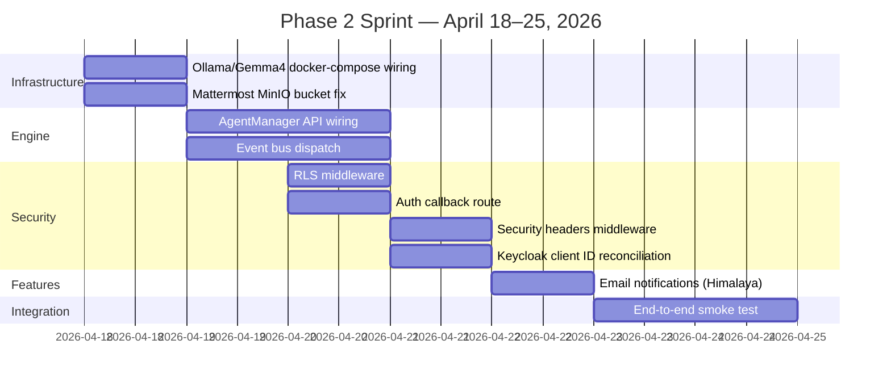
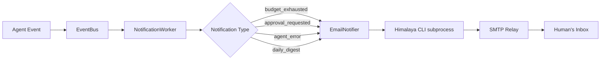
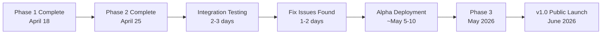

# AgentCompany — Phase 2 Plan and Progress Document

**Status:** Active  
**Phase 1 Completed:** April 18, 2026  
**Phase 2 Target:** April 25, 2026  
**Author:** Staff Engineering (claude-sonnet-4-6)  
**Last Updated:** April 18, 2026

---

## Table of Contents

1. [Phase 1 Recap](#1-phase-1-recap)
2. [Phase 2 Scope](#2-phase-2-scope)
   - [2a. Ollama/Gemma4 Integration](#2a-ollamagemma4-integration)
   - [2b. Agent Engine Wiring](#2b-agent-engine-wiring)
   - [2c. RLS Middleware](#2c-rls-middleware)
   - [2d. Auth Callback and Security Hardening](#2d-auth-callback--security-hardening)
   - [2e. Email Notifications via Himalaya](#2e-email-notifications-via-himalaya)
3. [Remaining Work — Phase 3 Candidates](#3-remaining-work--phase-3-candidates)
4. [Architecture Decisions Log](#4-architecture-decisions-log)
5. [Risk Register](#5-risk-register)
6. [Timeline Estimate](#6-timeline-estimate)

---

## 1. Phase 1 Recap

### 1.1 What Was Built

Phase 1 was a parallel-agent build that produced a structurally complete AgentCompany platform in a single coordinated wave. Sixteen agents worked concurrently across the full stack.

| Metric | Value |
|--------|-------|
| Agents deployed | 16 |
| Files produced | 162 |
| Lines of code | ~40,000 |
| Services implemented | 2 (agent-runtime, web-ui) |
| Architecture documents | 11 |
| Handoff documents | 15 |

**Services built:**

- `services/agent-runtime/` — FastAPI (Python 3.12) service implementing the full management and event API, authentication middleware, database models, adapter layer, and the agent engine core. Runs on port 8000.
- `services/web-ui/` — Next.js 14 frontend with a complete dark-mode design system (Linear/Raycast aesthetic). Implements all primary screens: Dashboard, Companies, Org Chart, Agents, Tasks (Kanban), Search, Settings. Runs on port 3000.

**Infrastructure layer:**

- `docker-compose.yml` — Production-aware Compose file covering 12 services: agent-runtime, web-ui, postgres, redis, minio, minio-init, traefik, keycloak, mattermost, outline, meilisearch, plane-proxy.
- Traefik reverse proxy with dynamic routing and TLS stub.
- Keycloak realm export pre-configured with four clients: `agentcompany-web`, `agentcompany-api`, `agent-service`, `outline`.
- MinIO for S3-compatible object storage (Outline bucket initialized on startup).
- Initialization scripts: `setup.sh`, `teardown.sh`, `dev.sh`, `seed-data.sh`.
- CI/CD: GitHub Actions workflows for lint, test, and multi-arch Docker publish to ghcr.io.

**Agent engine (implemented, pending wiring):**

The decision-making core at `services/agent-runtime/app/engine/` is fully implemented:
- `AgentDecisionLoop` — Observe → Think → Act → Reflect cycle with budget enforcement and context compaction.
- `AgentManager` — Lifecycle manager (create / configure / activate / pause / terminate) with state machine.
- `AgentStateMachine` — Validated state transitions with audit trail.
- `HeartbeatService` — Four trigger modes: always-on, event-triggered, scheduled, manual.
- `CostTracker` — Per-agent token budget enforcement via Redis counters with PostgreSQL persistence.
- `ContextWindowManager` — Automatic compaction at 80% context utilization.
- `AgentMemory` — Two-tier memory: pgvector for semantic similarity, asyncpg for structured entity facts.
- LLM adapters: `AnthropicAdapter`, `OpenAIAdapter`, `OllamaAdapter` (all inheriting `BaseLLMAdapter`).
- Role-specific system prompts for: CEO, CTO, CFO, PM, Developer, Designer, QA.

**Adapter layer (implemented):**

`services/agent-runtime/app/adapters/` covers the full integration surface:
- `PlaneAdapter` — issue CRUD, comments, cycles, labels, webhooks.
- `OutlineAdapter` — document CRUD, search, export, collections, webhooks.
- `MattermostAdapter` — message post/read/search, channel management, file upload, reactions, webhooks.
- `MeilisearchAdapter` — unified search with tenant isolation, multi-index support, document indexing.
- `AdapterRegistry` — process-level lifecycle manager; callers never construct adapters directly.

**Tool stack validated:**

Research confirmed the recommended stack is optimal across all five integration categories. See `docs/research/tool-selection.md` for the full evaluation matrix.

---

### 1.2 Architecture Review Results

The architecture review (April 18, 2026) scored the project across four dimensions:

| Area | Score | Notes |
|------|-------|-------|
| Architecture Consistency | 8/10 | API routes match design doc; deliberate deviations documented |
| Cross-Service Integration | 6/10 | Docker wiring clean; auth and client ID mismatches found |
| Code Quality | 7/10 | Strong backend; two security bugs in adapters fixed |
| Completeness | 6/10 | Engine and adapters substantive; integration seams had gaps |

**Critical issues found and fixed (Phase 1 end-of-sprint fixes):**

| ID | Issue | Status |
|----|-------|--------|
| C-1 | Web UI had no auth token wiring; all API calls unauthenticated | Fixed — PKCE auth module (`src/lib/auth.ts`) implemented; `api.ts` injects Bearer token |
| C-2 | Meilisearch filter injection — string concatenation enabled cross-tenant bypass | Fixed — allowlist for filter keys; value sanitization regex; all values quoted |
| C-3 (revised) | Webhook secrets opt-in; missing secret allowed unauthenticated event injection | Fixed — secrets are now required; handlers return 503 if unconfigured |

**Major issues found and fixed:**

| ID | Issue | Status |
|----|-------|--------|
| M-2 | Approvals API called by web UI but absent from backend | Fixed — `ApprovalModel`, `ApprovalSchema`, `/api/v1/approvals` endpoints implemented |
| M-3 | TaskStatus enum inconsistent between frontend and backend | Fixed — unified to `backlog\|todo\|in_progress\|review\|done\|cancelled` |
| M-4 | PaginatedResponse shape mismatch between frontend and backend | Fixed — `make_list_response()` now returns `{items, total, page, page_size, has_next}` |
| M-7 | `/metrics/platform` endpoint called by dashboard but not implemented | Fixed — CTE query aggregating company/agent/task/token metrics |

**Outstanding (carried into Phase 2):**

| ID | Issue | Phase 2 Item |
|----|-------|-------------|
| M-1 | Keycloak client ID mismatch between realm export and env vars | Part of 2d |
| M-6 | RLS policies designed but not implemented in migration | Part of 2c |
| W-2 | `start_agent` / `stop_agent` do not dispatch to the engine | Part of 2b |
| W-5 | `trigger_agent` discards trigger data without publishing to event bus | Part of 2b |
| W-6 | Mattermost MinIO bucket not initialized | Part of 2b (infra fix) |

---

### 1.3 Stack Decisions Validated

All technology choices made in the architecture phase have been confirmed by implementation.

| Layer | Choice | Validation Signal |
|-------|--------|------------------|
| API framework | FastAPI (Python 3.12) | Clean async/await; OpenAPI spec auto-generated; dependency injection works well for the auth/db pattern |
| LLM abstraction | `BaseLLMAdapter` ABC | All three adapters (Anthropic, OpenAI, Ollama) implement the same interface; decision loop holds only the base type |
| Auth | Keycloak + PKCE | JWKS caching works; PKCE flow implemented without third-party auth library |
| Event bus | Redis Pub/Sub + Streams | Pub/Sub for SSE fan-out; Streams for durable trigger queue — different primitives for different guarantees |
| Search | Meilisearch | Adapter layer handles tenant isolation; injection bug found and fixed |
| Primary store | PostgreSQL 16 | ULID PKs, soft deletes, RLS policies designed (awaiting implementation) |
| Container | Docker Compose | 12-service Compose file working; Traefik routing validated |
| CI/CD | GitHub Actions | Lint, test, Docker build pipeline operational; release pipeline publishes multi-arch images |

One deviation from the original plan: `keycloak-js` was evaluated and rejected in favor of a native PKCE implementation using `fetch` + `crypto.subtle`. The rationale: keycloak-js adds ~50 KB of implicit-flow code and couples the frontend to a specific Keycloak version. The native implementation is 200 lines, has zero dependencies, and supports the correct PKCE/S256 flow.

---

## 2. Phase 2 Scope

Phase 2 is a focused one-week sprint (April 18–25, 2026) targeting the remaining integration seams and hardening items identified by the architecture review. The theme is **making everything actually work end-to-end**.



---

### 2a. Ollama/Gemma4 Integration

**Goal:** Add local LLM capability so the platform runs fully offline with no external API dependencies, enabling cost-zero development and privacy-sensitive deployments.

**Why Ollama:** See [Section 4.1](#41-why-ollama-as-local-llm). The `OllamaAdapter` is already implemented at `services/agent-runtime/app/engine/llm/ollama.py`; this work item wires the infrastructure to match.

#### 2a.1 Docker Compose Service

Add an `ollama` service to `docker-compose.yml`:

```yaml
ollama:
  image: ollama/ollama:latest
  container_name: agentcompany-ollama
  restart: unless-stopped
  volumes:
    - ollama_models:/root/.ollama
  networks:
    - internal
  # GPU optional — the deploy block is a no-op when no GPU is present
  deploy:
    resources:
      reservations:
        devices:
          - driver: nvidia
            count: all
            capabilities: [gpu]
  healthcheck:
    test: ["CMD", "curl", "-f", "http://localhost:11434/api/tags"]
    interval: 30s
    timeout: 10s
    retries: 3
    start_period: 60s

ollama-init:
  image: curlimages/curl:latest
  container_name: agentcompany-ollama-init
  depends_on:
    ollama:
      condition: service_healthy
  networks:
    - internal
  # Pull the default model once on startup, then exit
  entrypoint: >
    sh -c "curl -s -X POST http://ollama:11434/api/pull
    -H 'Content-Type: application/json'
    -d '{\"name\": \"gemma3:4b\"}'"
  restart: "no"
```

Add named volume: `ollama_models:`.

**GPU-optional design:** The `deploy.resources.reservations` block is a Docker Swarm/Compose v3 syntax that is silently ignored when no NVIDIA runtime is present. Ollama detects GPU availability at runtime and falls back to CPU inference automatically. No separate CPU and GPU Compose profiles are needed.

**Model auto-pull:** The `ollama-init` sidecar pulls `gemma3:4b` on first startup and exits. On subsequent restarts, Ollama serves the cached model from the `ollama_models` volume immediately. The init container is idempotent — pulling an already-downloaded model is a no-op.

#### 2a.2 Environment Variable Wiring

Add to `.env.example`:

```
# Local LLM (Ollama)
OLLAMA_BASE_URL=http://ollama:11434
OLLAMA_DEFAULT_MODEL=gemma3:4b
```

The existing `OllamaAdapter` reads `base_url` from its `config` dict. The agent-runtime `Settings` class (`app/config.py`) needs two new optional fields:

```python
ollama_base_url: str = "http://ollama:11434"
ollama_default_model: str = "gemma3:4b"
```

These feed into the LLM registry when the runtime builds available adapters at startup.

#### 2a.3 LLM Registry Startup

The engine handoff notes that "the LLM registry should live in the runtime startup code, not the engine package." Phase 2 implements `build_registry(settings)` in `app/core/llm_registry.py`:

```python
def build_registry(settings: Settings) -> dict[str, BaseLLMAdapter]:
    registry = {}
    if settings.anthropic_api_key:
        registry["anthropic"] = AnthropicAdapter(api_key=settings.anthropic_api_key)
    if settings.openai_api_key:
        registry["openai"] = OpenAIAdapter(api_key=settings.openai_api_key)
    # Ollama is always registered when the URL is reachable; no key required
    registry["ollama"] = OllamaAdapter(
        base_url=settings.ollama_base_url,
        default_model=settings.ollama_default_model,
    )
    return registry
```

This registry is attached to `app.state.llm_registry` during the FastAPI lifespan startup sequence and injected into `AgentDecisionLoop` via `AgentManager`.

#### 2a.4 Agent LLM Selection

Each agent row has an `llm_config` JSONB column. When the engine builds an `AgentDecisionLoop` for an agent, it resolves the adapter like this:

```python
provider = agent.llm_config.get("provider", "anthropic")
model = agent.llm_config.get("model", settings.anthropic_default_model)
adapter = app.state.llm_registry.get(provider)
if adapter is None:
    raise ConfigurationError(f"LLM provider '{provider}' is not configured")
```

This means any agent can be pointed at the local Ollama instance by setting `llm_config.provider = "ollama"` — no code changes required.

---

### 2b. Agent Engine Wiring

**Goal:** Connect the `AgentManager` and `AgentDecisionLoop` to the API layer so that calling `POST /api/v1/agents/{id}/start` actually starts the agent's decision loop. Currently these API endpoints update the database status field but dispatch nothing.

The architecture review identified this as W-2 and W-5 with ticket reference `AC-ENGINE-01`.

#### 2b.1 Agent Lifecycle Flow

```mermaid
sequenceDiagram
    participant Client as Web UI / API Client
    participant API as FastAPI (agents.py)
    participant Manager as AgentManager
    participant SM as AgentStateMachine
    participant DB as PostgreSQL
    participant Bus as Redis Event Bus
    participant Loop as AgentDecisionLoop

    Client->>API: POST /agents/{id}/start
    API->>Manager: activate(agent_id)
    Manager->>DB: SELECT agent WHERE id = agent_id
    Manager->>SM: transition(CONFIGURED → ACTIVE)
    SM-->>Manager: validated
    Manager->>DB: UPDATE agent SET status = 'active'
    Manager->>Bus: publish("agent.activated", {agent_id, company_id})
    Manager-->>API: AgentState.ACTIVE
    API-->>Client: 200 {status: "active"}

    Note over Bus,Loop: TriggerConsumer picks up from Redis Stream
    Bus->>Loop: run(trigger={type: "manual"})
    Loop->>SM: transition(ACTIVE → RUNNING)
    Loop->>DB: INSERT agent_transitions (audit record)
    Loop->>Loop: Observe → Think → Act → Reflect
    Loop->>SM: transition(RUNNING → ACTIVE)
```

#### 2b.2 AgentManager on app.state

The `AgentManager` is initialized once during the FastAPI lifespan and attached to `app.state`:

```python
# app/main.py — lifespan startup
@asynccontextmanager
async def lifespan(app: FastAPI):
    # existing: db_pool, redis, event_bus setup ...
    agent_manager = AgentManager(
        agent_repo=AgentRepository(app.state.db),
        heartbeat_service=HeartbeatService(
            agent_repo=AgentRepository(app.state.db),
            trigger_queue=app.state.redis,
            scheduler=AsyncIOScheduler(),
        ),
        event_bus=app.state.event_bus,
        db_pool=app.state.db_pool,
    )
    app.state.agent_manager = agent_manager
    await agent_manager.start()
    yield
    await agent_manager.stop()
```

#### 2b.3 API Endpoint Changes

`app/api/agents.py` — `start_agent` endpoint (replacing the current TODO stub):

```python
@router.post("/{agent_id}/start")
async def start_agent(
    agent_id: str,
    request: Request,
    current_user: TokenClaims = Depends(OrgAdmin),
    db: AsyncSession = Depends(get_db),
):
    agent = await _get_agent_or_404(db, agent_id, current_user.org_id)
    manager: AgentManager = request.app.state.agent_manager
    try:
        await manager.activate(agent_id)
    except InvalidTransitionError as exc:
        raise HTTPException(status_code=409, detail=str(exc))
    return DataResponse(data={"status": "active", "agent_id": agent_id})
```

`trigger_agent` endpoint — dispatches trigger payload to the event bus:

```python
@router.post("/{agent_id}/trigger")
async def trigger_agent(
    agent_id: str,
    body: AgentTriggerRequest,
    request: Request,
    current_user: TokenClaims = Depends(OrgMember),
    db: AsyncSession = Depends(get_db),
):
    agent = await _get_agent_or_404(db, agent_id, current_user.org_id)
    event_bus: EventBus = request.app.state.event_bus
    await event_bus.publish(
        agent.company_id,
        {
            "type": "agent.trigger.manual",
            "agent_id": agent_id,
            "task_id": body.task_id,
            "context": body.context,
            "priority": body.priority,
            "triggered_by": current_user.sub,
        },
    )
    await db.execute(
        update(Agent)
        .where(Agent.id == agent_id)
        .values(last_active_at=datetime.utcnow())
    )
    await db.commit()
    return DataResponse(data={"queued": True, "agent_id": agent_id})
```

#### 2b.4 TriggerConsumer Worker

A background worker that consumes the Redis Stream and dispatches to `AgentDecisionLoop`. This lives in `app/workers/trigger_consumer.py`:

```python
class TriggerConsumer:
    """
    Consumes from the Redis Stream written by HeartbeatService and dispatches
    to AgentDecisionLoop. Uses a semaphore to cap concurrent agent runs.
    """
    STREAM_KEY = "triggers:all"  # Must match HeartbeatService.GLOBAL_STREAM
    CONSUMER_GROUP = "agent-runtime"
    MAX_CONCURRENT = 20  # Configurable via settings

    async def run(self) -> None:
        # XGROUP CREATE ... MKSTREAM if group does not exist
        # Loop: XREADGROUP, dispatch each entry to _run_agent(), ACK on completion
        ...

    async def _run_agent(self, entry: dict) -> None:
        agent_id = entry["agent_id"]
        async with self._semaphore:
            async with self._distributed_lock(agent_id):
                loop = await self._build_loop(agent_id)
                result = await loop.run(trigger=entry)
                await self._persist_result(agent_id, result)
```

The distributed lock (`agent_run_lock:{agent_id}` in Redis with a TTL) prevents two consumer instances from running the same agent simultaneously — critical for correctness as noted in the engine framework document.

#### 2b.5 Infra Fix: Mattermost MinIO Bucket

The `minio-init` service in `docker-compose.yml` currently only creates the `outline` bucket. Add:

```yaml
entrypoint: >
  sh -c "
    /usr/bin/mc alias set local http://minio:9000 $MINIO_ROOT_USER $MINIO_ROOT_PASSWORD &&
    /usr/bin/mc mb --ignore-existing local/outline &&
    /usr/bin/mc mb --ignore-existing local/mattermost &&
    /usr/bin/mc anonymous set download local/outline
  "
```

This resolves architecture review W-6. The `--ignore-existing` flag makes the init idempotent.

---

### 2c. RLS Middleware

**Goal:** Implement PostgreSQL Row-Level Security so that tenant isolation is enforced at the database layer, not only at the application layer. This is a defense-in-depth measure: if an application bug fails to filter by `org_id`, the database rejects the query.

Architecture review identified this as M-6, marked "Must fix before production hardening."

#### 2c.1 Why RLS at This Layer

Application-layer `org_id` filtering is the current guard. It is correct but fragile — a single missed `WHERE org_id = :org_id` clause in any query yields a full cross-tenant read. PostgreSQL RLS makes tenant isolation a database invariant: the application user literally cannot read rows from other tenants regardless of what SQL it executes.

The data model document (`docs/architecture/data-model.md`) specifies the exact DDL. Phase 2 implements it.

#### 2c.2 Alembic Migration

New migration `002_rls.py` — runs after `001_initial.py`:

```sql
-- Create a restricted application user (not superuser — superusers bypass RLS)
CREATE USER agentcompany_app WITH PASSWORD '<from env>';
GRANT CONNECT ON DATABASE agentcompany_core TO agentcompany_app;
GRANT USAGE ON SCHEMA public TO agentcompany_app;
GRANT SELECT, INSERT, UPDATE, DELETE ON ALL TABLES IN SCHEMA public TO agentcompany_app;

-- Enable RLS on all tenant-scoped tables
ALTER TABLE companies ENABLE ROW LEVEL SECURITY;
ALTER TABLE agents ENABLE ROW LEVEL SECURITY;
ALTER TABLE roles ENABLE ROW LEVEL SECURITY;
ALTER TABLE tasks ENABLE ROW LEVEL SECURITY;
ALTER TABLE events ENABLE ROW LEVEL SECURITY;
ALTER TABLE approvals ENABLE ROW LEVEL SECURITY;

-- Policy: rows are visible only when app.current_company_id matches
-- The superuser (used by migrations) bypasses RLS automatically
CREATE POLICY tenant_isolation ON companies
    USING (org_id = current_setting('app.current_org_id', TRUE));

CREATE POLICY tenant_isolation ON agents
    USING (org_id = current_setting('app.current_org_id', TRUE));

-- ... same pattern for all tables above
```

The `current_setting('app.current_org_id', TRUE)` call uses the `missing_ok = TRUE` flag so queries run outside a request context (migrations, maintenance scripts running as superuser) do not error — they simply see all rows because the superuser bypasses the policy entirely.

#### 2c.3 Request Lifecycle Middleware

A FastAPI middleware sets the `app.current_org_id` session variable at the start of every request and unsets it on completion:

```python
# app/middleware/rls.py

class RLSMiddleware(BaseHTTPMiddleware):
    """
    Sets app.current_org_id as a PostgreSQL session variable at the start
    of each request so RLS policies can enforce tenant isolation.

    Uses SET LOCAL so the setting is scoped to the current transaction and
    is automatically rolled back if the transaction rolls back — no risk of
    a leaked org_id across connections in the pool.
    """

    EXCLUDED_PATHS = {"/health", "/api/v1/webhooks/"}

    async def dispatch(self, request: Request, call_next):
        if any(request.url.path.startswith(p) for p in self.EXCLUDED_PATHS):
            return await call_next(request)

        # org_id is extracted from the validated JWT by the auth dependency.
        # At middleware time we read the raw claim — the auth dependency
        # performs full validation later in the request chain.
        org_id = self._extract_org_id_from_token(request)
        if not org_id:
            return await call_next(request)

        # Parameterized — org_id comes from a validated JWT claim, not
        # from user-controlled request data, but we still use parameterized
        # SET LOCAL rather than string interpolation as defense in depth.
        async with request.app.state.db_pool.acquire() as conn:
            await conn.execute(
                "SET LOCAL app.current_org_id = $1", org_id
            )

        return await call_next(request)
```

**Why `SET LOCAL` and not `SET`:** `SET LOCAL` scopes the variable to the current transaction. When the transaction commits or rolls back, the variable is cleared. This prevents a leaked `org_id` from persisting on a recycled connection in the pool. `SET` (without LOCAL) persists for the session lifetime, which would be dangerous in a connection pool.

**Why parameterized:** Even though `org_id` is extracted from a JWT claim (not raw user input), the `SET LOCAL app.current_org_id = $1` parameterized form protects against an edge case where a malformed but syntactically valid JWT contains a crafted claim value. The PostgreSQL driver handles quoting.

#### 2c.4 Verification

Add a test in `services/agent-runtime/tests/test_rls.py` that:
1. Creates two orgs with one company each.
2. Sets `app.current_org_id` to org A.
3. Queries `companies` — asserts only org A's company is returned.
4. Sets `app.current_org_id` to org B — asserts only org B's company is returned.
5. Drops `app.current_org_id` — asserts zero rows returned (policy returns null, which is falsy).

---

### 2d. Auth Callback + Security Hardening

**Goal:** Complete the Keycloak OIDC integration by adding the missing callback route, protecting all pages behind an auth guard, adding security response headers, and reconciling the Keycloak client ID mismatch.

#### 2d.1 Auth Callback Page

The frontend fix handoff (`frontend-fixes-handoff.md`) implemented `src/lib/auth.ts` with the PKCE flow but noted: "The `/auth/callback` route does not exist yet."

New file: `services/web-ui/src/app/auth/callback/page.tsx`

```typescript
'use client';
// Handles the OAuth2 PKCE redirect from Keycloak.
// Keycloak redirects here with ?code=<code>&state=<state> after login.
// We verify state, exchange code for tokens, then redirect to the app.

import { useEffect, useRef } from 'react';
import { useRouter, useSearchParams } from 'next/navigation';
import { handleCallback } from '@/lib/auth';

export default function AuthCallbackPage() {
  const router = useRouter();
  const searchParams = useSearchParams();
  // Guard against double-invocation in React 18 strict mode
  const handled = useRef(false);

  useEffect(() => {
    if (handled.current) return;
    handled.current = true;

    handleCallback(searchParams)
      .then(() => router.replace('/'))
      .catch((err) => {
        console.error('Auth callback failed:', err);
        router.replace('/?auth_error=callback_failed');
      });
  }, [router, searchParams]);

  return (
    <div className="flex h-screen items-center justify-center bg-surface">
      <p className="text-text-secondary">Signing you in…</p>
    </div>
  );
}
```

The `handled` ref prevents `handleCallback()` from firing twice under React 18 StrictMode, which double-invokes effects in development. Without this guard, the code exchange fails on the second call because the authorization code is single-use.

#### 2d.2 Route Guard Middleware

Next.js middleware (`services/web-ui/src/middleware.ts`) protects all app routes:

```typescript
import { NextResponse } from 'next/server';
import type { NextRequest } from 'next/server';

// Routes that do not require authentication
const PUBLIC_PATHS = ['/auth/callback', '/auth/login'];

export function middleware(request: NextRequest) {
  const { pathname } = request.nextUrl;

  if (PUBLIC_PATHS.some((p) => pathname.startsWith(p))) {
    return NextResponse.next();
  }

  // Check for token presence. The actual token validity is verified
  // by the backend on every API call — middleware only guards navigation.
  // We use a cookie flag set by auth.ts after a successful token exchange
  // rather than reading the token itself (avoids exposing it to middleware
  // which runs in the Edge runtime without access to localStorage).
  const isAuthenticated = request.cookies.has('ac_authenticated');

  if (!isAuthenticated) {
    const loginUrl = new URL('/auth/login', request.url);
    loginUrl.searchParams.set('next', pathname);
    return NextResponse.redirect(loginUrl);
  }

  return NextResponse.next();
}

export const config = {
  matcher: ['/((?!_next/static|_next/image|favicon.ico).*)'],
};
```

The `ac_authenticated` cookie is a non-httpOnly boolean flag set by `auth.ts` after a successful token exchange. It signals "a token is stored in localStorage" without exposing the token to the Edge runtime. The actual API security remains the backend JWT validation on every request.

#### 2d.3 Login/Logout in Header

Update `services/web-ui/src/components/layout/Header.tsx` to add:

- A "Sign In" button (triggers `login()` from `auth.ts`) when `!isAuthenticated()`.
- A user avatar + dropdown with "Sign Out" (triggers `logout()`) when authenticated.
- Display the current user's name from the decoded JWT `preferred_username` claim.

```typescript
import { isAuthenticated, login, logout, getDecodedToken } from '@/lib/auth';

// In the header JSX:
{isAuthenticated() ? (
  <Dropdown trigger={<UserAvatar name={getDecodedToken()?.preferred_username} />}>
    <DropdownItem onClick={logout} danger>Sign Out</DropdownItem>
  </Dropdown>
) : (
  <Button variant="primary" size="sm" onClick={login}>
    Sign In
  </Button>
)}
```

#### 2d.4 Security Headers Middleware

Add `services/agent-runtime/app/middleware/security_headers.py`:

```python
from starlette.middleware.base import BaseHTTPMiddleware

class SecurityHeadersMiddleware(BaseHTTPMiddleware):
    """
    Adds security headers to all responses.
    These headers are defense-in-depth — Traefik adds them in production too,
    but we add them here so the API is safe even when accessed directly.
    """

    async def dispatch(self, request, call_next):
        response = await call_next(request)
        response.headers["X-Content-Type-Options"] = "nosniff"
        response.headers["X-Frame-Options"] = "DENY"
        response.headers["X-XSS-Protection"] = "1; mode=block"
        response.headers["Referrer-Policy"] = "strict-origin-when-cross-origin"
        response.headers["Permissions-Policy"] = "geolocation=(), microphone=()"
        # Strict-Transport-Security only in production — avoid breaking local dev
        if settings.app_env == "production":
            response.headers["Strict-Transport-Security"] = (
                "max-age=31536000; includeSubDomains"
            )
        return response
```

Register in `app/main.py` before all other middleware so headers are set on every response including error responses.

#### 2d.5 Keycloak Client ID Reconciliation

Architecture review M-1 found that the realm export defines clients `agentcompany-web` and `agentcompany-api`, while the environment variables use `web-ui` and `agent-runtime`.

Resolution: **Update the realm export to match the environment variables.** The env vars are already used consistently across docker-compose, `.env.example`, and the frontend `.env.example`. Changing the realm export is the smaller edit.

In `configs/keycloak/realm-export.json`:
- Rename client `agentcompany-web` → `web-ui`
- Rename client `agentcompany-api` → `agent-runtime`
- Update all cross-references within the JSON (audience mappers, scope entries)

Add a validation step to `scripts/setup.sh` that compares the `NEXT_PUBLIC_KEYCLOAK_CLIENT_ID` value against the list of clients in the realm export and warns if they diverge. This prevents the mismatch from re-appearing silently.

#### 2d.6 CORS Configuration Fix

Architecture review W-3 noted `allow_credentials=True` with `allow_methods=["*"]` is a browser-rejected misconfiguration. Fix in `app/main.py`:

```python
app.add_middleware(
    CORSMiddleware,
    allow_origins=settings.cors_origins,  # Read from CORS_ORIGINS env var
    allow_credentials=True,
    allow_methods=["GET", "POST", "PUT", "DELETE", "OPTIONS"],
    allow_headers=["Authorization", "Content-Type", "X-Request-ID"],
)
```

Also add `CORS_ORIGINS` to the docker-compose `environment` block for the `agent-runtime` service so the env var is actually passed through:

```yaml
agent-runtime:
  environment:
    - CORS_ORIGINS=["http://localhost:3000","https://${DOMAIN}"]
```

---

### 2e. Email Notifications via Himalaya

**Goal:** Send email alerts for critical agent events — budget exhaustion, approval requests, agent errors, and daily status digests — using Himalaya CLI as the email integration layer.

**Why Himalaya:** Himalaya is a Rust CLI email client with IMAP/SMTP support. It requires no daemon, no persistent service, and no Python email library — a subprocess call sends the email. This fits the self-hosted model: users configure their own SMTP relay (Postfix, Gmail SMTP, SendGrid), and AgentCompany calls Himalaya to deliver without taking a runtime dependency on an email SDK.

#### 2e.1 Email Service Architecture



#### 2e.2 Himalaya Configuration

Add to `docker-compose.yml` — Himalaya runs as a sidecar to `agent-runtime`:

```yaml
# Himalaya runs as a sidecar; agent-runtime calls it via subprocess.
# No separate network port — communication is via shared volume or exec.
himalaya-config:
  image: alpine:latest
  container_name: agentcompany-himalaya-setup
  volumes:
    - himalaya_config:/root/.config/himalaya
  environment:
    - SMTP_HOST=${SMTP_HOST:-localhost}
    - SMTP_PORT=${SMTP_PORT:-587}
    - SMTP_USER=${SMTP_USER}
    - SMTP_PASSWORD=${SMTP_PASSWORD}
    - EMAIL_FROM=${EMAIL_FROM:-agentcompany@localhost}
  entrypoint: >
    sh -c "
      mkdir -p /root/.config/himalaya &&
      cat > /root/.config/himalaya/config.toml << EOF
      [accounts.default]
      email = \"$${EMAIL_FROM}\"
      display-name = \"AgentCompany\"

      [accounts.default.smtp]
      host = \"$${SMTP_HOST}\"
      port = $${SMTP_PORT}
      encryption = \"start-tls\"
      login = \"$${SMTP_USER}\"
      passwd-cmd = \"echo $${SMTP_PASSWORD}\"
      EOF
    "
  restart: "no"
```

The `agent-runtime` container mounts the `himalaya_config` volume and has Himalaya installed in its Docker image (added to the Dockerfile as a binary download).

#### 2e.3 Email Notifier Implementation

New file: `services/agent-runtime/app/notifications/email.py`

```python
import asyncio
import subprocess
from dataclasses import dataclass
from pathlib import Path

@dataclass
class EmailMessage:
    to: str
    subject: str
    body: str
    html_body: str | None = None

class HimalayaEmailNotifier:
    """
    Sends email via Himalaya CLI subprocess.
    Himalaya is called as an async subprocess so it does not block the event loop.
    Failures are logged but not re-raised — email delivery is best-effort.
    """

    def __init__(self, himalaya_binary: str = "himalaya", config_dir: str | None = None):
        self._binary = himalaya_binary
        self._config_dir = config_dir or str(Path.home() / ".config" / "himalaya")

    async def send(self, message: EmailMessage) -> bool:
        cmd = [
            self._binary,
            "--config", f"{self._config_dir}/config.toml",
            "send",
            "--",
            f"To: {message.to}",
            f"Subject: {message.subject}",
            "",
            message.body,
        ]
        try:
            proc = await asyncio.create_subprocess_exec(
                *cmd,
                stdout=asyncio.subprocess.PIPE,
                stderr=asyncio.subprocess.PIPE,
            )
            stdout, stderr = await asyncio.wait_for(proc.communicate(), timeout=30)
            if proc.returncode != 0:
                logger.error(
                    "Himalaya send failed",
                    returncode=proc.returncode,
                    stderr=stderr.decode(),
                )
                return False
            return True
        except asyncio.TimeoutError:
            logger.error("Himalaya send timed out after 30s")
            return False
```

#### 2e.4 Notification Events

A `NotificationWorker` subscribes to the Redis event bus and sends emails for these event types:

| Event Type | Trigger | Email Content |
|-----------|---------|---------------|
| `agent.budget.exhausted` | CostTracker hits 100% of daily budget | Agent name, budget limit, amount used, link to agent detail page |
| `agent.budget.warning` | CostTracker hits 80% of daily budget | Same as above with "approaching limit" framing |
| `approval.requested` | Agent action requires human approval | Action summary, agent name, approve/deny links |
| `agent.error.unrecoverable` | AgentStateMachine enters ERROR state | Error message, last action attempted, link to agent logs |
| `agent.daily_digest` | Scheduled 8am digest (configurable) | Summary: tasks completed, tokens used, cost, pending approvals |

Email delivery is explicitly **best-effort**: the notification worker catches all exceptions from `HimalayaEmailNotifier.send()` and logs them without crashing. A failed email does not affect agent operation or event processing.

#### 2e.5 Environment Variables

Add to `.env.example`:

```
# Email Notifications (Himalaya)
SMTP_HOST=
SMTP_PORT=587
SMTP_USER=
SMTP_PASSWORD=
EMAIL_FROM=agentcompany@localhost
NOTIFICATION_EMAIL_TO=admin@example.com
# Comma-separated: budget_warning,budget_exhausted,approval_requested,agent_error,daily_digest
NOTIFICATION_EVENTS=budget_exhausted,approval_requested,agent_error
EMAIL_NOTIFICATIONS_ENABLED=false
```

When `EMAIL_NOTIFICATIONS_ENABLED=false` (the default), the `NotificationWorker` is registered but sends nothing. This allows the platform to start cleanly without SMTP configuration.

---

## 3. Remaining Work — Phase 3 Candidates

These items are out of scope for the April 25 sprint but are well-understood and have clear implementation paths. They are logged here so the next engineering wave has a prioritized backlog.

### 3.1 End-to-End Integration Testing

**What:** A test suite that exercises the complete agent lifecycle from a user action in the web UI to a task being created in Plane and an agent picking it up, executing, and reporting back.

**Why deferred:** Requires all Phase 2 items (engine wiring, auth, RLS) to be complete before the integration path exists.

**Shape:** Docker Compose test stack (`docker-compose.test.yml`) + pytest fixtures using `httpx.AsyncClient` against a real running service. Key scenarios:
- Create company → create agent → start agent → trigger with task → verify Plane issue created → verify Mattermost message posted.
- Budget exhaustion: set agent budget to 1 token → trigger → verify agent transitions to PAUSED → verify email sent.
- Approval flow: configure agent with approval policy → trigger action that requires approval → verify approval appears in web UI → approve → verify action executed.

### 3.2 Plane Sidecar Integration

**What:** Plane's docker-compose is ~15 services. The current `docker-compose.yml` has a `plane-proxy` placeholder. Phase 3 integrates Plane properly.

**Why deferred:** Plane's own Compose file needs to be consumed as a Compose `include` or merged. This is a Docker Compose architecture question, not a code question. The `PlaneAdapter` is already implemented; only the infrastructure wiring is pending.

**Approach:** Use `docker compose include` (Compose v3.9+) to pull in Plane's official docker-compose, then override specific settings (database URL pointing at the shared Postgres, domain routing through Traefik).

### 3.3 Agent Personality Tuning

**What:** The system prompts in `app/engine/prompts/system_prompts.py` are role-specific defaults. Phase 3 adds per-company prompt customization stored in the database and rendered via Jinja2.

**Schema:** `prompt_templates` table (referenced in the engine framework doc) with columns: `id`, `company_id`, `role`, `template_content`, `version`.

**Why deferred:** The defaults work for the demo use case. Customization is a product polish feature, not a correctness item.

### 3.4 UI Polish and Accessibility

**What:** Several items from the web UI handoff's known gaps list:
- Real-time Kanban updates via SSE (multiple users see task moves without refresh).
- Error boundaries wrapping all route components.
- Pagination controls on all list views (currently loads first 50/100 items only).
- Light mode toggle.
- SSE authentication (EventSource does not support custom headers; requires short-lived token query parameter or BFF routing).
- `notFound()` cleanup in `agents/[id]/page.tsx`.

**Why deferred:** The functional flows work. These are experience improvements, not blockers.

### 3.5 Production Deployment Guide

**What:** A `docs/deployment/production.md` covering:
- Domain and TLS setup (Traefik ACME).
- Secrets management (recommend HashiCorp Vault or AWS Secrets Manager over plain `.env`).
- PostgreSQL backup strategy (pg_dump cron sidecar + MinIO bucket versioning).
- Resource limits (`mem_limit`, `cpus`) for each container.
- Log aggregation (Loki + Grafana or ship to managed service).
- Keycloak production hardening (disable dev admin, rotate placeholder secrets, set token lifetimes).
- Branch protection and release tagging process.

**Why deferred:** The platform needs to work correctly before it can be deployed reliably.

### 3.6 Monitoring and Alerting

**What:** Observability stack:
- Prometheus metrics endpoint on `agent-runtime` (via `prometheus-fastapi-instrumentator`).
- Grafana dashboards: agent health, token spend vs. budget, API error rates, queue depth.
- Alerts: budget exhaustion, high error rates, Keycloak JWKS fetch failures, queue backlog.
- Distributed tracing (OpenTelemetry → Jaeger or Tempo) for end-to-end request tracing.

**Why deferred:** Requires stable operation to define meaningful baseline metrics. Build after Phase 2 integration testing.

### 3.7 Optimistic Concurrency Enforcement (W-1)

**What:** Architecture review W-1 noted that the `version` column on all entities is incremented on update but never validated against a caller-supplied expected version. Add `If-Match: {version}` header handling to all `PUT` endpoints.

**Why deferred:** This is a correctness improvement for concurrent multi-user scenarios. In the near term (single admin user, small teams) the risk of concurrent overwrites is low. The column is already in the schema; the enforcement is one middleware check.

### 3.8 Meilisearch Scoped Search Key (S-3)

**What:** Architecture review S-3 noted the search endpoint uses the Meilisearch master key (full admin access) for user-facing searches. Phase 3 generates a scoped search-only key at startup and rotates it on service restart.

**How:** During the `AdapterRegistry` initialization of the `MeilisearchAdapter`, call `POST /keys` with `actions: ["search"]` and `indexes: ["*"]` to create a scoped key. Store it in `app.state` and inject it into the search endpoint.

---

## 4. Architecture Decisions Log

This section records every significant architecture decision made across Phase 1 and Phase 2, with the rationale. Engineering should not reverse these without a recorded architecture review.

### 4.1 Why Ollama as Local LLM

**Decision:** Ollama is the local LLM provider, not llama.cpp directly, not a self-hosted OpenAI-compatible proxy.

**Rationale:**
1. **Cost control.** Cloud LLM API costs accumulate fast during development and testing. A local model running in Ollama eliminates per-token charges for development workflows. The `OllamaAdapter` is already implemented with the same interface as `AnthropicAdapter`.
2. **Privacy.** Some deployments (enterprise, government) cannot send data to external API providers. Ollama enables fully air-gapped operation: no network egress from the Docker Compose network.
3. **Offline capability.** Developers without reliable internet (conference demos, remote work, travel) can run the full platform with a local model pulled once.
4. **Zero configuration alternative.** Ollama's REST API is OpenAI-compatible for basic completions. The `OllamaAdapter` wraps the Ollama-specific API (which supports proper streaming and model management); no OpenAI shim needed.
5. **Gemma3:4b as default.** Google's Gemma 3 4B parameter model runs comfortably on Apple Silicon M1/M2 (8GB VRAM) and consumer NVIDIA GPUs. It provides reasonable reasoning capability for the observe-think-act-reflect cycle without requiring a 70B parameter model.

**Alternatives rejected:**
- llama.cpp directly: requires more operational overhead, no built-in model registry or pull mechanism.
- LM Studio: no Docker image, GUI-only, not scriptable.
- Self-hosted vLLM: requires significantly more GPU VRAM, overkill for development use.

### 4.2 Why RLS Over Application-Level Filtering Only

**Decision:** Implement PostgreSQL Row-Level Security in addition to application-layer `org_id` filtering.

**Rationale:** Defense in depth. The application layer is correct today, but:
1. **Future regressions.** A new endpoint added by a future contributor might miss the `org_id` filter. RLS makes this a database error instead of a silent data leak.
2. **ORM bypass risk.** Raw SQL queries, Alembic migrations, and admin scripts executed against the database bypass the ORM and its filters. RLS catches these too.
3. **Compliance posture.** For enterprise customers evaluating AgentCompany, database-level tenant isolation is a checkbox requirement. Application-layer filtering alone is difficult to audit.
4. **Zero overhead on reads.** PostgreSQL RLS is applied at the storage level during query planning. The cost is a session variable lookup per query, which is negligible compared to the I/O cost of the query itself.

**The superuser caveat:** PostgreSQL superusers bypass RLS. The application database user (`agentcompany_app`) must not be a superuser. Migrations run as the superuser (this is intentional — migrations must see all rows). The `002_rls.py` migration creates the restricted app user as part of setup.

### 4.3 Why PKCE Over Implicit Flow

**Decision:** Use Authorization Code Flow with PKCE (S256) for the web UI. No implicit flow. No client secret in the browser.

**Rationale:**
1. **Implicit flow is deprecated.** OAuth 2.0 Security Best Current Practice (RFC 9700) explicitly recommends against implicit flow for all new implementations. The authorization server (Keycloak 26.x) still supports it but it is on a deprecation path.
2. **PKCE eliminates the code interception attack.** The code verifier is generated per-authorization-request and never transmitted before exchange. An attacker who intercepts the authorization code cannot exchange it without the verifier.
3. **No client secret in browser JavaScript.** Implicit flow requires the client secret to be embedded in the JavaScript bundle, where it is trivially extractable. PKCE uses a dynamically generated verifier instead.
4. **Keycloak supports PKCE natively.** The `agentcompany-web` client in the realm export is configured as a public client with `pkce.code.challenge.method: S256`. No additional Keycloak configuration is required.
5. **Native crypto.subtle.** The PKCE implementation uses `crypto.subtle.digest('SHA-256', ...)` which is available in all modern browsers and the Next.js Edge runtime. No crypto library dependency needed.

**Why not `keycloak-js`:** The official library adds ~50 KB, implements implicit flow internally, and creates a coupling to Keycloak's release schedule. The custom 200-line `auth.ts` implementation is PKCE-only, has zero dependencies, and is fully auditable.

### 4.4 Why the Heartbeat System

**Decision:** Two agent modes — always-on (periodic tick) and event-triggered (webhook-based) — rather than polling-only or always-running.

**Rationale:**
1. **Token cost management.** An always-on agent making one LLM call per minute costs ~$43/day at Anthropic Sonnet pricing (estimating 1000 tokens/call). Most agents (Developer, Designer, QA) do not need continuous awareness — they should wake when assigned work. The event-triggered mode reduces costs by 90%+ for most agent roles.
2. **Signal clarity.** An event-triggered agent's decision loop always has a clear trigger: "a task was assigned to me." An always-on agent must first discover whether there is anything to do. The heartbeat system makes trigger intent explicit.
3. **Infrastructure simplicity.** Redis Streams provide durable, at-least-once delivery for triggers. The `TriggerConsumer` uses consumer groups for distributed processing without a separate message queue service.
4. **Graceful degradation.** If the event bus is unavailable, agents can fall back to scheduled mode (APScheduler fires a timer-based trigger). The system degrades gracefully rather than losing work.

### 4.5 Why Redis for Budget Enforcement (Not DB Polling)

**Decision:** Token budget enforcement uses Redis `INCRBYFLOAT` atomic counters, not periodic database queries.

**Rationale:**
1. **Sub-millisecond budget check.** The budget check happens before every LLM call (inside the decision loop, not once at run start). A database query at every loop iteration would add 5-20ms per check across the network. Redis counters complete in <1ms.
2. **Atomic increments.** `INCRBYFLOAT` is atomic — two concurrent agent runs cannot race and both undercount their usage. A `SELECT ... FOR UPDATE` approach in PostgreSQL would serialize concurrent runs.
3. **Eventual consistency with DB.** Redis counters are the source of truth for real-time budget enforcement. The `metrics.token_usage` table is the audit record. If DB writes fail (DB down), the Redis counter remains accurate and the mismatch self-heals when the DB recovers.
4. **Key expiry.** Daily budget counters use `EXPIRE` to reset automatically at midnight. No cron job required.

### 4.6 Why FastAPI Over Django/Flask

**Decision:** FastAPI (Python 3.12) for the agent-runtime service.

**Rationale:**
1. **Async-native.** The agent runtime is I/O-bound: LLM API calls (1–30s), database queries, Redis operations, and HTTP calls to external tools all block on I/O. FastAPI's async handlers and SQLAlchemy 2.0 async sessions handle 20+ concurrent agent runs on a single process.
2. **OpenAPI generation.** The full API is automatically documented via OpenAPI/Swagger, enabling frontend developers to generate typed clients and integration tests to validate against the spec.
3. **LLM ecosystem.** The Python AI/LLM ecosystem (Anthropic SDK, OpenAI SDK, pgvector, sentence-transformers) is Python-first. Keeping the runtime in Python eliminates FFI complexity.
4. **Pydantic v2.** Request/response validation at the boundary with zero boilerplate. The schema files are also the documentation.

### 4.7 Why Shared PostgreSQL (Not Per-Tenant Databases)

**Decision:** Single PostgreSQL instance with one database (`agentcompany_core`), tenant isolation via `org_id` column + RLS.

**Rationale:**
1. **Operational simplicity for self-hosting.** Running one Postgres container is a docker-compose entry. Running one container per tenant (100 users = 100 Postgres containers) is operationally unreasonable for the target self-hosted use case.
2. **RLS provides database-level isolation.** With RLS enabled, the database enforces tenant boundaries even in a shared schema. This closes the gap between shared-schema and per-database isolation for most threat models.
3. **Migration simplicity.** Schema migrations run once against one database. Per-tenant databases require a migration fan-out system (run migration N against all tenant databases atomically — this is a hard distributed systems problem).
4. **Upgrade path exists.** The data model is designed so tenant data can be migrated to a separate database later: all entities have an `org_id` column, and the `pg_dump` + restore pattern works per-org. This is not needed for MVP but is possible if enterprise customers require stronger isolation.

---

## 5. Risk Register

### 5.1 Active Risks

| ID | Risk | Likelihood | Impact | Mitigation |
|----|------|-----------|--------|-----------|
| R-01 | Ollama CPU inference is too slow for development workflows | Medium | Medium | Ship with `gemma3:4b` default (fastest reasonable quality); document GPU setup for users who need speed. Anthropic adapter remains the primary provider. |
| R-02 | Keycloak client ID reconciliation breaks existing dev environments | Low | High | Change is in the realm export JSON only; dev environments that manually configured Keycloak need to re-import. Document in `CHANGELOG.md`. The reconciliation fix is a one-time migration. |
| R-03 | RLS middleware performance regression on high-traffic endpoints | Low | Medium | Measure with `pg_stat_statements` before and after. Expected overhead is <1ms per query (session variable lookup). If overhead is unacceptable, RLS can be disabled per table and applied only to high-sensitivity tables. |
| R-04 | Agent engine wiring introduces concurrency bugs (two trigger consumers starting the same agent) | Medium | High | Distributed lock (`agent_run_lock:{agent_id}`) is non-negotiable per the engine framework document. Implement lock before running TriggerConsumer in multi-replica mode. |
| R-05 | Himalaya email delivery failures silently swallowed | Medium | Low | Email is best-effort by design. Log every failure with structured context. Add a metrics counter `notifications_email_failed_total` so operators can alert on sustained failure. |
| R-06 | Gemma3:4b model quality insufficient for complex agent reasoning | High | Medium | Local Ollama is positioned as development/cost-control fallback, not the primary production provider. Production deployments use Anthropic Claude or OpenAI GPT-4. Document this distinction clearly in the setup guide. |
| R-07 | PostgreSQL `SET LOCAL app.current_org_id` breaks Alembic migrations | Low | Medium | Alembic connects as superuser; superusers bypass RLS entirely. The `SET LOCAL` middleware is skipped for migrations. Verify by running `alembic upgrade head` in CI against the RLS-enabled schema. |
| R-08 | PKCE auth callback double-invocation in React StrictMode drops session | Low | High | The `useRef(false)` guard in the callback page prevents this. Test explicitly in development mode (StrictMode is active). |
| R-09 | Webhook secret requirement breaks existing integrations configured without secrets | Medium | Medium | The change from opt-in to required webhook secrets (C-3 fix) returns 503 when secrets are absent. This is intentional. Document the change in migration notes. Operators with existing webhook configs must set the secret env vars. |
| R-10 | Phase 2 scope creep delays the April 25 deadline | Medium | Medium | Each Phase 2 item (2a–2e) is independent. If timeline pressure arises, prioritize in order: 2b (engine wiring, highest business value) → 2c (RLS, security) → 2d (auth callback, user-facing) → 2a (Ollama, developer experience) → 2e (email, nice-to-have). |

### 5.2 Resolved Risks (Phase 1)

| ID | Risk | Resolution |
|----|------|-----------|
| R-P1-01 | Meilisearch filter injection enables cross-tenant data access | Fixed — key allowlist + value sanitization + parameterized quoting |
| R-P1-02 | Unauthenticated webhook injection via missing secrets | Fixed — secrets required; 503 if absent |
| R-P1-03 | All web UI API calls unauthenticated (no token) | Fixed — PKCE flow implemented; Bearer token injected in `api.ts` |
| R-P1-04 | Approvals API missing from backend; human-in-the-loop safety control broken | Fixed — Approval model, schema, and endpoints implemented |
| R-P1-05 | Frontend/backend enum mismatch silently corrupts task status | Fixed — canonical enum defined; both sides aligned |

---

## 6. Timeline Estimate

### 6.1 Phase 2 (April 18–25, 2026)

**Total estimate: 6–8 engineering days**

| Item | Estimate | Dependencies | Notes |
|------|----------|-------------|-------|
| 2a. Ollama/Gemma4 docker-compose wiring | 0.5 days | None | YAML additions + `build_registry()` function |
| 2a. LLM registry startup wiring | 0.5 days | None | Straightforward `app.state` attachment |
| 2b. AgentManager on `app.state` + lifespan | 0.5 days | Engine handoff complete | Wire existing classes |
| 2b. `start_agent` / `stop_agent` API dispatch | 0.5 days | AgentManager on state | Remove TODO stubs, add real calls |
| 2b. `trigger_agent` event bus publish | 0.5 days | Event bus on state | Publish trigger payload to Redis |
| 2b. TriggerConsumer worker | 2 days | All above | Redis Streams consumer + distributed lock |
| 2b. Mattermost MinIO bucket fix | 0.25 days | None | One line in docker-compose entrypoint |
| 2c. RLS Alembic migration (`002_rls.py`) | 1 day | DB superuser access | DDL for RLS policies + restricted app user |
| 2c. RLS request middleware | 0.5 days | Migration complete | `SET LOCAL` per-request + tests |
| 2d. Auth callback page | 0.5 days | `auth.ts` (done) | React page + useRef guard |
| 2d. Next.js middleware route guard | 0.5 days | Callback page | Middleware matcher config |
| 2d. Login/logout in Header | 0.5 days | Auth module | Token decode + conditional render |
| 2d. Security headers middleware | 0.25 days | None | Five response headers |
| 2d. Keycloak client ID reconciliation | 0.25 days | None | JSON rename + setup.sh validation |
| 2d. CORS fix | 0.25 days | None | Explicit method/header list |
| 2e. Himalaya Docker setup + Dockerfile | 0.5 days | None | Binary install + config volume |
| 2e. `HimalayaEmailNotifier` | 1 day | Himalaya installed | Async subprocess + error handling |
| 2e. `NotificationWorker` event subscriptions | 0.5 days | Email notifier | Subscribe to budget/approval/error events |

**Buffer:** 1 day for integration issues found during testing.

**Critical path:** 2b (engine wiring) is the most complex item and unblocks integration testing. Start 2b on Day 1.

### 6.2 Phase 3 (May 2026 — Estimates)

| Item | Estimate | Priority |
|------|----------|----------|
| End-to-end integration testing | 3–4 days | Must-have before alpha |
| Plane sidecar integration | 1–2 days | High — core tool integration |
| Agent personality tuning (DB-backed prompts) | 2 days | Medium |
| UI polish (SSE Kanban, error boundaries, pagination) | 2–3 days | Medium |
| SSE authentication (BFF or token query param) | 1 day | Medium |
| Optimistic concurrency enforcement (W-1) | 1 day | Low |
| Production deployment guide | 1–2 days | High before public launch |
| Prometheus metrics + Grafana dashboards | 2 days | Medium |
| Meilisearch scoped search key (S-3) | 0.5 days | Low |
| README rewrite (S-5) | 0.5 days | High before public launch |

**Phase 3 total estimate: 14–19 engineering days**

### 6.3 Path to Alpha Deployment



Alpha deployment requires: all Phase 2 items complete + integration testing passing + production deployment guide (minimum: domain, TLS, Keycloak secrets, backup strategy).

---

*This document is a living record. Update the status fields in Section 2 as Phase 2 items are completed. Archive superseded decisions in Section 4 with a note on what changed and why.*
