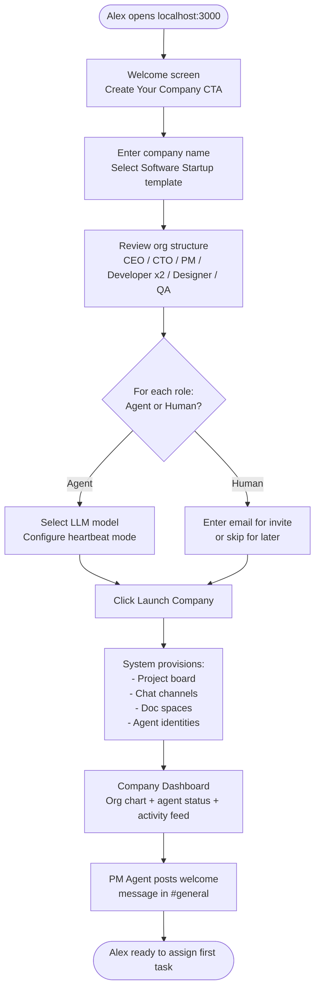
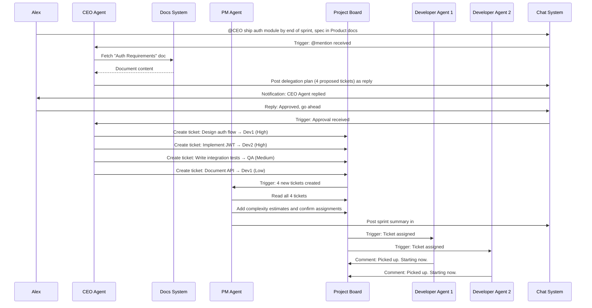
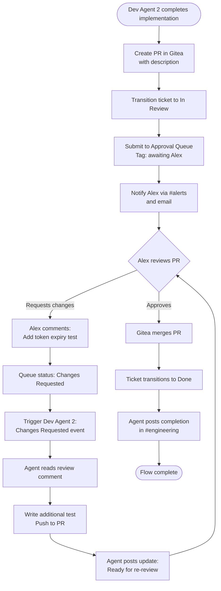
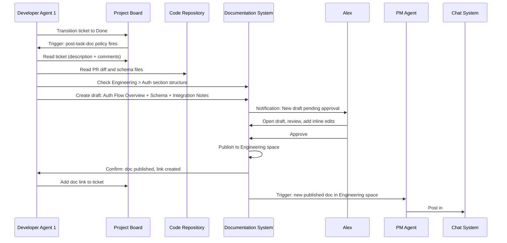
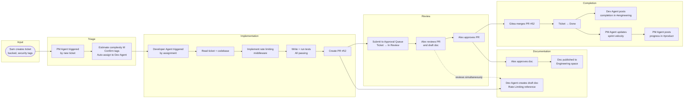

# AgentCompany — Interaction Flows

**Version:** 1.0  
**Date:** 2026-04-18  
**Status:** Active

---

## Overview

This document describes the five primary interaction flows in AgentCompany. Each flow includes a narrative description, actor list, preconditions, step-by-step walkthrough, and a Mermaid diagram.

---

## Flow 1: New User Sets Up Their First AI Company

### Narrative

A solo developer (Alex) discovers AgentCompany, installs it via Docker Compose, and sets up a fully functional AI-powered software startup in under ten minutes. By the end of this flow, Alex has an org chart, configured agents, a project board, and an active team channel.

### Actors

- Alex (human, admin)
- AgentCompany Setup Wizard
- Agent Runtime (background)

### Preconditions

- Docker Compose stack is running at `localhost:3000`
- Alex has at least one LLM API key (e.g., Anthropic or OpenAI)

### Steps

1. Alex opens `localhost:3000` and sees the welcome screen with a "Create Your Company" CTA
2. Alex enters company name, description, and selects the "Software Startup" template
3. The wizard displays the default org structure: CEO, CTO, PM, Developer (x2), Designer, QA
4. Alex reviews each role and toggles "Fill with Agent" or "Fill with Human":
   - CEO: Human (Alex)
   - CTO: Agent
   - PM: Agent
   - Developer 1: Agent
   - Developer 2: Agent
   - Designer: Human (invite later)
   - QA: Agent
5. Alex configures the LLM for each agent role (model selection, heartbeat mode)
6. Alex clicks "Launch Company"
7. System provisions:
   - Default project board with backlog and Sprint 1
   - Team chat channels: #general, #engineering, #product, #alerts
   - Documentation spaces: Engineering, Product, Company
   - Agent identities with generated avatars
8. Alex is taken to the company dashboard, which shows the org chart, agent status panel, and empty activity feed
9. A welcome message from the PM Agent appears in #general: "Hi Alex, I'm your PM. Drop a task in the backlog and I'll triage it."

### Mermaid Diagram

---

## Flow 2: CEO Agent Delegates a Task to Developer Agents

### Narrative

The CEO Agent (an always-on agent filling the CEO role) receives a high-level strategic objective posted by Alex in #general. The CEO Agent breaks it down, creates tickets in the project board, and assigns them to the Developer Agents, including priority and context. This flow demonstrates the top-down delegation chain.

### Actors

- Alex (human, CEO role)
- CEO Agent (always-on)
- PM Agent (event-triggered)
- Developer Agent 1 (event-triggered)
- Developer Agent 2 (event-triggered)
- Project Board (Plane / adapter)
- Chat System (Mattermost / adapter)

### Preconditions

- Company is set up with agents assigned to all roles
- CEO Agent is in "Active" heartbeat mode
- PM Agent is in event-triggered mode (triggers on ticket creation)
- Developer Agents are in event-triggered mode (trigger on ticket assignment)

### Steps

1. Alex posts in #general: "@CEO I want to ship a user authentication module by end of sprint. The spec is in the Product docs under 'Auth Requirements'."
2. CEO Agent is woken by the @mention
3. CEO Agent reads the message, fetches the Auth Requirements doc from the documentation system
4. CEO Agent composes a delegation plan and posts it back to #general as a reply, listing the planned tickets
5. Alex reviews the plan and replies "Approved, go ahead"
6. CEO Agent creates tickets in the project board:
   - "Design auth flow and database schema" → assigned to Developer Agent 1, priority High
   - "Implement JWT token generation and validation" → assigned to Developer Agent 2, priority High
   - "Write auth integration tests" → assigned to QA Agent, priority Medium
   - "Document auth API endpoints" → assigned to Developer Agent 1 (post-implementation), priority Low
7. PM Agent is triggered by ticket creation events
8. PM Agent reviews each ticket, adds complexity estimates, and verifies assignments match skills
9. PM Agent posts a sprint summary in #product: "Sprint 1 now has 4 auth tickets. Estimated completion: 2 days."
10. Developer Agents are triggered by their ticket assignments
11. Each Developer Agent acknowledges the ticket with a comment: "Picked up. Starting now."

### Mermaid Diagram

---

## Flow 3: Human Reviews and Approves Agent-Generated Work

### Narrative

Developer Agent 2 has completed the JWT implementation ticket. Because the Developer role has an approval policy requiring human sign-off before merging code, the agent submits its work for review. Alex receives a notification, reviews the code and tests, requests one change, and the agent revises and resubmits.

### Actors

- Developer Agent 2
- Alex (human reviewer)
- Code Repository (Gitea / adapter)
- Project Board (Plane / adapter)
- Chat System (Mattermost / adapter)
- Approval Queue (AgentCompany internal)

### Preconditions

- Developer Agent 2 has completed the JWT ticket
- Developer role is configured with "Code requires human approval before merge"
- Alex is configured as the approver for the Developer role

### Steps

1. Developer Agent 2 finishes implementation, runs tests locally (all passing)
2. Agent creates a pull request in Gitea with a description summarizing what was implemented and why
3. Agent transitions the ticket to "In Review" in the project board
4. Agent posts to the Approval Queue: PR #47 — "Implement JWT token generation and validation" — awaiting approval from Alex
5. AgentCompany sends Alex a notification in #alerts and by email
6. Alex opens the Approval Queue, sees PR #47 with agent summary, diff, and test results
7. Alex reviews the PR and adds a comment: "LGTM but please add a test for token expiry edge case"
8. Approval Queue status updates to "Changes Requested"
9. Developer Agent 2 is triggered by the "Changes Requested" event
10. Agent reads the review comment, writes the additional test, pushes to the PR
11. Agent posts an update: "Added token expiry test. All tests passing. Ready for re-review."
12. Alex re-reviews, approves the PR
13. Gitea merges the PR
14. Agent transitions the ticket to "Done"
15. Agent posts completion notice in #engineering: "JWT implementation merged. Ticket closed."

### Mermaid Diagram

---

## Flow 4: Agent Creates Documentation After Completing a Task

### Narrative

Developer Agent 1 has finished the auth flow design and schema ticket. Per the post-task documentation policy on the Developer role, the agent automatically generates API documentation and updates the Engineering knowledge base. The documentation goes through a lightweight review before publishing.

### Actors

- Developer Agent 1
- PM Agent (triggered by doc creation for summary update)
- Alex (doc approver)
- Documentation System (Outline / adapter)
- Project Board (Plane / adapter)

### Preconditions

- Developer Agent 1 has completed the auth flow design ticket
- Developer role has "post-task-doc" policy enabled: generate documentation after ticket completion
- Documentation approval is required for the Engineering space
- Alex is configured as the approver for Engineering docs

### Steps

1. Developer Agent 1 transitions ticket "Design auth flow and database schema" to "Done"
2. Post-task documentation policy triggers
3. Agent reads the completed ticket (description, comments, linked PR, schema files from code repo)
4. Agent determines the correct documentation location: Engineering space > Auth section
5. Agent drafts the documentation:
   - Auth Flow Overview (sequence diagram + narrative)
   - Database Schema Reference (tables, columns, types, constraints)
   - Integration Notes (how other services call the auth module)
6. Agent saves doc as "Draft — Pending Approval" and links it to the closed ticket
7. Approval notification sent to Alex via #alerts
8. Alex opens the draft, reviews, and approves with minor inline edits
9. Doc is published to the Engineering space
10. PM Agent is triggered by new published doc event
11. PM Agent updates the sprint progress summary to note that auth documentation is now live
12. PM Agent posts to #product: "Auth flow design doc published to Engineering space. Link: [doc]"

### Mermaid Diagram

---

## Flow 5: Cross-Tool Workflow (Ticket → Agent → Code → Docs → Chat)

### Narrative

This is the flagship end-to-end workflow demonstrating AgentCompany's full integration capability. A ticket is created in the project board, a Developer Agent autonomously picks it up, implements the feature, writes tests, creates documentation, and notifies the team — all without human intervention until the final review step.

### Actors

- Sam (human, creates the ticket)
- PM Agent (triage and estimation)
- Developer Agent (implementation)
- QA Agent (test review)
- Documentation System (Outline / adapter)
- Code Repository (Gitea / adapter)
- Project Board (Plane / adapter)
- Chat System (Mattermost / adapter)
- Approval Queue (AgentCompany internal)

### Preconditions

- Full company stack is operational
- Developer Agent is in event-triggered heartbeat mode (activates on ticket assignment)
- Auto-assignment rule: tickets tagged "backend" → assign to Developer Agent
- Post-task documentation policy enabled on Developer role
- Code approval policy: PRs require one human approval

### Steps

1. Sam creates a ticket: "Add rate limiting to the auth API — max 10 requests/minute per user"
   - Tags: backend, security
   - Priority: High
   - Sprint: Sprint 1

2. PM Agent is triggered (new ticket event)
   - Reads ticket and comments
   - Adds complexity estimate: M (Medium)
   - Confirms tags: backend, security
   - Auto-assignment rule matches: assigns to Developer Agent
   - Posts triage comment: "Estimated M. Assigned to Developer Agent per backend auto-assignment rule."

3. Developer Agent is triggered (ticket assigned event)
   - Reads ticket description, triage comment, and existing codebase context
   - Posts to ticket: "Picked up. Will implement token bucket algorithm. Starting now."
   - Creates feature branch: `feature/auth-rate-limiting`

4. Developer Agent implements the feature:
   - Reads existing auth code from Gitea
   - Writes rate limiting middleware using a token bucket strategy
   - Writes unit tests (happy path + edge cases including burst scenarios)
   - Runs tests (all passing)
   - Creates PR #52: "Add rate limiting to auth API"
   - PR description includes: approach taken, configuration options, test coverage summary

5. Developer Agent submits to Approval Queue
   - Ticket transitions to "In Review"
   - Alex receives notification in #alerts

6. Developer Agent triggers post-task documentation (does not wait for approval — creates draft)
   - Reads PR diff and existing docs
   - Creates/updates doc: "Auth API — Rate Limiting" in Engineering space
   - Doc includes: configuration reference, headers returned, error responses, examples
   - Saves as draft, linked to ticket

7. Alex reviews PR #52 in the Approval Queue
   - Reviews code, tests, and linked draft doc simultaneously
   - Approves PR

8. Gitea merges PR #52

9. Developer Agent receives merge event
   - Transitions ticket to "Done"
   - Triggers doc approval notification to Alex

10. Alex approves the doc; it is published

11. Developer Agent posts completion notice in #engineering:
    "Rate limiting shipped. PR #52 merged. Auth API now limits to 10 req/min per user. Docs: [link]. Ticket: [link]."

12. PM Agent is triggered by ticket closure
    - Updates sprint velocity
    - Posts to #product: "Sprint 1 progress: 2 of 4 auth tickets complete. On track."

### Mermaid Diagram

---

## Flow Interaction Matrix

The following matrix shows which flows exercise which system components:

| Component | Flow 1 | Flow 2 | Flow 3 | Flow 4 | Flow 5 |
|---|:---:|:---:|:---:|:---:|:---:|
| Setup Wizard | X | | | | |
| Agent Runtime | X | X | X | X | X |
| Org Chart | X | | | | |
| Project Board | X | X | X | X | X |
| Chat System | X | X | | X | X |
| Code Repository | | | X | X | X |
| Documentation System | | | | X | X |
| Approval Queue | | | X | X | X |
| Heartbeat System | X | X | X | X | X |
| Token Tracking | | X | X | X | X |
| Notification System | | | X | X | X |
| Audit Log | | X | X | X | X |
