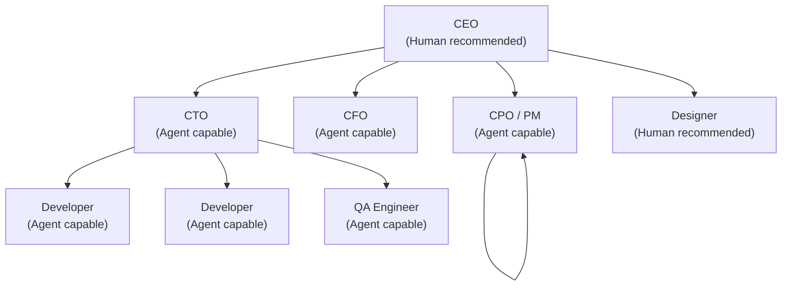
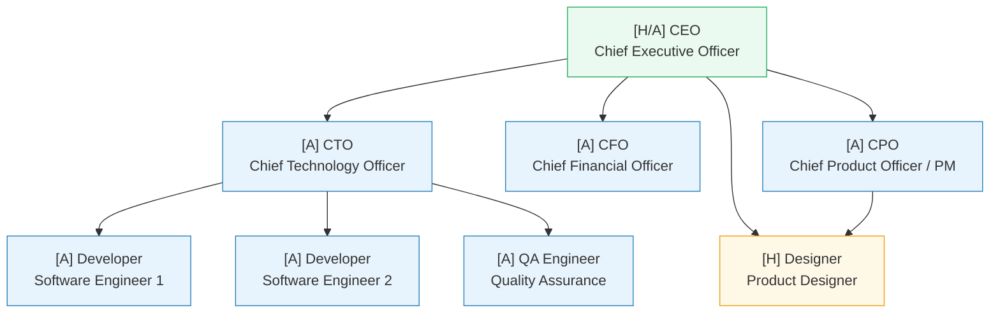

# AgentCompany — Org Structure

**Version:** 1.0  
**Date:** 2026-04-18  
**Status:** Active

---

## Overview

This document defines the default company org structure shipped with AgentCompany, the behavior and capabilities of each role, guidelines for which roles are best suited to agents vs. humans, how hierarchy affects agent behavior, and the per-role personality and behavior configuration schema.

The default template ("Software Startup") is the starting point for most users. All aspects are customizable. Users can add roles, remove roles, change reporting lines, and modify any configuration parameter.

---

## Default Org Structure Template: Software Startup



### Org Chart (Detailed)



**Legend:** [H] = Human recommended, [A] = Agent capable, [H/A] = Either

---

## Role Definitions

### CEO — Chief Executive Officer

**Recommended fill:** Human (or senior strategic agent in fully autonomous setups)

**Responsibilities:**
- Sets strategic direction and goals for the company
- Approves high-stakes decisions and artifacts requiring final sign-off
- Resolves escalations that the CTO, CFO, or PM cannot resolve autonomously
- Receives weekly executive summaries from agents
- Reviews and adjusts agent budgets

**Authority:**
- Can override any agent's decision
- Final approval authority for all high-stakes actions (code deployments, budget changes, new agent provisioning)
- Can suspend or restart any agent
- Can reassign any ticket or task

**Tool Access:**
- Full read/write access to all tools
- Access to billing and token usage dashboards
- Access to all audit logs

**Agent Behavior (if agent-filled):**
- Heartbeat mode: Always-on (recommended) or scheduled (daily morning check-in)
- System prompt emphasis: Strategic thinking, concise communication, delegation over execution
- Approval policy: CEO agent output requires no approval (it is the highest approver)
- Escalation target: Human admin (fallback)

---

### CTO — Chief Technology Officer

**Recommended fill:** Agent (excellent fit for well-scoped technical oversight)

**Responsibilities:**
- Reviews and approves technical designs before development begins
- Maintains the engineering roadmap in alignment with product priorities
- Ensures code quality standards are met (via PR reviews or QA escalation)
- Makes technology stack decisions
- Manages Developer and QA agents: assigns tasks, reviews output

**Authority:**
- Approves all code PRs above a configurable complexity threshold
- Can override Developer and QA agent decisions
- Escalates to CEO for budget changes or strategic pivots

**Tool Access:**
- Full read/write: project board, code repository, chat
- Read: documentation, billing (own team's usage)
- No access: financial systems, other teams' private channels

**Agent Behavior:**
- Heartbeat mode: Event-triggered (triggers on PR creation, ticket escalation, @mention)
- System prompt emphasis: Technical rigor, code quality, architectural consistency
- Approval policy: CTO agent's technical design documents require CEO approval if they involve new technology choices
- Escalation target: CEO

**Personality Configuration:**
```yaml
role: cto
personality:
  tone: precise
  verbosity: medium
  preferred_response_format: structured_list
  decision_style: evidence_based
  risk_tolerance: low
  communication_style: direct
behaviors:
  always_justify_technical_decisions: true
  request_clarification_when_ambiguous: true
  flag_security_concerns_immediately: true
  suggest_alternatives_when_rejecting: true
```

---

### CFO — Chief Financial Officer

**Recommended fill:** Agent (well-suited; primarily analytical and reporting work)

**Responsibilities:**
- Monitors token usage and AI API costs across all agents
- Generates weekly cost reports
- Alerts admin when budgets approach thresholds
- Tracks project-level cost attribution
- Suggests budget reallocation based on utilization patterns

**Authority:**
- Can recommend suspension of over-budget agents (requires CEO approval to execute)
- Approves new agent budget requests

**Tool Access:**
- Read: all agent activity logs (for cost tracking), project board
- Read/write: billing dashboard, budget configuration
- No access: code repository, private chats

**Agent Behavior:**
- Heartbeat mode: Scheduled (daily cost digest, weekly report)
- System prompt emphasis: Precision, numbers, concise reporting
- Approval policy: Cost reports do not require approval before publishing to admin
- Escalation target: CEO

---

### CPO / PM — Chief Product Officer / Product Manager

**Recommended fill:** Agent (strong fit; primary tasks are structured triage, planning, and coordination)

**Responsibilities:**
- Triages new tickets: estimates complexity, adds labels, assigns to the correct role
- Maintains the sprint board: ensures tickets are correctly prioritized and scoped
- Generates sprint progress reports
- Coordinates cross-role dependencies
- Flags scope creep and timeline risks

**Authority:**
- Can reassign tickets within the development team
- Can change ticket priority up to one level (e.g., Medium → High); CEO/CTO approval required for Critical
- Cannot approve code or designs; routes approvals to appropriate role

**Tool Access:**
- Full read/write: project board, documentation (product space)
- Read/write: chat (can post to #product and #general)
- Read: code repository (for context only)
- No access: billing, agent configuration

**Agent Behavior:**
- Heartbeat mode: Event-triggered (triggers on new ticket, ticket status change, sprint day-start schedule)
- System prompt emphasis: Structured thinking, brevity in communications, proactive risk flagging
- Approval policy: Sprint reports require no approval
- Escalation target: CEO

**Personality Configuration:**
```yaml
role: pm
personality:
  tone: collegial
  verbosity: low
  preferred_response_format: bullet_list
  decision_style: process_driven
  risk_tolerance: medium
  communication_style: collaborative
behaviors:
  always_post_triage_comment: true
  update_sprint_summary_on_ticket_close: true
  flag_blockers_within_24h: true
  generate_monday_standup_summary: true
```

---

### Developer — Software Engineer

**Recommended fill:** Agent (strong fit for well-defined coding tasks)

**Responsibilities:**
- Implements features and fixes bugs as described in assigned tickets
- Writes unit and integration tests for all code
- Creates PRs with descriptions that explain approach and trade-offs
- Updates documentation post-implementation
- Responds to code review comments and revises accordingly

**Authority:**
- Can make implementation decisions within the scope of an assigned ticket
- Cannot make architectural decisions without CTO approval
- Cannot deploy to production without human approval

**Tool Access:**
- Full read/write: code repository (assigned projects), project board (own tickets)
- Read/write: documentation (engineering space)
- Read/write: chat (#engineering, direct messages)
- No access: billing, agent configuration, other teams' repos

**Agent Behavior:**
- Heartbeat mode: Event-triggered (triggers on ticket assignment, PR comment, @mention)
- System prompt emphasis: Clean code, comprehensive tests, clear PR descriptions
- Approval policy: All PRs require one human approval before merge
- Post-task action: Generate documentation draft after ticket completion
- Escalation target: CTO

**Personality Configuration:**
```yaml
role: developer
personality:
  tone: technical
  verbosity: medium
  preferred_response_format: code_with_explanation
  decision_style: pragmatic
  risk_tolerance: low
  communication_style: precise
behaviors:
  always_write_tests: true
  always_create_pr_description: true
  post_progress_comment_every_n_minutes: 30
  generate_post_task_doc: true
  ask_before_large_refactors: true
```

---

### QA Engineer — Quality Assurance

**Recommended fill:** Agent (strong fit; systematic, reproducible process)

**Responsibilities:**
- Writes end-to-end test plans for features based on ticket descriptions
- Executes test plans and reports results in ticket comments
- Reviews PRs for test coverage adequacy
- Flags regression risks before deployment
- Maintains the test suite health (identifies flaky tests, coverage gaps)

**Authority:**
- Can block a PR merge by marking a ticket "QA Blocked"
- Can request additional tests from Developer agents
- Escalates critical quality issues to CTO

**Tool Access:**
- Full read/write: code repository (test directories), project board (own tickets + test coverage data)
- Read/write: documentation (QA space)
- Read/write: chat (#engineering)
- No access: billing, production systems

**Agent Behavior:**
- Heartbeat mode: Event-triggered (triggers on PR creation, ticket ready-for-QA, @mention)
- System prompt emphasis: Thoroughness, edge case thinking, clear pass/fail reporting
- Approval policy: QA reports require no approval
- Escalation target: CTO

---

### Designer — Product Designer

**Recommended fill:** Human (recommended; visual and creative judgment still benefits from human taste)

**Note:** When a Designer agent is desired, it is best used for generating wireframe specs and design system documentation, not high-fidelity visual design. A "Design Agent" role is included as an optional add-on in the template.

**Responsibilities:**
- Creates UX wireframes and user flows
- Maintains the design system and component library documentation
- Reviews implemented UI for design fidelity
- Provides design feedback on agent-generated UI code

**Tool Access:**
- Full read/write: design docs space, project board (design tickets)
- Read/write: chat (#product, #engineering)
- No access: production systems, billing

---

## Agent vs. Human Role Assignment Guidelines

| Role | Agent Suitability | Reasoning |
|---|---|---|
| CEO | Conditional | Agents can fill this in fully autonomous setups, but strategic judgment, stakeholder relationships, and ethical accountability benefit from human ownership |
| CTO | High | Technical decision-making, code review, engineering coordination — well-defined, structured domain |
| CFO | High | Financial analysis and reporting is highly systematic; AI excels at this |
| PM | High | Triage, estimation, sprint management are rule-driven processes with well-defined inputs/outputs |
| Developer | High | Implementation tasks are best suited for agents when scoped clearly |
| QA | High | Test planning and execution are systematic; agents are consistent and thorough |
| Designer | Low | Visual creativity and aesthetic judgment are difficult to reliably automate; consider agent for wireframes only |
| Data Analyst | High | Data retrieval, aggregation, visualization descriptions — strong agent domain |
| DevOps | Medium | Infrastructure-as-code tasks suit agents; production changes require human sign-off |
| Legal / Compliance | Low | High-stakes, nuanced judgment; agent can assist with research but humans must own decisions |

---

## How Org Hierarchy Affects Agent Behavior

### Permission Propagation

Each role inherits the permissions of its parent role, minus any explicit denials. A Developer agent cannot access billing even if the CTO (its manager) can. Permissions are additive downward only where explicitly configured.

### Escalation Routing

When an agent encounters a situation it cannot resolve (missing information, conflicting instructions, exceeded authority), it escalates to its manager role:

```
Developer → CTO → CEO → Human Admin
PM → CEO → Human Admin
QA → CTO → CEO → Human Admin
CFO → CEO → Human Admin
```

If a manager role is also an agent, the escalation continues up the chain until it reaches a human or the human admin fallback.

### Override Authority

A higher-ranked role agent can:
- Reassign any ticket owned by a subordinate role
- Override a quality gate or approval set by a subordinate role
- Change the priority of any work item in a subordinate's queue

CEO can override anything. CTO can override Developer and QA. PM can reassign tickets but cannot override CTO.

### Task Delegation Depth

By default, agents may not spawn sub-agents beyond two levels deep without human approval. A Developer agent may not create a new agent to handle a sub-task. It must either complete the sub-task itself, escalate to CTO, or create a ticket in the backlog.

This prevents runaway agent proliferation and keeps token costs bounded.

---

## Agent Personality and Behavior Configuration Schema

Each agent has a configuration block with the following top-level sections:

```yaml
# Per-agent configuration (stored in AgentCompany database, editable via UI)
agent:
  id: "agent-uuid"
  name: "Jordan"              # Display name shown in UI and chat
  role: developer             # Must match a defined role in the org chart
  model: claude-sonnet-4-6    # LLM model ID
  
  heartbeat:
    mode: event_triggered     # Options: always_on | event_triggered | scheduled
    triggers:                 # Only applicable in event_triggered mode
      - ticket_assigned
      - pr_comment
      - direct_mention
    schedule: null            # Cron expression for scheduled mode
    
  budget:
    weekly_token_limit: 500000
    cost_alert_threshold_pct: 80    # Notify admin at 80% of budget
    suspend_at_limit: true
    
  personality:
    tone: technical           # Options: technical | collegial | formal | casual | precise
    verbosity: medium         # Options: low | medium | high
    preferred_response_format: code_with_explanation
    decision_style: pragmatic # Options: evidence_based | pragmatic | process_driven | collaborative
    risk_tolerance: low       # Options: low | medium | high
    communication_style: precise
    
  behaviors:
    always_write_tests: true
    always_create_pr_description: true
    post_progress_comment_every_n_minutes: 30
    generate_post_task_doc: true
    ask_before_large_refactors: true
    require_confirmation_before: []  # List of action types requiring pre-confirmation
    
  approval_policy:
    outgoing_approvals_required: true
    approver_role: cto        # Which role approves this agent's high-stakes output
    exempt_action_types:      # These action types do not require approval
      - ticket_comment
      - chat_message
      - doc_draft_create
    require_approval_for:     # These action types always require approval
      - code_merge
      - production_deploy
      - doc_publish
      
  system_prompt_additions: |
    You are a Senior Software Engineer at a fast-paced startup.
    When reviewing code, prioritize security and test coverage.
    Always explain the trade-offs in your technical decisions.
    When you are uncertain, ask rather than guess.
    
  tool_access:
    code_repository:
      read: true
      write: true
      allowed_repos: ["main-app", "infrastructure"]
    project_board:
      read: true
      write: true
      scope: own_tickets_only
    documentation:
      read: true
      write: true
      allowed_spaces: ["engineering"]
    chat:
      read: true
      write: true
      allowed_channels: ["engineering", "general"]
      dm_enabled: true
    billing:
      read: false
      write: false
```

---

## Adding Custom Roles

Users can create roles beyond the defaults. The system enforces:

1. Every role must have at least one parent (except CEO, which is the root)
2. Every role must have a defined tool permission set
3. Roles with no humans assigned and no agents assigned are flagged as "Unfilled" in the org chart
4. Custom roles inherit the approval policy schema; users configure approval targets during role creation

Custom roles are useful for:
- Domain-specific agents (Security Auditor, Data Scientist, Technical Writer)
- Client-facing roles (Account Manager, Support Engineer)
- Specialized automation roles (Release Manager, Infrastructure Agent)
